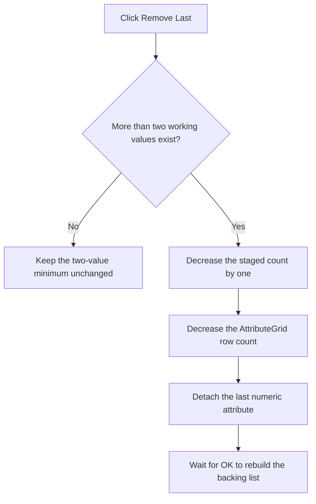

# Remove the Last Step Value

> Analysis status: Recovered handler, minimum-count guard, grid-row removal, and accepted consumer reviewed.

## Control

| Property | Recovered value |
| --- | --- |
| Form | ParStepListEditor |
| Component path | ParStepListEditor.RemoveLast |
| Control class | TBitBtn |
| Caption | &Remove Last |
| Handler name | RemoveLastClick |
| Handler address | 01437ab0 |
| Graph node | `resource:dfm:ParStepListEditor/ParStepListEditor.RemoveLast` |
| Handler node | `function:01437ab0` |
| Graph layer | UI |

## What happens when clicked

The handler reads the working value count from form field `+0x718`. If the
count is two or less, it returns without changing the grid or working list.
This guard preserves the form's minimum closeable value count during normal
Remove Last use.

When more than two values exist, the handler:

1. decreases the working count by one;
2. decreases the `AttributeGrid` row count by one; and
3. removes the grid's last attached numeric attribute.

It does not zero the removed double-array slot and it does not change the
caller's backing list. The lower working count makes the stale slot inactive.
A later Add click overwrites that slot from the new last active value, and OK
rebuilds the backing list from active slots only.

## Click flow

## State, output, and error behavior

- The immediate output is one fewer working value and grid item.
- The control cannot reduce the normal working list below two values.
- A count of zero or one can exist after Clear; Remove Last is also a no-op in
  those states.
- The handler does not save a file, change the caller's list immediately, or
  update the caller's visible count.
- The minimum-count branch has no error message or disabled-state change.
- The handler has no confirmation, undo record, retry, or local catch.

## Handler evidence

- Remove handler: [FUN_01437ab0](../../../DecompiledSources/Tina16/functions/0000000001437AB0__FUN_01437ab0.c)
- Grid row-count helper: [FUN_00848a70](../../../DecompiledSources/Tina16/functions/0000000000848A70__FUN_00848a70.c)
- Last-attribute removal: [FUN_00b0adf0](../../../DecompiledSources/Tina16/functions/0000000000B0ADF0__FUN_00b0adf0.c)
- Accepted list rebuild: [FUN_014377e0](../../../DecompiledSources/Tina16/functions/00000000014377E0__FUN_014377e0.c)
- Close guard: [FUN_01437bf0](../../../DecompiledSources/Tina16/functions/0000000001437BF0__FUN_01437bf0.c)
- Recovered form evidence: [ui-evidence.json](../../../DecompiledSources/Tina16/resources/dfm/ui-evidence.json)
- Complexity: complex
- Distinct outgoing graph calls: 3

## Resource evidence

- The button caption is `&Remove Last`.
- `AttributeGrid` is the only list-like editor on the form.
- The hidden nearby label has caption `Parameter #`. The handler's last-row and
  last-attribute calls establish removal; proximity alone does not.
- No hint, action, image reference, or custom glyph is present.

## Analysis limits

- The original Delphi names for working count field `+0x718` and the working
  double array are not recovered.
- The compiled function contains a cleanup branch for count zero after the
  guarded decrement. Because the handler enters only when the old count is
  greater than two, that branch is unreachable in this click path.
- Removed working-array bytes remain until another Add overwrites them, but
  downstream code uses the reduced count and does not serialize the stale slot.
