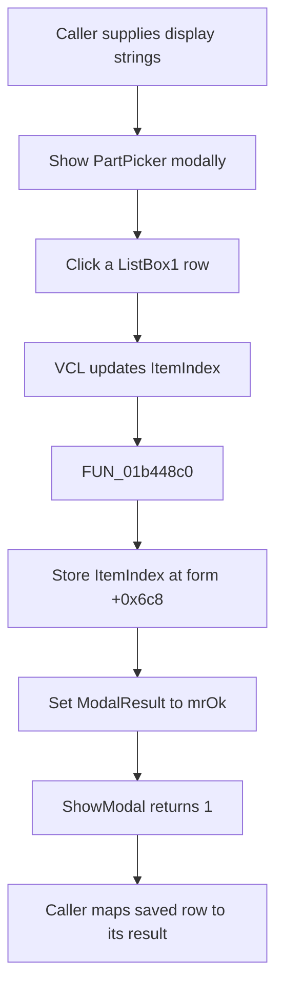

# ListBox1

> Analysis status: Reviewed from the recovered handler, runtime list setup, and modal callers.

## Control

| Property | Recovered value |
| --- | --- |
| Form | PartPicker |
| Component path | PartPicker.ListBox1 |
| Control class | TListBox |
| Caption | Not present in the recovered resource. |
| Hint | Not present in the recovered resource. |
| Text | Not present in the recovered resource. |
| Handler name | ListBox1Click |
| Handler address | 01b448c0 |
| Graph node | `resource:dfm:PartPicker/PartPicker.ListBox1` |
| Handler node | `function:01b448c0` |
| Graph layer | UI |

## What happens when clicked

`ListBox1` is both the selection control and the accept control for `PartPicker`. The VCL updates the list box selection before it dispatches `ListBox1Click`. The handler then:

1. Reads the current zero-based `ItemIndex` through the list box virtual getter.
2. Stores that index in form field `+0x6c8`.
3. Writes value `1` (`mrOk`) to the form modal-result field at `+0x508`.

The modal-result write ends the caller's `ShowModal` wait. The recovered callers fill the list at run time, show the picker, and use the saved row index only when the modal result is `1`. Most callers translate the row into a domain-specific identifier. Another caller reads the selected list string and stores a derived path. A `bkCancel` button provides the non-accepted result.

The handler does not read the selected text, validate the row, copy a part object, or perform the caller's index-to-result mapping. It has no branch, message, allocation, or local exception handler. If the virtual getter returns `-1`, the handler stores `-1` and still accepts the dialog. A normal list-selection notification supplies a valid row, but the handler itself does not enforce that condition.

## Click flow

## Handler evidence

- Source: [DecompiledSources/Tina16/functions/0000000001B448C0__FUN_01b448c0.c](../../../DecompiledSources/Tina16/functions/0000000001B448C0__FUN_01b448c0.c)
- Recovered role: Capture the selected PartPicker row and accept the modal dialog.
- Current graph summary: Handles 1 Delphi UI event: PartPicker.ListBox1.OnClick.
- Current graph behavior: Read `ListBox1.ItemIndex`, save it at form offset `+0x6c8`, and set modal result `1` without validation.
- Current graph evidence: The handler invokes the list box virtual method at VMT offset `+0x260`, stores its 32-bit result at `+0x6c8`, writes `1` at `+0x508`, and returns.
- Complexity: simple
- Distinct outgoing calls: 0

## Direct calls

- No direct call edge is present in the recovered graph. The `ItemIndex` read uses VCL virtual dispatch. The recovered list-box getter uses the native `LB_GETCURSEL` message for a standard list box.

## Resource evidence

- Kind: Not present in the recovered resource.
- Modal result: Not present in the recovered resource.
- Checked state: Not present in the recovered resource.
- List items: Not present in the recovered resource.
- Image reference: Not present in the recovered resource.
- Extracted glyph: None.

## Nearby label candidates

Nearby labels are layout candidates only. They are not proof of behavior.

- No same-parent label candidate is available.

## Analysis limits

- The DFM contains no static list items. The callers build the display strings and assign them at run time.
- The original Delphi name for form field `+0x6c8` is not recovered. Its writes and caller reads prove that it is the saved row index.
- The row's domain meaning depends on the caller. The handler returns an index, not a universal part identifier.
- No nearby label, caption, hint, glyph, or image provides additional behavior evidence.

## Supporting sources

- [Form initialization](../../../DecompiledSources/Tina16/functions/0000000001B44900__FUN_01b44900.c)
- [Runtime list assignment wrapper](../../../DecompiledSources/Tina16/functions/0000000001B44940__FUN_01b44940.c)
- [VCL list-items assignment](../../../DecompiledSources/Tina16/functions/000000000068C1B0__FUN_0068c1b0.c)
- [Native list-box ItemIndex getter](../../../DecompiledSources/Tina16/functions/000000000068BA00__FUN_0068ba00.c)
- [Caller that maps the saved row through a part table](../../../DecompiledSources/Tina16/functions/0000000001B45390__FUN_01b45390.c)
- [Caller that consumes the selected list string](../../../DecompiledSources/Tina16/functions/0000000001BA92A0__FUN_01ba92a0.c)
