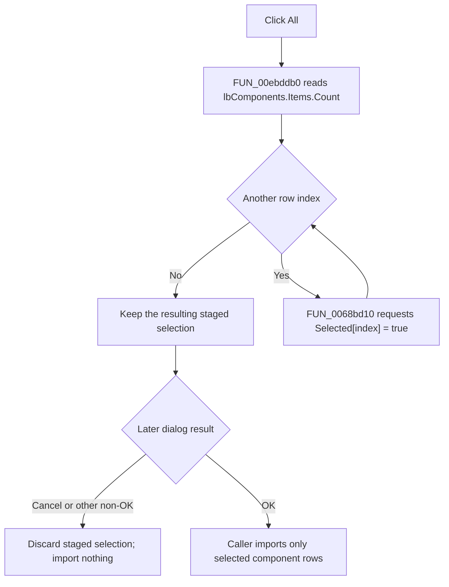

# &All

> Analysis status: Reviewed from recovered handler, list-box, caller, and UI resource evidence.

## Control

| Property | Recovered value |
| --- | --- |
| Form | PCBCompImportDlg |
| Component path | PCBCompImportDlg.btnAll |
| Control class | TButton |
| Caption | &All |
| Hint | Not present in the recovered resource. |
| Text | Not present in the recovered resource. |
| Handler name | btnAllClick |
| Handler address | 00ebddb0 |
| Graph node | `resource:dfm:PCBCompImportDlg/PCBCompImportDlg.btnAll` |
| Handler node | `function:00ebddb0` |
| Graph layer | UI |

## What happens when clicked

`FUN_00ebddb0` selects every row in `PCBCompImportDlg.lbComponents`. It reads the current `Items.Count`, visits indexes 0 through `Count - 1`, and calls `FUN_0068bd10` with the requested selected state set to true.

The shared setter first compares each row with the requested state. A row that is already selected causes no native update. A repeated **All** click is therefore idempotent, although the handler still scans the complete list. If the list is empty, the loop does not run and the click has no effect.

This handler changes only the staged multi-selection in the open dialog. It does not import a component, change the current PCB component list, close the dialog, or inspect `Sender`.

## Selection and import boundary

The **All**, **None**, and **Invert** handlers use the same list box at form offset `0x6D0`. **None** requests false for every row. **Invert** reads each current selection and writes its opposite. The recovered instruction label confirms that the rows are components offered for addition and that Shift+Click and Ctrl+Click provide extended selection.

Two recovered PCB import callers populate this dialog from an external source and then show it modally. Only an OK result makes a caller scan the selected rows and try to copy their source components into the current component list. A non-OK result skips that import. The All handler itself does not perform this later operation.

When a later import finds a duplicate name, `FUN_00eab320` proposes an available alternate name. An accepted result imports that component, a declined result skips it, and a cancel result stops the remaining scan. Earlier accepted rows are not rolled back by this later stop.

## Empty and error paths

All row indexes come from the current item count, and this handler does not change the collection while it scans. It has no local exception handler or rollback. `FUN_0068bd10` can raise an indexed list-box exception if the native selection request fails. If a later row fails, earlier rows can remain selected and later rows remain unchanged.

## Click flow

## Handler evidence

- Source: [DecompiledSources/Tina16/functions/0000000000EBDDB0__FUN_00ebddb0.c](../../../DecompiledSources/Tina16/functions/0000000000EBDDB0__FUN_00ebddb0.c)
- Recovered role: Select every component row offered by the PCB component import dialog.
- Current graph summary: Handles 1 Delphi UI event: PCBCompImportDlg.btnAll.OnClick.
- Current graph behavior: Walks the complete `lbComponents.Items` range and requests selected state true for each row. An empty list is a no-op.
- Current graph evidence: The handler reads the count through the Items object at form field `+0x6D0`, derives indexes from zero to count minus one, and passes each index with value 1 to `FUN_0068bd10`. The DFM identifies this field as `lbComponents` and binds `btnAllClick` to `00ebddb0`.
- Complexity: simple
- Distinct outgoing calls: 1

## Direct calls

- `function:0068bd10` — Compare and set one list-box row's selected state.

## Related source

- [Selection setter `FUN_0068bd10`](../../../DecompiledSources/Tina16/functions/000000000068BD10__FUN_0068bd10.c) — Writes a row's native selected state and raises on a native list-box error.
- [None handler `FUN_00ebde10`](../../../DecompiledSources/Tina16/functions/0000000000EBDE10__FUN_00ebde10.c) — Requests false for every row in the same list.
- [Invert handler `FUN_00ebde70`](../../../DecompiledSources/Tina16/functions/0000000000EBDE70__FUN_00ebde70.c) — Reads and complements every row in the same list.
- [PcbForm4 import caller `FUN_00ec7d60`](../../../DecompiledSources/Tina16/functions/0000000000EC7D60__FUN_00ec7d60.c) and [PcbForm import caller `FUN_00ed4e00`](../../../DecompiledSources/Tina16/functions/0000000000ED4E00__FUN_00ed4e00.c) — Populate the dialog, show it modally, and process selected rows only after OK.

## Resource evidence

- Kind: Not present in the recovered resource.
- Modal result: Not present in the recovered resource.
- Checked state: Not present in the recovered resource.
- List items: Not present in the recovered resource.
- Image reference: Not present in the recovered resource.
- Extracted glyph: None.

## Nearby label candidates

Nearby labels are layout candidates only. They are not proof of behavior.

- Rank 1: Please select the components you would like to add to the current component list. Use Shift+Click and/or Ctrl+Click for extended selection. at distance 207.

## Analysis limits

- The handler and label establish extended list selection. The recovered DFM does not expose the list box's Delphi multi-selection property name.
- The later callers own component copying and duplicate resolution. They are evidence for the commit boundary, not responsibilities assigned to this control handler.
- Shared VCL selection helpers are evidence only and are not duplicated in this control's annotation fragment.
