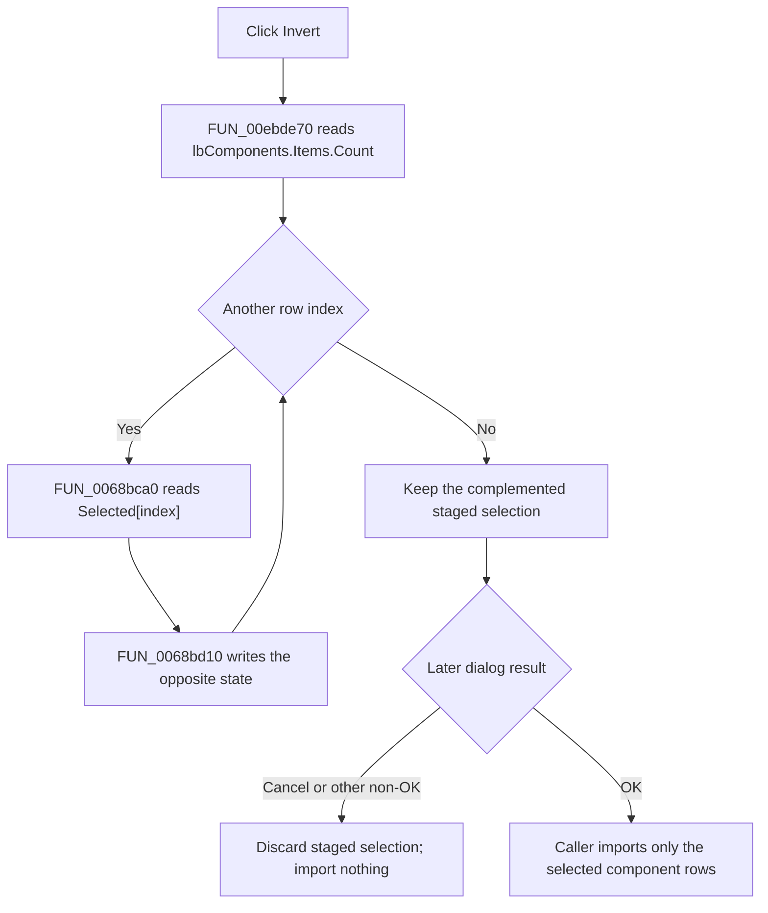

# &Invert

> Analysis status: Reviewed from recovered handler, list-box, caller, and UI resource evidence.

## Control

| Property | Recovered value |
| --- | --- |
| Form | PCBCompImportDlg |
| Component path | PCBCompImportDlg.btnInvert |
| Control class | TButton |
| Caption | &Invert |
| Hint | Not present in the recovered resource. |
| Text | Not present in the recovered resource. |
| Handler name | btnInvertClick |
| Handler address | 00ebde70 |
| Graph node | `resource:dfm:PCBCompImportDlg/PCBCompImportDlg.btnInvert` |
| Handler node | `function:00ebde70` |
| Graph layer | UI |

## What happens when clicked

`FUN_00ebde70` complements the selection of every row in `PCBCompImportDlg.lbComponents`. It reads the current `Items.Count` and visits indexes 0 through `Count - 1`. For each row, `FUN_0068bca0` reads `Selected[index]`, and `FUN_0068bd10` writes the opposite Boolean state.

The result is the exact complement of the selection present when the handler starts. A second Invert click restores the earlier selection if nothing else changes the list and no error occurs. If the list is empty, the loop is skipped and the click has no effect.

This handler changes only the staged multi-selection in the open dialog. It does not change component data, reorder rows, import a component, close the dialog, or inspect `Sender`.

## Interaction with All and None

All three handlers operate on the list box at form offset `0x6D0`:

- **All** requests selected state true for every row. Invert after All clears every row.
- **None** requests selected state false for every row. Invert after None selects every row.
- A mixed manual selection becomes its exact complement.

The recovered instruction label identifies the rows as components offered for addition and documents Shift+Click and Ctrl+Click extended selection.

## Import boundary

Two recovered PCB import callers populate the dialog from an external component source and show it modally. Only after an OK result does a caller scan `Selected[index]` and try to copy the selected source components into the current component list. A non-OK result skips this mutation. Invert changes which rows that later caller will consider; it does not perform the import itself.

For a duplicate name, `FUN_00eab320` proposes an available alternate name. An accepted result imports the component, a declined result skips it, and a cancel result stops the remaining scan. The later import loop is not transactional; stopping does not roll back earlier accepted rows.

## Empty and error paths

The handler has no validation message, exception handler, or rollback. `FUN_0068bca0` raises if the native selected-state query returns a list-box error. `FUN_0068bd10` can also raise if the native write fails. A failure after earlier rows were inverted can leave those rows changed while later rows retain their prior state.

## Click flow

## Handler evidence

- Source: [DecompiledSources/Tina16/functions/0000000000EBDE70__FUN_00ebde70.c](../../../DecompiledSources/Tina16/functions/0000000000EBDE70__FUN_00ebde70.c)
- Recovered role: Invert every component-row selection in the PCB component import dialog.
- Current graph summary: Handles 1 Delphi UI event: PCBCompImportDlg.btnInvert.OnClick.
- Current graph behavior: Walks the complete `lbComponents.Items` range, reads each current selected state, and writes its opposite. An empty list is a no-op.
- Current graph evidence: The handler reads the count through the Items object at form field `+0x6D0`. For each derived index, it calls `FUN_0068bca0` and passes the Boolean inverse to `FUN_0068bd10`. The DFM identifies the field as `lbComponents` and binds `btnInvertClick` to `00ebde70`.
- Complexity: moderate
- Distinct outgoing calls: 2

## Direct calls

- `function:0068bca0` — Read one list-box row's selected state.
- `function:0068bd10` — Compare and set one list-box row's selected state.

## Related source

- [Selection getter `FUN_0068bca0`](../../../DecompiledSources/Tina16/functions/000000000068BCA0__FUN_0068bca0.c) — Uses the native `LB_GETSEL` operation and raises on `LB_ERR`.
- [Selection setter `FUN_0068bd10`](../../../DecompiledSources/Tina16/functions/000000000068BD10__FUN_0068bd10.c) — Writes a row's native selected state and raises on a native list-box error.
- [All handler `FUN_00ebddb0`](../../../DecompiledSources/Tina16/functions/0000000000EBDDB0__FUN_00ebddb0.c) and [None handler `FUN_00ebde10`](../../../DecompiledSources/Tina16/functions/0000000000EBDE10__FUN_00ebde10.c) — Request fixed true and false states for the same list.
- [PcbForm4 import caller `FUN_00ec7d60`](../../../DecompiledSources/Tina16/functions/0000000000EC7D60__FUN_00ec7d60.c) and [PcbForm import caller `FUN_00ed4e00`](../../../DecompiledSources/Tina16/functions/0000000000ED4E00__FUN_00ed4e00.c) — Populate the dialog, show it modally, and process selected rows only after OK.
- [Duplicate-name helper `FUN_00eab320`](../../../DecompiledSources/Tina16/functions/0000000000EAB320__FUN_00eab320.c) — Proposes an unused alternate name and returns the user's later import decision.

## Resource evidence

- Kind: Not present in the recovered resource.
- Modal result: Not present in the recovered resource.
- Checked state: Not present in the recovered resource.
- List items: Not present in the recovered resource.
- Image reference: Not present in the recovered resource.
- Extracted glyph: None.

## Nearby label candidates

Nearby labels are layout candidates only. They are not proof of behavior.

- Rank 1: Please select the components you would like to add to the current component list. Use Shift+Click and/or Ctrl+Click for extended selection. at distance 267.

## Analysis limits

- The handler proves selection inversion but does not identify a default selection established outside the click. The recovered callers do not explicitly set one after population.
- The later callers own component copying and duplicate resolution. They are evidence for the commit boundary, not responsibilities assigned to this control handler.
- The selection getter already has a canonical shared annotation in `TIARA-diz.6.7.35`; shared VCL helpers are not duplicated in this fragment.
