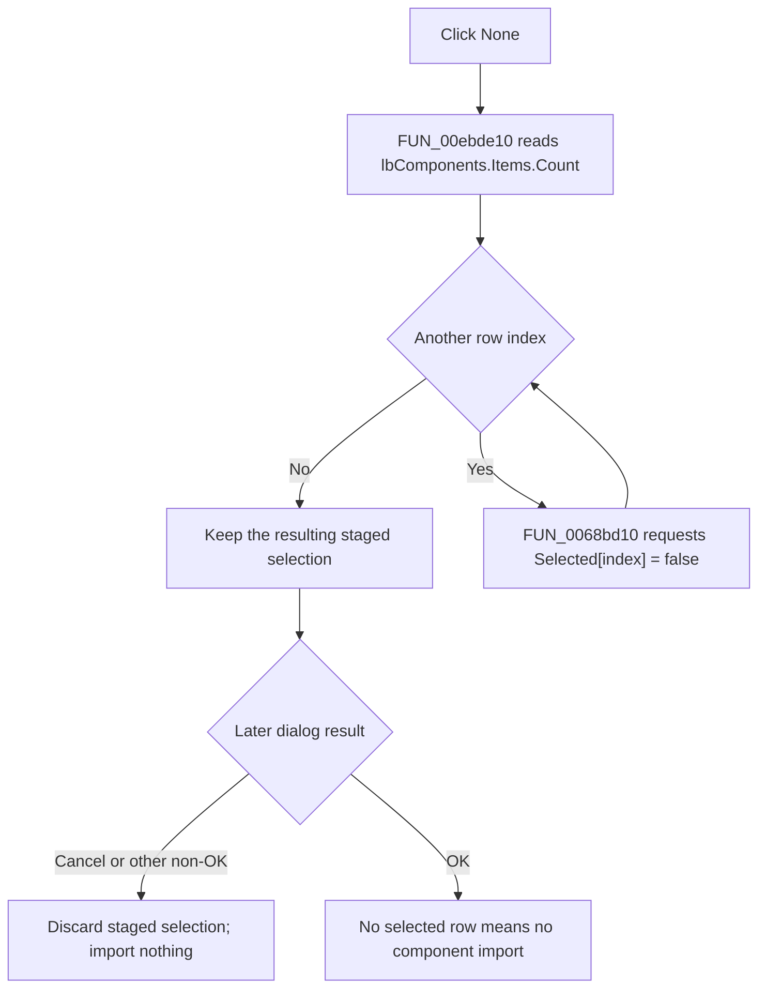

# &None

> Analysis status: Reviewed from recovered handler, list-box, caller, and UI resource evidence.

## Control

| Property | Recovered value |
| --- | --- |
| Form | PCBCompImportDlg |
| Component path | PCBCompImportDlg.btnNone |
| Control class | TButton |
| Caption | &None |
| Hint | Not present in the recovered resource. |
| Text | Not present in the recovered resource. |
| Handler name | btnNoneClick |
| Handler address | 00ebde10 |
| Graph node | `resource:dfm:PCBCompImportDlg/PCBCompImportDlg.btnNone` |
| Handler node | `function:00ebde10` |
| Graph layer | UI |

## What happens when clicked

`FUN_00ebde10` clears the selection of every row in `PCBCompImportDlg.lbComponents`. It reads the current `Items.Count`, visits indexes 0 through `Count - 1`, and calls `FUN_0068bd10` with the requested selected state set to false.

The shared setter first compares each row with the requested state. A row that is already clear causes no native update. A repeated **None** click is therefore idempotent, although the handler still scans the complete list. If the list is empty, the loop does not run and the click has no effect.

This handler changes only the staged multi-selection in the open dialog. It does not remove a component row, import a component, change the current PCB component list, close the dialog, or inspect `Sender`.

## Selection and import boundary

The three selection buttons use the same list box at form offset `0x6D0`: **All** requests true for every row, **None** requests false, and **Invert** reads and complements each current state. The recovered instruction label identifies the rows as components offered for addition and documents Shift+Click and Ctrl+Click extended selection.

The recovered PCB import callers populate the dialog from an external source and then show it modally. Only after an OK result does a caller scan the rows and try to copy selected source components into the current component list. With no selected row, OK imports no component. A non-OK result also skips the import. Clicking None does not itself change the destination list.

## Empty and error paths

All indexes come from the current item count, and the collection is not changed inside the handler. The handler has no local exception handler or rollback. `FUN_0068bd10` can raise an indexed list-box exception if the native selection operation fails. A failure after some rows were cleared can leave a partial selection state.

## Click flow

## Handler evidence

- Source: [DecompiledSources/Tina16/functions/0000000000EBDE10__FUN_00ebde10.c](../../../DecompiledSources/Tina16/functions/0000000000EBDE10__FUN_00ebde10.c)
- Recovered role: Clear every component-row selection in the PCB component import dialog.
- Current graph summary: Handles 1 Delphi UI event: PCBCompImportDlg.btnNone.OnClick.
- Current graph behavior: Walks the complete `lbComponents.Items` range and requests selected state false for each row. An empty list is a no-op.
- Current graph evidence: The handler reads the count through the Items object at form field `+0x6D0`, derives indexes from zero to count minus one, and passes each index with value 0 to `FUN_0068bd10`. The DFM identifies this field as `lbComponents` and binds `btnNoneClick` to `00ebde10`.
- Complexity: simple
- Distinct outgoing calls: 1

## Direct calls

- `function:0068bd10` — Compare and set one list-box row's selected state.

## Related source

- [Selection setter `FUN_0068bd10`](../../../DecompiledSources/Tina16/functions/000000000068BD10__FUN_0068bd10.c) — Writes a row's native selected state and raises on a native list-box error.
- [All handler `FUN_00ebddb0`](../../../DecompiledSources/Tina16/functions/0000000000EBDDB0__FUN_00ebddb0.c) — Requests true for every row in the same list.
- [Invert handler `FUN_00ebde70`](../../../DecompiledSources/Tina16/functions/0000000000EBDE70__FUN_00ebde70.c) — Reads and complements every row in the same list.
- [PcbForm4 import caller `FUN_00ec7d60`](../../../DecompiledSources/Tina16/functions/0000000000EC7D60__FUN_00ec7d60.c) and [PcbForm import caller `FUN_00ed4e00`](../../../DecompiledSources/Tina16/functions/0000000000ED4E00__FUN_00ed4e00.c) — Populate the dialog, show it modally, and process selected rows only after OK.

## Resource evidence

- Kind: Not present in the recovered resource.
- Modal result: Not present in the recovered resource.
- Checked state: Not present in the recovered resource.
- List items: Not present in the recovered resource.
- Image reference: Not present in the recovered resource.
- Extracted glyph: None.

## Nearby label candidates

Nearby labels are layout candidates only. They are not proof of behavior.

- Rank 1: Please select the components you would like to add to the current component list. Use Shift+Click and/or Ctrl+Click for extended selection. at distance 237.

## Analysis limits

- The recovered callers do not explicitly invoke None during dialog initialization. The source proves the click effect, but it does not prove the initial selected state for every population path.
- The later callers own component copying and duplicate resolution. They are evidence for the commit boundary, not responsibilities assigned to this control handler.
- Shared VCL selection helpers are evidence only and are not duplicated in this control's annotation fragment.
