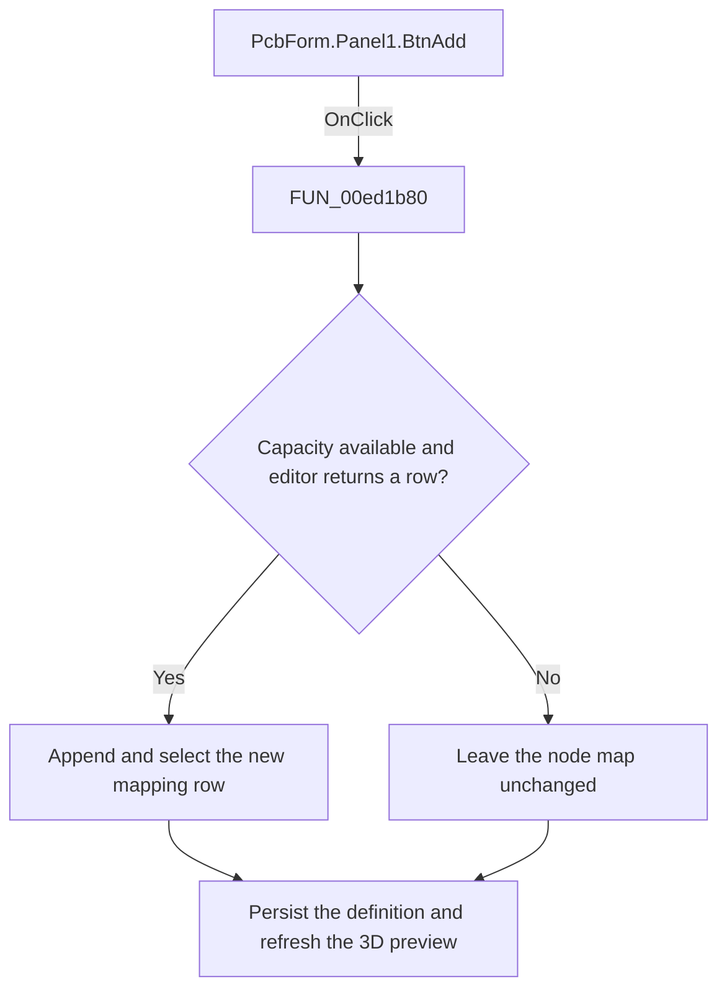

# Add

> Analysis status: Reviewed: the handler adds one pin or node mapping row when the selected footprint has capacity.

## Control

| Property | Recovered value |
| --- | --- |
| Form | PcbForm |
| Form caption | PCB information for SPICE macro components |
| Component path | PcbForm.Panel1.BtnAdd |
| Control class | TBitBtn |
| Caption | &Add |
| Hint | Not present |
| Handler name | BtnAddClick |
| Handler address | 00ed1b80 |
| Graph node | `resource:dfm:PcbForm/PcbForm.Panel1.BtnAdd` |
| Handler node | `function:00ed1b80` |
| Graph layer | UI |

## What happens when clicked

1. The handler reads the selected component and footprint, derives the footprint-library context, and uses `FUN_00eba760` and `FUN_00eb9d90` to obtain the available external-pin list.
2. If an external-pin list exists and the current node-map row count already reaches that pin count, the handler returns without a message.
3. Otherwise, it opens `FUN_00ec9120` in add mode. A nonempty result becomes a new row with the next ordinal and, when available, the matching external-pin label. The handler selects the new row, persists the component and footprint definition through `FUN_00ed3300`, and refreshes controls and the 3D preview.
4. Canceling the editor or returning an empty value leaves the mapping unchanged.

## Click flow

## Handler and call-path evidence

- [`FUN_00ed1b80`](../../../DecompiledSources/Tina16/functions/0000000000ED1B80__FUN_00ed1b80.c) — Add a PCB node mapping row.
- [`FUN_00ec9120`](../../../DecompiledSources/Tina16/functions/0000000000EC9120__FUN_00ec9120.c) — edit a node-mapping row.
- [`FUN_00eba760`](../../../DecompiledSources/Tina16/functions/0000000000EBA760__FUN_00eba760.c) — resolve the footprint-library context.
- [`FUN_00eb9d90`](../../../DecompiledSources/Tina16/functions/0000000000EB9D90__FUN_00eb9d90.c) — load the external-pin list.
- [`FUN_00ed3300`](../../../DecompiledSources/Tina16/functions/0000000000ED3300__FUN_00ed3300.c) — persist the selected PCB definition.

## Resource and glyph evidence

- Recovered form resource: [`ui-evidence.json`](../../../DecompiledSources/Tina16/resources/dfm/ui-evidence.json).

## Inputs, outputs, and limits

- Input: an OnClick event from `PcbForm.Panel1.BtnAdd`, plus the current form selections and state described above.
- State change: Checks footprint pin capacity, prompts for a new mapping, appends and selects the row, persists the selected definition, and refreshes the UI.
- Error or no-op behavior: The decision branches above identify the recovered validation, cancel, confirmation, boundary, or no-op path.
- Analysis limit: The recovered constants do not identify the serialized delimiter names.

