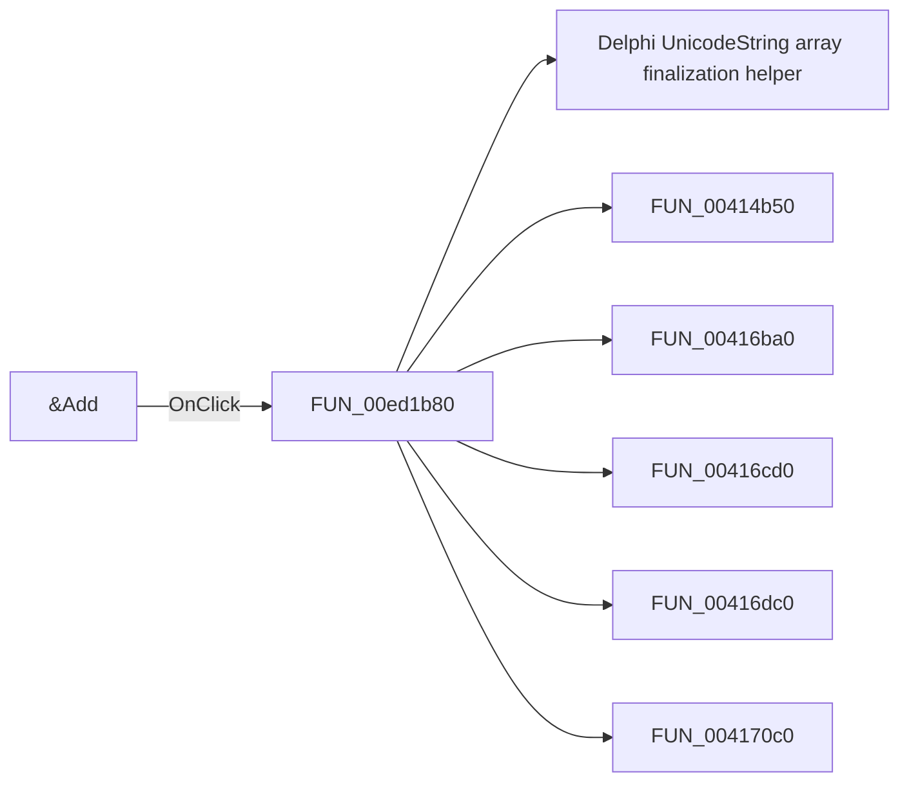

# &Add

> Analysis status: Pending individual source review.

## Control

| Property | Recovered value |
| --- | --- |
| Form | PcbForm |
| Component path | PcbForm.Panel1.BtnAdd |
| Control class | TBitBtn |
| Caption | &Add |
| Hint | Not present in the recovered resource. |
| Text | Not present in the recovered resource. |
| Handler name | BtnAddClick |
| Handler address | 00ed1b80 |
| Graph node | `resource:dfm:PcbForm/PcbForm.Panel1.BtnAdd` |
| Handler node | `function:00ed1b80` |
| Graph layer | UI |

## What happens when clicked

Pending individual analysis. An agent must read the recovered handler source and its relevant callees before it replaces this text.

## Click flow

## Handler evidence

- Source: [DecompiledSources/Tina16/functions/0000000000ED1B80__FUN_00ed1b80.c](../../../DecompiledSources/Tina16/functions/0000000000ED1B80__FUN_00ed1b80.c)
- Recovered role: Not present in the recovered resource.
- Current graph summary: Handles 1 Delphi UI event: PcbForm.Panel1.BtnAdd.OnClick.
- Current graph behavior: Not present in the recovered resource.
- Current graph evidence: Not present in the recovered resource.
- Complexity: complex
- Distinct outgoing calls: 14

## Direct calls

- `function:00414560` — Delphi UnicodeString array finalization helper
- `function:00414b50` — FUN_00414b50
- `function:00416ba0` — FUN_00416ba0
- `function:00416cd0` — FUN_00416cd0
- `function:00416dc0` — FUN_00416dc0
- `function:004170c0` — FUN_004170c0
- `function:0043f750` — FUN_0043f750
- `function:00ea9ca0` — FUN_00ea9ca0
- `function:00ea9ef0` — FUN_00ea9ef0
- `function:00eb9d90` — FUN_00eb9d90
- `function:00eba760` — FUN_00eba760
- `function:00ec9120` — FUN_00ec9120
- `function:00ecbca0` — FUN_00ecbca0
- `function:00ed3300` — FUN_00ed3300

## Resource evidence

- Kind: Not present in the recovered resource.
- Modal result: Not present in the recovered resource.
- Checked state: Not present in the recovered resource.
- List items: Not present in the recovered resource.
- Image reference: Not present in the recovered resource.
- Extracted glyph: None.

## Nearby label candidates

Nearby labels are layout candidates only. They are not proof of behavior.

- Rank 1: Part: at distance 66.
- Rank 2: Swapped nodes at distance 72.
- Rank 3: Node list: at distance 163.

## Analysis limits

- Do not infer behavior from the control class, caption, hint, glyph, or nearby label alone.
- Do not replace the pending status until the handler source and relevant call path provide enough evidence.
