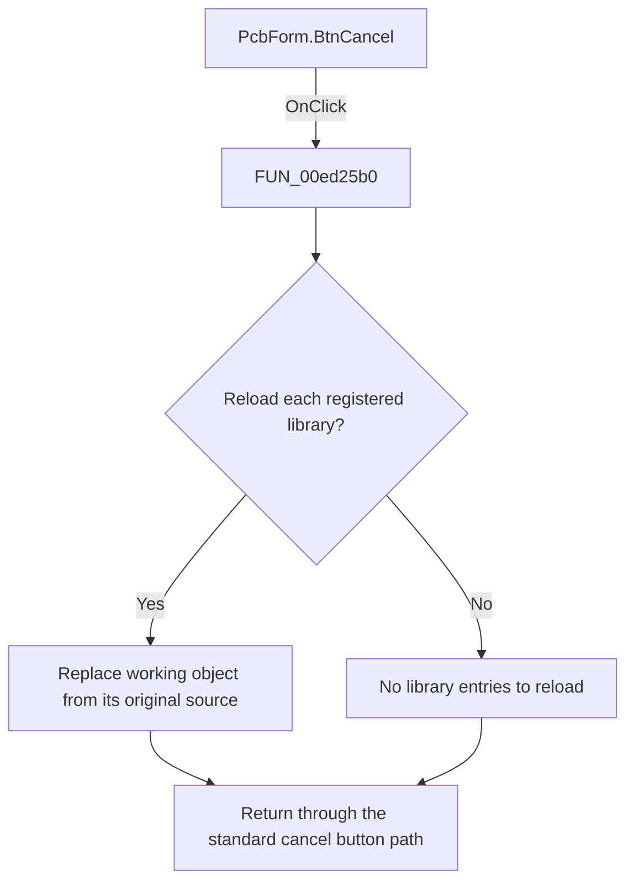

# Cancel

> Analysis status: Reviewed: the handler discards the PCB-library working copies by reloading every registered library.

## Control

| Property | Recovered value |
| --- | --- |
| Form | PcbForm |
| Form caption | PCB information for SPICE macro components |
| Component path | PcbForm.BtnCancel |
| Control class | TBitBtn |
| Caption | Not present |
| Hint | Not present |
| Handler name | BtnCancelClick |
| Handler address | 00ed25b0 |
| Graph node | `resource:dfm:PcbForm/PcbForm.BtnCancel` |
| Handler node | `function:00ed25b0` |
| Graph layer | UI |

## What happens when clicked

1. The custom handler calls `FUN_00eaeb60`. That helper visits every entry in the global PCB-library collection and calls `FUN_00eae880` for each entry.
2. `FUN_00eae880` saves the entry's original source identifier, destroys the current working object, constructs a new object from that source, and replaces the collection entry. This discards unsaved edits across all loaded PCB libraries.
3. The recovered `bkCancel` resource also supplies the standard cancel action. The custom handler does not validate the current component or save a library.

## Click flow

## Handler and call-path evidence

- [`FUN_00ed25b0`](../../../DecompiledSources/Tina16/functions/0000000000ED25B0__FUN_00ed25b0.c) — Discard PCB library working changes.
- [`FUN_00eaeb60`](../../../DecompiledSources/Tina16/functions/0000000000EAEB60__FUN_00eaeb60.c) — reload every PCB library working copy.
- [`FUN_00eae880`](../../../DecompiledSources/Tina16/functions/0000000000EAE880__FUN_00eae880.c) — replace one working library object from its original source.

## Resource and glyph evidence

- Button semantics: bkCancel.
- Recovered form resource: [`ui-evidence.json`](../../../DecompiledSources/Tina16/resources/dfm/ui-evidence.json).

## Inputs, outputs, and limits

- Input: an OnClick event from `PcbForm.BtnCancel`, plus the current form selections and state described above.
- State change: Reloads every registered PCB library from its original source so unsaved form edits are discarded.
- Error or no-op behavior: The decision branches above identify the recovered validation, cancel, confirmation, boundary, or no-op path.
- Analysis limit: The recovered source does not show the caller that consumes the final modal result.

