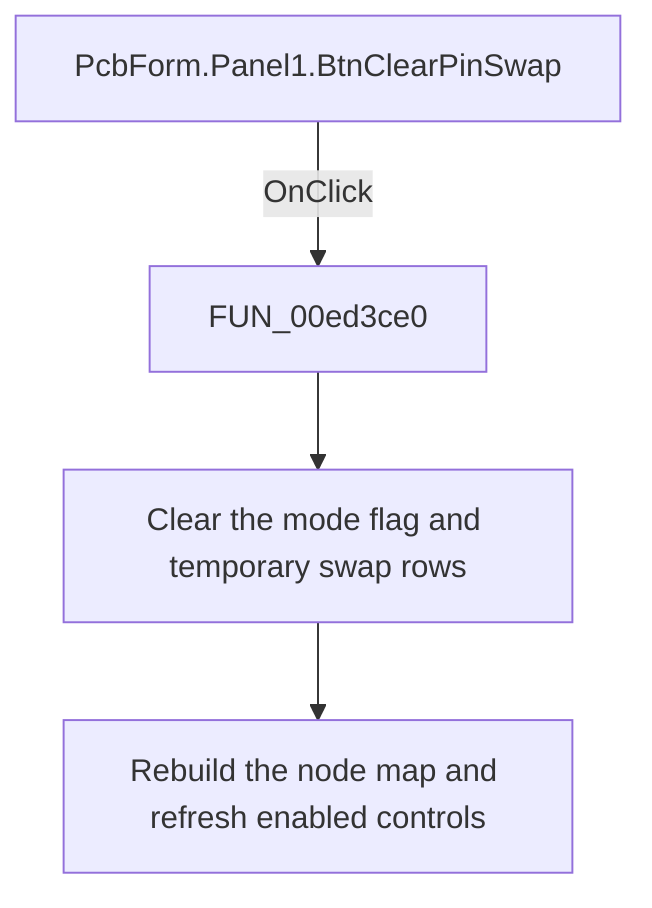

# Clear pin swap

> Analysis status: Reviewed: the handler leaves pin-swap comparison mode, clears its temporary swap rows, and rebuilds the normal node map.

## Control

| Property | Recovered value |
| --- | --- |
| Form | PcbForm |
| Form caption | PCB information for SPICE macro components |
| Component path | PcbForm.Panel1.BtnClearPinSwap |
| Control class | TBitBtn |
| Caption | Clear pin swap |
| Hint | Not present |
| Handler name | BtnClearPinSwapClick |
| Handler address | 00ed3ce0 |
| Graph node | `resource:dfm:PcbForm/PcbForm.Panel1.BtnClearPinSwap` |
| Handler node | `function:00ed3ce0` |
| Graph layer | UI |

## What happens when clicked

1. The handler clears the form flag at offset `0x900`, which the component-selection, footprint-selection, node-list drawing, and enabled-state paths all test as the active pin-swap comparison state.
2. It clears the temporary string-list object at offset `0x890`. `FUN_00ecc490` then rebuilds the visible node map from the selected component and footprint without merging those temporary swap rows.
3. `FUN_00ecbca0` refreshes control availability. Controls that are specific to pin-swap mode become disabled when the flag is clear.

## Click flow

## Handler and call-path evidence

- [`FUN_00ed3ce0`](../../../DecompiledSources/Tina16/functions/0000000000ED3CE0__FUN_00ed3ce0.c) — Clear PCB pin-swap comparison state.
- [`FUN_00ecc490`](../../../DecompiledSources/Tina16/functions/0000000000ECC490__FUN_00ecc490.c) — rebuild the selected footprint node map.
- [`FUN_00ecbca0`](../../../DecompiledSources/Tina16/functions/0000000000ECBCA0__FUN_00ecbca0.c) — refresh PCB form control availability.

## Resource and glyph evidence

- Recovered form resource: [`ui-evidence.json`](../../../DecompiledSources/Tina16/resources/dfm/ui-evidence.json).

## Inputs, outputs, and limits

- Input: an OnClick event from `PcbForm.Panel1.BtnClearPinSwap`, plus the current form selections and state described above.
- State change: Clears the pin-swap mode flag and temporary swap rows, rebuilds the selected footprint node map, and refreshes enabled controls.
- Error or no-op behavior: The decision branches above identify the recovered validation, cancel, confirmation, boundary, or no-op path.
- Analysis limit: The recovered field names are unavailable; the role of offsets 0x900 and 0x890 is established from their shared readers and writers.

