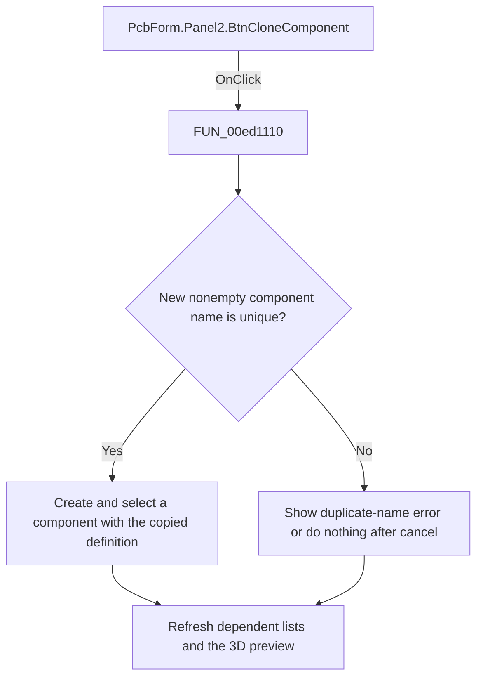

# Copy component

> Analysis status: Reviewed: the handler copies the selected component definition to a new unique component name.

## Control

| Property | Recovered value |
| --- | --- |
| Form | PcbForm |
| Form caption | PCB information for SPICE macro components |
| Component path | PcbForm.Panel2.BtnCloneComponent |
| Control class | TBitBtn |
| Caption | Copy |
| Hint | Not present |
| Handler name | BtnCloneComponentClick |
| Handler address | 00ed1110 |
| Graph node | `resource:dfm:PcbForm/PcbForm.Panel2.BtnCloneComponent` |
| Handler node | `function:00ed1110` |
| Graph layer | UI |

## What happens when clicked

1. The handler reads the selected component and asks `FUN_00ebd270` for a new component name.
2. If the returned name is nonempty and the backend reports that it does not exist, the handler reads the selected definition, adds and selects the new list entry, and creates the new backend component with the copied definition.
3. It then refreshes component-dependent lists, enabled controls, and the 3D preview. A duplicate name shows localized message 0x846. Canceling the prompt or returning an empty name is a no-op.

## Click flow

## Handler and call-path evidence

- [`FUN_00ed1110`](../../../DecompiledSources/Tina16/functions/0000000000ED1110__FUN_00ed1110.c) — Clone a PCB component definition.
- [`FUN_00ebd270`](../../../DecompiledSources/Tina16/functions/0000000000EBD270__FUN_00ebd270.c) — prompt and normalize a component name.
- [`FUN_00eccc30`](../../../DecompiledSources/Tina16/functions/0000000000ECCC30__FUN_00eccc30.c) — refresh component-dependent selections.
- [`FUN_00ecbca0`](../../../DecompiledSources/Tina16/functions/0000000000ECBCA0__FUN_00ecbca0.c) — refresh PCB form control availability.

## Resource and glyph evidence

- Recovered form resource: [`ui-evidence.json`](../../../DecompiledSources/Tina16/resources/dfm/ui-evidence.json).

## Inputs, outputs, and limits

- Input: an OnClick event from `PcbForm.Panel2.BtnCloneComponent`, plus the current form selections and state described above.
- State change: Prompts for a unique name, creates a new component with the selected definition, selects it, and refreshes dependent PCB controls.
- Error or no-op behavior: The decision branches above identify the recovered validation, cancel, confirmation, boundary, or no-op path.
- Analysis limit: The text of localized duplicate-name message 0x846 is not recovered here.

