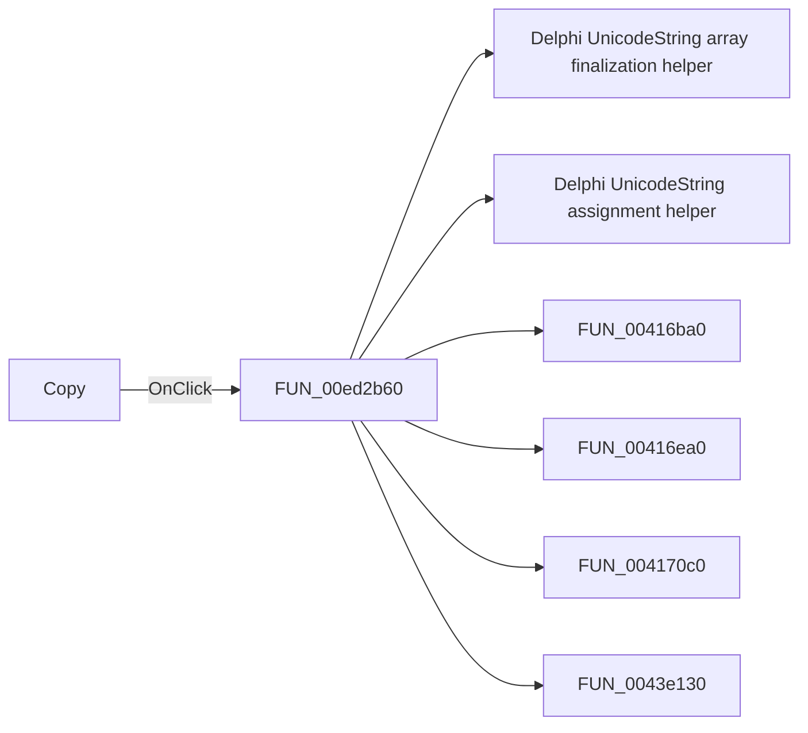

# Copy

> Analysis status: Pending individual source review.

## Control

| Property | Recovered value |
| --- | --- |
| Form | PcbForm |
| Component path | PcbForm.Panel2.BtnCloneModule |
| Control class | TBitBtn |
| Caption | Copy |
| Hint | Not present in the recovered resource. |
| Text | Not present in the recovered resource. |
| Handler name | BtnCloneModuleClick |
| Handler address | 00ed2b60 |
| Graph node | `resource:dfm:PcbForm/PcbForm.Panel2.BtnCloneModule` |
| Handler node | `function:00ed2b60` |
| Graph layer | UI |

## What happens when clicked

Pending individual analysis. An agent must read the recovered handler source and its relevant callees before it replaces this text.

## Click flow

## Handler evidence

- Source: [DecompiledSources/Tina16/functions/0000000000ED2B60__FUN_00ed2b60.c](../../../DecompiledSources/Tina16/functions/0000000000ED2B60__FUN_00ed2b60.c)
- Recovered role: Not present in the recovered resource.
- Current graph summary: Handles 1 Delphi UI event: PcbForm.Panel2.BtnCloneModule.OnClick.
- Current graph behavior: Not present in the recovered resource.
- Current graph evidence: Not present in the recovered resource.
- Complexity: complex
- Distinct outgoing calls: 16

## Direct calls

- `function:00414560` — Delphi UnicodeString array finalization helper
- `function:00414ad0` — Delphi UnicodeString assignment helper
- `function:00416ba0` — FUN_00416ba0
- `function:00416ea0` — FUN_00416ea0
- `function:004170c0` — FUN_004170c0
- `function:0043e130` — FUN_0043e130
- `function:0043ea00` — FUN_0043ea00
- `function:00442f70` — FUN_00442f70
- `function:0072d440` — FUN_0072d440
- `function:00b89270` — FUN_00b89270
- `function:00b8e520` — FUN_00b8e520
- `function:00ea9ca0` — FUN_00ea9ca0
- `function:00ea9ef0` — FUN_00ea9ef0
- `function:00ebb850` — FUN_00ebb850
- `function:00ecbca0` — FUN_00ecbca0
- `function:00eccc30` — FUN_00eccc30

## Resource evidence

- Kind: Not present in the recovered resource.
- Modal result: Not present in the recovered resource.
- Checked state: Not present in the recovered resource.
- List items: Not present in the recovered resource.
- Image reference: Not present in the recovered resource.
- Extracted glyph: None.

## Nearby label candidates

Nearby labels are layout candidates only. They are not proof of behavior.

- Rank 1: Footprint list: at distance 260.
- Rank 2: Component list: at distance 421.
- Rank 3: 3D component view: at distance 425.

## Analysis limits

- Do not infer behavior from the control class, caption, hint, glyph, or nearby label alone.
- Do not replace the pending status until the handler source and relevant call path provide enough evidence.
