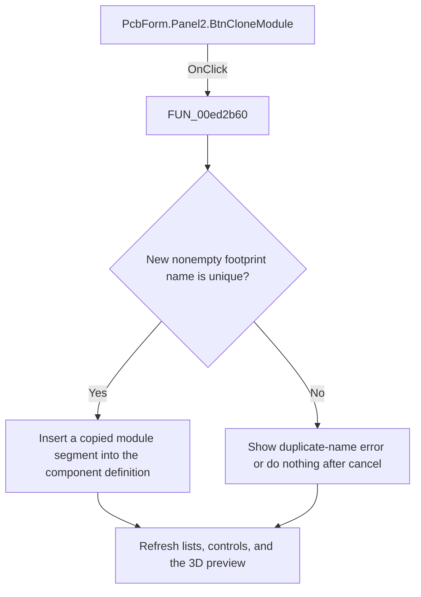

# Copy footprint

> Analysis status: Reviewed: the handler inserts a copied footprint or module definition under a new unique name.

## Control

| Property | Recovered value |
| --- | --- |
| Form | PcbForm |
| Form caption | PCB information for SPICE macro components |
| Component path | PcbForm.Panel2.BtnCloneModule |
| Control class | TBitBtn |
| Caption | Copy |
| Hint | Not present |
| Handler name | BtnCloneModuleClick |
| Handler address | 00ed2b60 |
| Graph node | `resource:dfm:PcbForm/PcbForm.Panel2.BtnCloneModule` |
| Handler node | `function:00ed2b60` |
| Graph layer | UI |

## What happens when clicked

1. The handler reads the selected component, selected footprint or module, and serialized component definition. It asks `FUN_00ebb850` for a new module name.
2. If the name is nonempty and absent from the footprint list, the handler splices a copied module segment with the new name into the component definition and writes the updated definition to the backend.
3. It keeps the original module, then refreshes the lists, enabled controls, and 3D preview. A duplicate name shows localized message 0x845. Canceling the prompt is a no-op.

## Click flow

## Handler and call-path evidence

- [`FUN_00ed2b60`](../../../DecompiledSources/Tina16/functions/0000000000ED2B60__FUN_00ed2b60.c) — Clone a PCB footprint definition.
- [`FUN_00ebb850`](../../../DecompiledSources/Tina16/functions/0000000000EBB850__FUN_00ebb850.c) — prompt for a footprint or module name.
- [`FUN_00ecc490`](../../../DecompiledSources/Tina16/functions/0000000000ECC490__FUN_00ecc490.c) — rebuild the selected footprint node map.
- [`FUN_00ecbca0`](../../../DecompiledSources/Tina16/functions/0000000000ECBCA0__FUN_00ecbca0.c) — refresh PCB form control availability.

## Resource and glyph evidence

- Recovered form resource: [`ui-evidence.json`](../../../DecompiledSources/Tina16/resources/dfm/ui-evidence.json).

## Inputs, outputs, and limits

- Input: an OnClick event from `PcbForm.Panel2.BtnCloneModule`, plus the current form selections and state described above.
- State change: Prompts for a unique footprint or module name, inserts a copied segment into the selected component definition, and refreshes the UI.
- Error or no-op behavior: The decision branches above identify the recovered validation, cancel, confirmation, boundary, or no-op path.
- Analysis limit: The source uses both case and module concepts for this serialized PCB segment; this article calls the user-facing list item a footprint or module.

