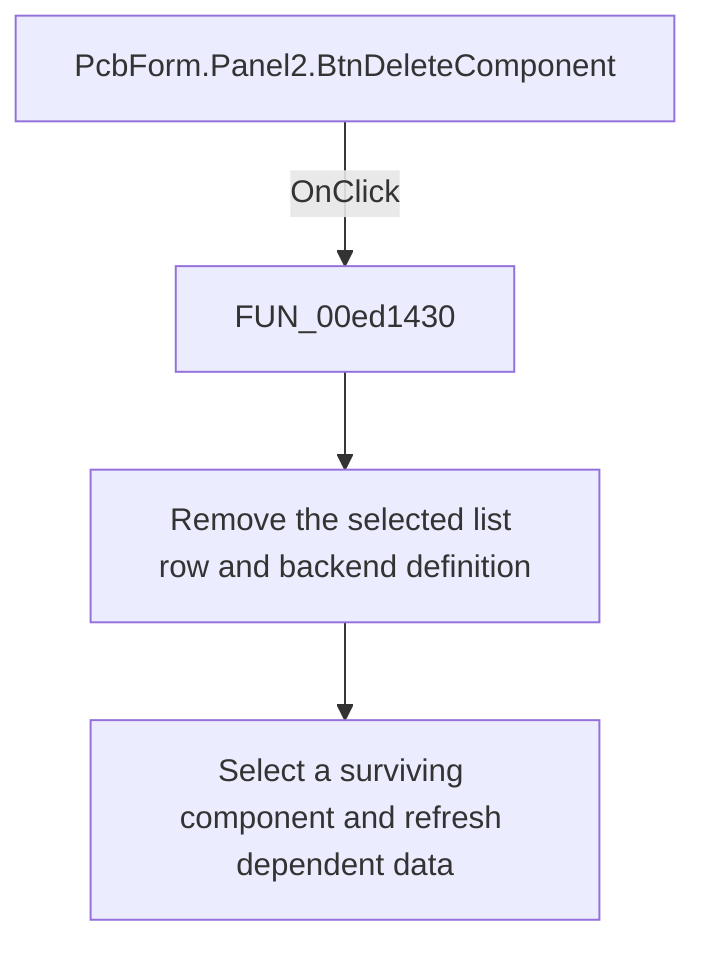

# Delete component

> Analysis status: Reviewed: the handler deletes the selected component definition and refreshes dependent PCB data.

## Control

| Property | Recovered value |
| --- | --- |
| Form | PcbForm |
| Form caption | PCB information for SPICE macro components |
| Component path | PcbForm.Panel2.BtnDeleteComponent |
| Control class | TBitBtn |
| Caption | Delete |
| Hint | Not present |
| Handler name | BtnDeleteComponentClick |
| Handler address | 00ed1430 |
| Graph node | `resource:dfm:PcbForm/PcbForm.Panel2.BtnDeleteComponent` |
| Handler node | `function:00ed1430` |
| Graph layer | UI |

## What happens when clicked

1. The handler reads the selected component and its list index, removes the list entry, and selects the item now at that index or the preceding item when the deleted entry was last.
2. It invokes the backend delete operation for the selected component definition. It then rebuilds the footprint and node-map lists, refreshes enabled controls, and updates the 3D preview.
3. The body has no confirmation dialog. The shared enabled-state function normally disables this button when the component list is empty.

## Click flow

## Handler and call-path evidence

- [`FUN_00ed1430`](../../../DecompiledSources/Tina16/functions/0000000000ED1430__FUN_00ed1430.c) — Delete the selected PCB component.
- [`FUN_00eccc30`](../../../DecompiledSources/Tina16/functions/0000000000ECCC30__FUN_00eccc30.c) — refresh component-dependent selections.
- [`FUN_00ecbca0`](../../../DecompiledSources/Tina16/functions/0000000000ECBCA0__FUN_00ecbca0.c) — refresh PCB form control availability.
- [`FUN_00ed3a60`](../../../DecompiledSources/Tina16/functions/0000000000ED3A60__FUN_00ed3a60.c) — refresh the selected 3D footprint view.

## Resource and glyph evidence

- Recovered form resource: [`ui-evidence.json`](../../../DecompiledSources/Tina16/resources/dfm/ui-evidence.json).

## Inputs, outputs, and limits

- Input: an OnClick event from `PcbForm.Panel2.BtnDeleteComponent`, plus the current form selections and state described above.
- State change: Removes the selected component from the list and backend, selects a surviving row, and refreshes dependent footprint, node-map, and 3D state.
- Error or no-op behavior: The decision branches above identify the recovered validation, cancel, confirmation, boundary, or no-op path.
- Analysis limit: The backend delete method is an indirect virtual call, so its Delphi method name is not recovered.

