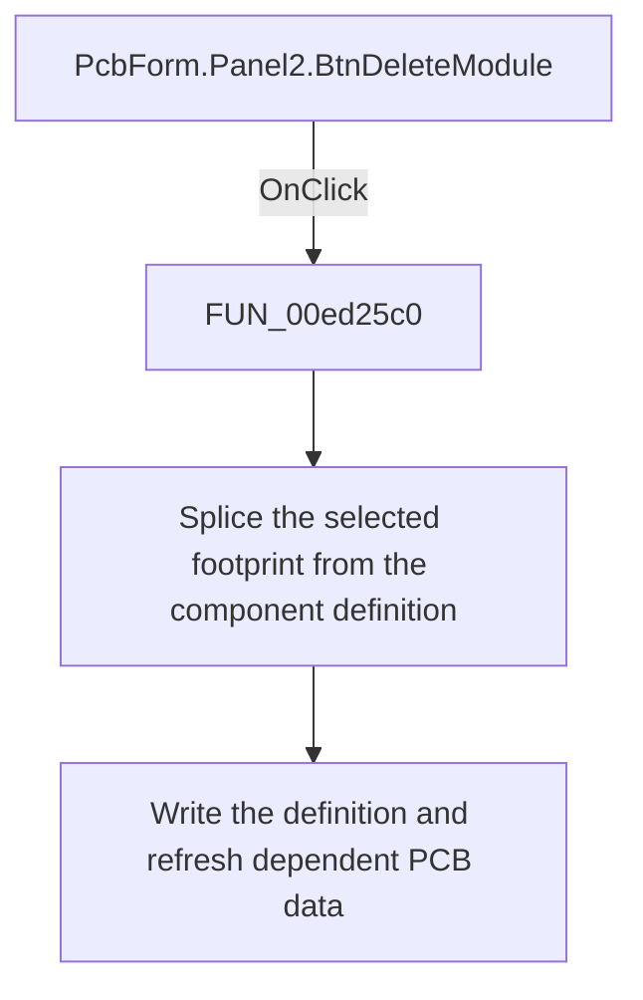

# Delete footprint

> Analysis status: Reviewed: the handler removes the selected footprint or module segment from the component definition.

## Control

| Property | Recovered value |
| --- | --- |
| Form | PcbForm |
| Form caption | PCB information for SPICE macro components |
| Component path | PcbForm.Panel2.BtnDeleteModule |
| Control class | TBitBtn |
| Caption | Delete |
| Hint | Not present |
| Handler name | BtnDeleteModuleClick |
| Handler address | 00ed25c0 |
| Graph node | `resource:dfm:PcbForm/PcbForm.Panel2.BtnDeleteModule` |
| Handler node | `function:00ed25c0` |
| Graph layer | UI |

## What happens when clicked

1. The handler reads the selected component and footprint names and calls `FUN_00ed2f60` with its clear-current-selection flag set.
2. `FUN_00ed2f60` locates the selected module segment in the serialized component definition, removes its name and parenthesized pin mapping with the required delimiter adjustment, and clears the saved current-footprint field when it matches the deleted item.
3. The updated definition is written to the backend. The handler then refreshes lists, enabled controls, node mappings, and the 3D preview. No confirmation dialog is present.

## Click flow

## Handler and call-path evidence

- [`FUN_00ed25c0`](../../../DecompiledSources/Tina16/functions/0000000000ED25C0__FUN_00ed25c0.c) — Delete the selected PCB footprint definition.
- [`FUN_00ed2f60`](../../../DecompiledSources/Tina16/functions/0000000000ED2F60__FUN_00ed2f60.c) — remove one footprint or module segment.
- [`FUN_00ecc490`](../../../DecompiledSources/Tina16/functions/0000000000ECC490__FUN_00ecc490.c) — rebuild the selected footprint node map.
- [`FUN_00ecbca0`](../../../DecompiledSources/Tina16/functions/0000000000ECBCA0__FUN_00ecbca0.c) — refresh PCB form control availability.

## Resource and glyph evidence

- Recovered form resource: [`ui-evidence.json`](../../../DecompiledSources/Tina16/resources/dfm/ui-evidence.json).

## Inputs, outputs, and limits

- Input: an OnClick event from `PcbForm.Panel2.BtnDeleteModule`, plus the current form selections and state described above.
- State change: Removes the selected footprint or module segment from its component definition, clears a matching saved selection, writes the result, and refreshes the UI.
- Error or no-op behavior: The decision branches above identify the recovered validation, cancel, confirmation, boundary, or no-op path.
- Analysis limit: The backend exposes the definition through virtual calls whose Delphi names are not recovered.

