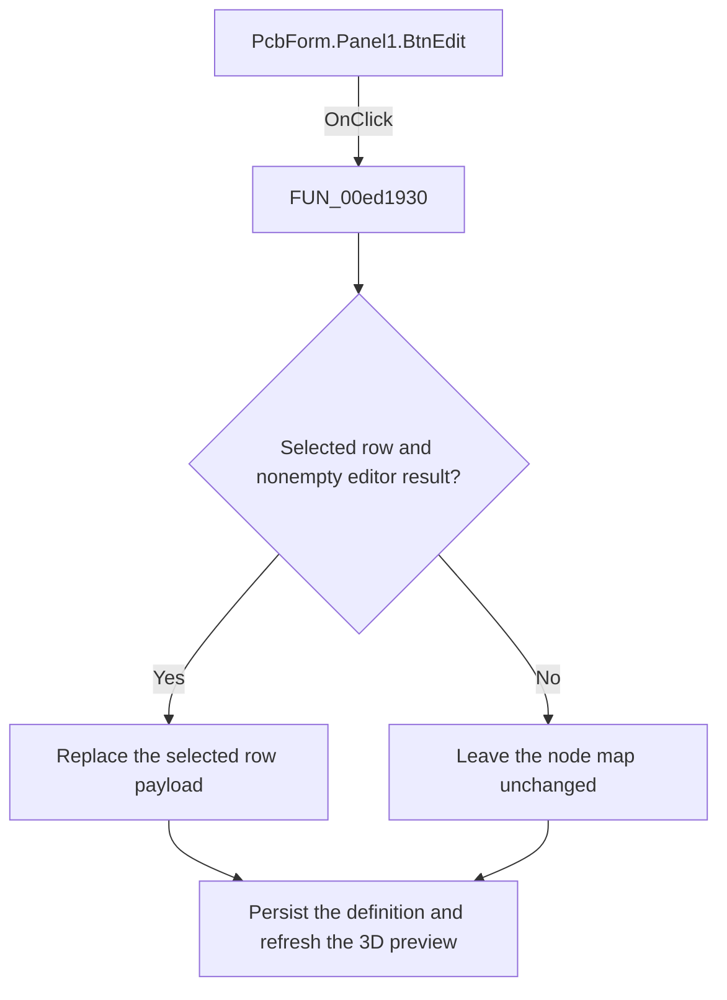

# Change

> Analysis status: Reviewed: the handler edits the selected node-mapping row and persists the result.

## Control

| Property | Recovered value |
| --- | --- |
| Form | PcbForm |
| Form caption | PCB information for SPICE macro components |
| Component path | PcbForm.Panel1.BtnEdit |
| Control class | TBitBtn |
| Caption | &Change |
| Hint | Not present |
| Handler name | BtnEditClick |
| Handler address | 00ed1930 |
| Graph node | `resource:dfm:PcbForm/PcbForm.Panel1.BtnEdit` |
| Handler node | `function:00ed1930` |
| Graph layer | UI |

## What happens when clicked

1. The handler reads the selected node-map index and opens `FUN_00ec9120` in edit mode with the current mapping list and the recovered maximum part count.
2. If the editor returns a nonempty value and a row is selected, the handler preserves the row's ordinal prefix and replaces only its mapping payload.
3. It persists the selected component and footprint definition through `FUN_00ed3300` and refreshes the 3D preview. A canceled editor, empty result, or missing selection is a no-op.

## Click flow

## Handler and call-path evidence

- [`FUN_00ed1930`](../../../DecompiledSources/Tina16/functions/0000000000ED1930__FUN_00ed1930.c) — Edit the selected PCB node mapping.
- [`FUN_00ec9120`](../../../DecompiledSources/Tina16/functions/0000000000EC9120__FUN_00ec9120.c) — edit a node-mapping row.
- [`FUN_00ed3300`](../../../DecompiledSources/Tina16/functions/0000000000ED3300__FUN_00ed3300.c) — persist the selected PCB definition.

## Resource and glyph evidence

- Recovered form resource: [`ui-evidence.json`](../../../DecompiledSources/Tina16/resources/dfm/ui-evidence.json).

## Inputs, outputs, and limits

- Input: an OnClick event from `PcbForm.Panel1.BtnEdit`, plus the current form selections and state described above.
- State change: Prompts for an edited node mapping, preserves the row ordinal, persists a nonempty result, and refreshes the 3D preview.
- Error or no-op behavior: The decision branches above identify the recovered validation, cancel, confirmation, boundary, or no-op path.
- Analysis limit: The serialized row delimiters are recovered as constants but not as named fields.

