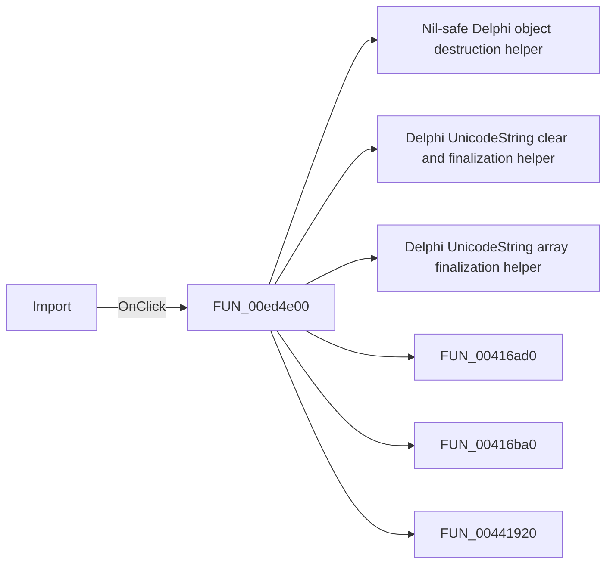

# Import

> Analysis status: Pending individual source review.

## Control

| Property | Recovered value |
| --- | --- |
| Form | PcbForm |
| Component path | PcbForm.Panel2.BtnImportComponent |
| Control class | TBitBtn |
| Caption | Import |
| Hint | Not present in the recovered resource. |
| Text | Not present in the recovered resource. |
| Handler name | BtnImportComponentClick |
| Handler address | 00ed4e00 |
| Graph node | `resource:dfm:PcbForm/PcbForm.Panel2.BtnImportComponent` |
| Handler node | `function:00ed4e00` |
| Graph layer | UI |

## What happens when clicked

Pending individual analysis. An agent must read the recovered handler source and its relevant callees before it replaces this text.

## Click flow

## Handler evidence

- Source: [DecompiledSources/Tina16/functions/0000000000ED4E00__FUN_00ed4e00.c](../../../DecompiledSources/Tina16/functions/0000000000ED4E00__FUN_00ed4e00.c)
- Recovered role: Not present in the recovered resource.
- Current graph summary: Handles 1 Delphi UI event: PcbForm.Panel2.BtnImportComponent.OnClick.
- Current graph behavior: Not present in the recovered resource.
- Current graph evidence: Not present in the recovered resource.
- Complexity: complex
- Distinct outgoing calls: 15

## Direct calls

- `function:00410f20` — Nil-safe Delphi object destruction helper
- `function:00414480` — Delphi UnicodeString clear and finalization helper
- `function:00414560` — Delphi UnicodeString array finalization helper
- `function:00416ad0` — FUN_00416ad0
- `function:00416ba0` — FUN_00416ba0
- `function:00441920` — FUN_00441920
- `function:005dc9d0` — FUN_005dc9d0
- `function:0064dd90` — VCL control Unicode text reader
- `function:0064de00` — VCL control text setter with change suppression
- `function:0068bca0` — FUN_0068bca0
- `function:00724270` — FUN_00724270
- `function:00724420` — FUN_00724420
- `function:007fc180` — FUN_007fc180
- `function:00eab320` — FUN_00eab320
- `function:00ece0d0` — Handles 1 Delphi UI event: PcbForm.Panel2.cbxShowAllComp.OnClick.

## Resource evidence

- Kind: Not present in the recovered resource.
- Modal result: Not present in the recovered resource.
- Checked state: Not present in the recovered resource.
- List items: Not present in the recovered resource.
- Image reference: Not present in the recovered resource.
- Extracted glyph: None.

## Nearby label candidates

Nearby labels are layout candidates only. They are not proof of behavior.

- Rank 1: Component list: at distance 279.
- Rank 2: Footprint list: at distance 460.
- Rank 3: 3D component view: at distance 625.

## Analysis limits

- Do not infer behavior from the control class, caption, hint, glyph, or nearby label alone.
- Do not replace the pending status until the handler source and relevant call path provide enough evidence.
