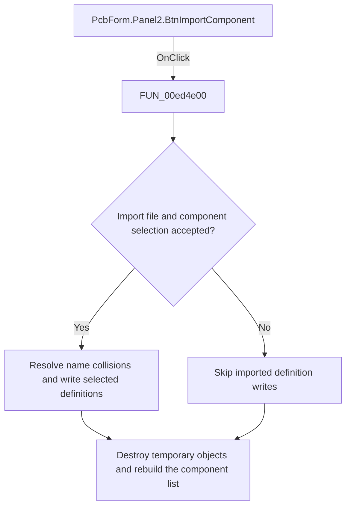

# Import component

> Analysis status: Reviewed: the handler imports selected component definitions from a user-selected file and rebuilds the component list.

## Control

| Property | Recovered value |
| --- | --- |
| Form | PcbForm |
| Form caption | PCB information for SPICE macro components |
| Component path | PcbForm.Panel2.BtnImportComponent |
| Control class | TBitBtn |
| Caption | Import |
| Hint | Not present |
| Handler name | BtnImportComponentClick |
| Handler address | 00ed4e00 |
| Graph node | `resource:dfm:PcbForm/PcbForm.Panel2.BtnImportComponent` |
| Handler node | `function:00ed4e00` |
| Graph layer | UI |

## What happens when clicked

1. The handler executes its import-file dialog. When accepted, it constructs a parser and a component-selection modal form, loads the selected file in the current PCB-library context, and shows the selection form.
2. If the selection form returns result 1, the handler iterates the selected imported components. `FUN_00eab320` handles name collisions: it finds a free numeric suffix, asks the user about the proposed replacement name through localized message 0x847, and returns the dialog result.
3. A result of 6 writes the imported definition under the accepted name. A result of 2 stops the import loop. After cleanup, the handler calls the component-filter handler to rebuild the component list, including after dialog cancellation.

## Click flow

## Handler and call-path evidence

- [`FUN_00ed4e00`](../../../DecompiledSources/Tina16/functions/0000000000ED4E00__FUN_00ed4e00.c) — Import PCB component definitions.
- [`FUN_00eab320`](../../../DecompiledSources/Tina16/functions/0000000000EAB320__FUN_00eab320.c) — resolve an imported component-name collision.
- [`FUN_00ecc070`](../../../DecompiledSources/Tina16/functions/0000000000ECC070__FUN_00ecc070.c) — rebuild the component list.
- [`FUN_00ece0d0`](../../../DecompiledSources/Tina16/functions/0000000000ECE0D0__FUN_00ece0d0.c) — apply the current component filter.

## Resource and glyph evidence

- Recovered form resource: [`ui-evidence.json`](../../../DecompiledSources/Tina16/resources/dfm/ui-evidence.json).

## Inputs, outputs, and limits

- Input: an OnClick event from `PcbForm.Panel2.BtnImportComponent`, plus the current form selections and state described above.
- State change: Loads a selected import file, lets the user select components, resolves duplicate names, writes accepted definitions, and rebuilds the component list.
- Error or no-op behavior: The decision branches above identify the recovered validation, cancel, confirmation, boundary, or no-op path.
- Analysis limit: The selected import file format and localized message 0x847 text are not identified by recovered resource strings.

