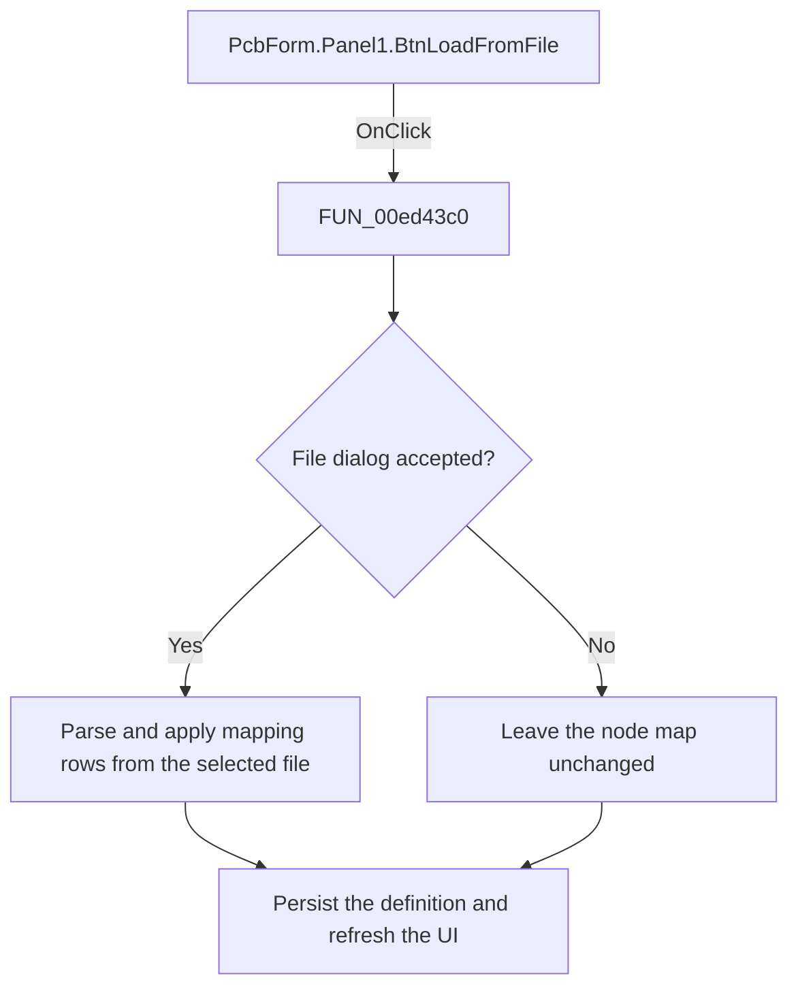

# Load

> Analysis status: Reviewed: the handler loads node mappings from a selected text file and applies them to the current PCB definition.

## Control

| Property | Recovered value |
| --- | --- |
| Form | PcbForm |
| Form caption | PCB information for SPICE macro components |
| Component path | PcbForm.Panel1.BtnLoadFromFile |
| Control class | TBitBtn |
| Caption | Load... |
| Hint | Not present |
| Handler name | BtnLoadFromFileClick |
| Handler address | 00ed43c0 |
| Graph node | `resource:dfm:PcbForm/PcbForm.Panel1.BtnLoadFromFile` |
| Handler node | `function:00ed43c0` |
| Graph layer | UI |

## What happens when clicked

1. The handler initializes the form's open-file dialog from recovered global path and file-name values. If the user accepts the dialog, it passes the selected file to `FUN_00ed4890`.
2. `FUN_00ed4890` reads the text file, parses its lines into temporary string lists, clears the visible node map, matches file tokens to the current definition, and replaces or appends mapping rows.
3. The loader persists the result through `FUN_00ed3300`, then refreshes controls and the 3D preview. Canceling the file dialog leaves the mappings unchanged. No local exception handler is visible around file I/O or parsing.

## Click flow

## Handler and call-path evidence

- [`FUN_00ed43c0`](../../../DecompiledSources/Tina16/functions/0000000000ED43C0__FUN_00ed43c0.c) — Load PCB node mappings from a file.
- [`FUN_00ed4890`](../../../DecompiledSources/Tina16/functions/0000000000ED4890__FUN_00ed4890.c) — parse and apply a node-mapping text file.
- [`FUN_00ed3300`](../../../DecompiledSources/Tina16/functions/0000000000ED3300__FUN_00ed3300.c) — persist the selected PCB definition.

## Resource and glyph evidence

- Recovered form resource: [`ui-evidence.json`](../../../DecompiledSources/Tina16/resources/dfm/ui-evidence.json).

## Inputs, outputs, and limits

- Input: an OnClick event from `PcbForm.Panel1.BtnLoadFromFile`, plus the current form selections and state described above.
- State change: Opens a file picker and, when accepted, parses mapping rows into the current component and footprint definition before refreshing the UI.
- Error or no-op behavior: The decision branches above identify the recovered validation, cancel, confirmation, boundary, or no-op path.
- Analysis limit: The open-dialog resource does not expose a user-facing file-format name, and the parser has no recovered local error message.

