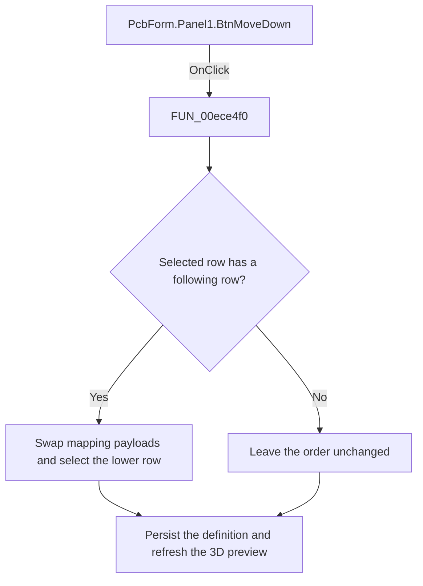

# Move Down

> Analysis status: Reviewed: the handler moves the selected node-mapping payload down by one row.

## Control

| Property | Recovered value |
| --- | --- |
| Form | PcbForm |
| Form caption | PCB information for SPICE macro components |
| Component path | PcbForm.Panel1.BtnMoveDown |
| Control class | TBitBtn |
| Caption | Move D&own |
| Hint | Not present |
| Handler name | BtnMoveDownClick |
| Handler address | 00ece4f0 |
| Graph node | `resource:dfm:PcbForm/PcbForm.Panel1.BtnMoveDown` |
| Handler node | `function:00ece4f0` |
| Graph layer | UI |

## What happens when clicked

1. The handler requires a selected row before the last item. It parses that row and the next row, exchanges their mapping payloads while keeping each position's ordinal prefix, and selects the lower row.
2. It persists the reordered component and footprint definition through `FUN_00ed3300` and refreshes the 3D preview. A missing selection or last-row selection is a no-op.

## Click flow

## Handler and call-path evidence

- [`FUN_00ece4f0`](../../../DecompiledSources/Tina16/functions/0000000000ECE4F0__FUN_00ece4f0.c) — Move a PCB node mapping down.
- [`FUN_00ed3300`](../../../DecompiledSources/Tina16/functions/0000000000ED3300__FUN_00ed3300.c) — persist the selected PCB definition.

## Resource and glyph evidence

- Recovered form resource: [`ui-evidence.json`](../../../DecompiledSources/Tina16/resources/dfm/ui-evidence.json).

## Inputs, outputs, and limits

- Input: an OnClick event from `PcbForm.Panel1.BtnMoveDown`, plus the current form selections and state described above.
- State change: Moves the selected node-mapping payload down one position, preserves row ordinals, persists the definition, and refreshes the 3D preview.
- Error or no-op behavior: The decision branches above identify the recovered validation, cancel, confirmation, boundary, or no-op path.
- Analysis limit: The handler reorders serialized row payloads; the constant delimiter names are not recovered.

