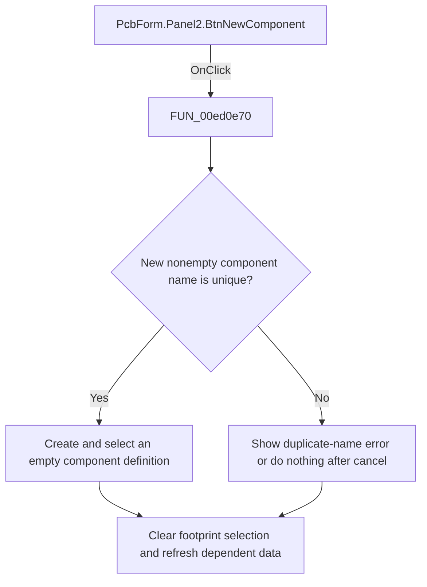

# Add component

> Analysis status: Reviewed: the handler creates an empty PCB component definition under a new unique name.

## Control

| Property | Recovered value |
| --- | --- |
| Form | PcbForm |
| Form caption | PCB information for SPICE macro components |
| Component path | PcbForm.Panel2.BtnNewComponent |
| Control class | TBitBtn |
| Caption | Add |
| Hint | Not present |
| Handler name | BtnNewComponentClick |
| Handler address | 00ed0e70 |
| Graph node | `resource:dfm:PcbForm/PcbForm.Panel2.BtnNewComponent` |
| Handler node | `function:00ed0e70` |
| Graph layer | UI |

## What happens when clicked

1. The handler starts with the saved current component name. When the recovered suffix flag is set, it removes trailing digits before it asks `FUN_00ebd270` to normalize or edit the proposed name.
2. If the result is nonempty and the backend reports that it does not exist, the handler adds and selects the name, stores it as the current component, and creates a backend component with no footprint definition. It clears the current-footprint field and refreshes dependent lists and the 3D preview.
3. A duplicate name shows localized message 0x846. Canceling the name prompt is a no-op.

## Click flow

## Handler and call-path evidence

- [`FUN_00ed0e70`](../../../DecompiledSources/Tina16/functions/0000000000ED0E70__FUN_00ed0e70.c) — Create a PCB component definition.
- [`FUN_00ebd270`](../../../DecompiledSources/Tina16/functions/0000000000EBD270__FUN_00ebd270.c) — prompt and normalize a component name.
- [`FUN_00eccc30`](../../../DecompiledSources/Tina16/functions/0000000000ECCC30__FUN_00eccc30.c) — refresh component-dependent selections.
- [`FUN_00ed3a60`](../../../DecompiledSources/Tina16/functions/0000000000ED3A60__FUN_00ed3a60.c) — refresh the selected 3D footprint view.

## Resource and glyph evidence

- Recovered form resource: [`ui-evidence.json`](../../../DecompiledSources/Tina16/resources/dfm/ui-evidence.json).

## Inputs, outputs, and limits

- Input: an OnClick event from `PcbForm.Panel2.BtnNewComponent`, plus the current form selections and state described above.
- State change: Prompts for a unique component name, creates an empty backend definition, selects it, clears the current footprint, and refreshes dependent data.
- Error or no-op behavior: The decision branches above identify the recovered validation, cancel, confirmation, boundary, or no-op path.
- Analysis limit: The purpose of the recovered suffix flag is inferred only from its direct trailing-digit removal branch.

