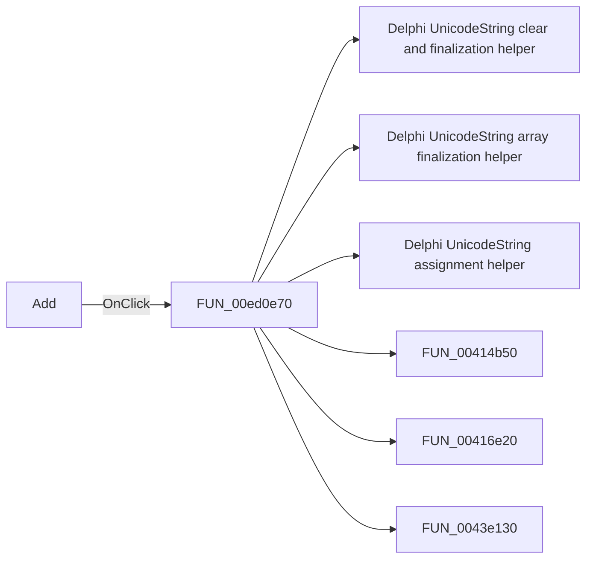

# Add

> Analysis status: Pending individual source review.

## Control

| Property | Recovered value |
| --- | --- |
| Form | PcbForm |
| Component path | PcbForm.Panel2.BtnNewComponent |
| Control class | TBitBtn |
| Caption | Add |
| Hint | Not present in the recovered resource. |
| Text | Not present in the recovered resource. |
| Handler name | BtnNewComponentClick |
| Handler address | 00ed0e70 |
| Graph node | `resource:dfm:PcbForm/PcbForm.Panel2.BtnNewComponent` |
| Handler node | `function:00ed0e70` |
| Graph layer | UI |

## What happens when clicked

Pending individual analysis. An agent must read the recovered handler source and its relevant callees before it replaces this text.

## Click flow

## Handler evidence

- Source: [DecompiledSources/Tina16/functions/0000000000ED0E70__FUN_00ed0e70.c](../../../DecompiledSources/Tina16/functions/0000000000ED0E70__FUN_00ed0e70.c)
- Recovered role: Not present in the recovered resource.
- Current graph summary: Handles 1 Delphi UI event: PcbForm.Panel2.BtnNewComponent.OnClick.
- Current graph behavior: Not present in the recovered resource.
- Current graph evidence: Not present in the recovered resource.
- Complexity: complex
- Distinct outgoing calls: 15

## Direct calls

- `function:00414480` — Delphi UnicodeString clear and finalization helper
- `function:00414560` — Delphi UnicodeString array finalization helper
- `function:00414ad0` — Delphi UnicodeString assignment helper
- `function:00414b50` — FUN_00414b50
- `function:00416e20` — FUN_00416e20
- `function:0043e130` — FUN_0043e130
- `function:00442f70` — FUN_00442f70
- `function:0072d440` — FUN_0072d440
- `function:00b89270` — FUN_00b89270
- `function:00b8e520` — FUN_00b8e520
- `function:00ea9ef0` — FUN_00ea9ef0
- `function:00ebd270` — FUN_00ebd270
- `function:00ecbca0` — FUN_00ecbca0
- `function:00ecc050` — FUN_00ecc050
- `function:00eccc30` — FUN_00eccc30

## Resource evidence

- Kind: Not present in the recovered resource.
- Modal result: Not present in the recovered resource.
- Checked state: Not present in the recovered resource.
- List items: Not present in the recovered resource.
- Image reference: Not present in the recovered resource.
- Extracted glyph: None.

## Nearby label candidates

Nearby labels are layout candidates only. They are not proof of behavior.

- Rank 1: Component list: at distance 233.
- Rank 2: Footprint list: at distance 414.
- Rank 3: 3D component view: at distance 579.

## Analysis limits

- Do not infer behavior from the control class, caption, hint, glyph, or nearby label alone.
- Do not replace the pending status until the handler source and relevant call path provide enough evidence.
