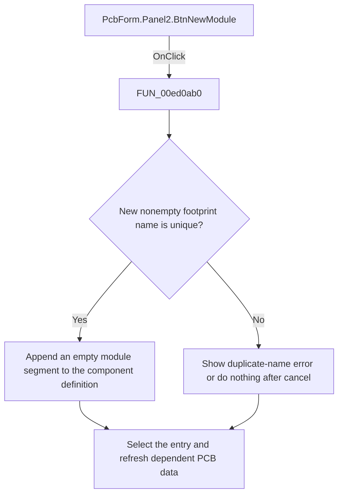

# Add footprint

> Analysis status: Reviewed: the handler adds an empty footprint or module segment to the selected component definition.

## Control

| Property | Recovered value |
| --- | --- |
| Form | PcbForm |
| Form caption | PCB information for SPICE macro components |
| Component path | PcbForm.Panel2.BtnNewModule |
| Control class | TBitBtn |
| Caption | Add |
| Hint | Not present |
| Handler name | BtnNewModuleClick |
| Handler address | 00ed0ab0 |
| Graph node | `resource:dfm:PcbForm/PcbForm.Panel2.BtnNewModule` |
| Handler node | `function:00ed0ab0` |
| Graph layer | UI |

## What happens when clicked

1. The handler calls `FUN_00ebb850` to request a module name. If the result is nonempty and absent from the footprint list, it adds and selects the new list entry and stores it as the current footprint when no current value exists.
2. It reads the selected component definition, appends a new named module segment with an empty parenthesized mapping, and writes the updated definition to the backend.
3. It stores the current serialized definition and refreshes node mappings, enabled controls, and the 3D preview. A duplicate name shows localized message 0x845. Canceling the prompt is a no-op.

## Click flow

## Handler and call-path evidence

- [`FUN_00ed0ab0`](../../../DecompiledSources/Tina16/functions/0000000000ED0AB0__FUN_00ed0ab0.c) — Create a PCB footprint definition.
- [`FUN_00ebb850`](../../../DecompiledSources/Tina16/functions/0000000000EBB850__FUN_00ebb850.c) — prompt for a footprint or module name.
- [`FUN_00ecc490`](../../../DecompiledSources/Tina16/functions/0000000000ECC490__FUN_00ecc490.c) — rebuild the selected footprint node map.
- [`FUN_00ecbca0`](../../../DecompiledSources/Tina16/functions/0000000000ECBCA0__FUN_00ecbca0.c) — refresh PCB form control availability.

## Resource and glyph evidence

- Recovered form resource: [`ui-evidence.json`](../../../DecompiledSources/Tina16/resources/dfm/ui-evidence.json).

## Inputs, outputs, and limits

- Input: an OnClick event from `PcbForm.Panel2.BtnNewModule`, plus the current form selections and state described above.
- State change: Prompts for a unique footprint or module name, appends an empty segment to the selected component definition, selects it, and refreshes the UI.
- Error or no-op behavior: The decision branches above identify the recovered validation, cancel, confirmation, boundary, or no-op path.
- Analysis limit: The recovered constants prove an empty parenthesized segment but do not expose formal field names for the serialization.

