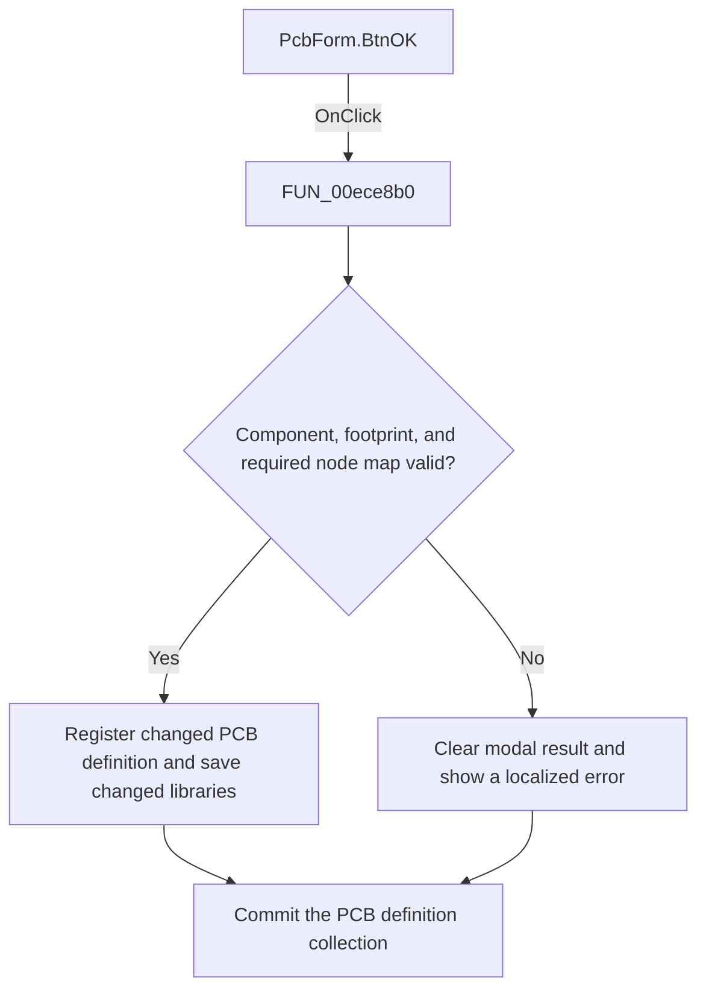

# OK

> Analysis status: Reviewed: the handler validates the PCB selection, updates the selected definition when needed, saves changed libraries, and accepts the dialog only when validation succeeds.

## Control

| Property | Recovered value |
| --- | --- |
| Form | PcbForm |
| Form caption | PCB information for SPICE macro components |
| Component path | PcbForm.BtnOK |
| Control class | TBitBtn |
| Caption | OK |
| Hint | Not present |
| Handler name | BtnOKClick |
| Handler address | 00ece8b0 |
| Graph node | `resource:dfm:PcbForm/PcbForm.BtnOK` |
| Handler node | `function:00ece8b0` |
| Graph layer | UI |

## What happens when clicked

1. The handler first requires both a selected component and a selected footprint or module. If either selection is missing, it resets the form modal result to zero and shows localized error 0x843.
2. For any selected footprint other than `NOPCB`, a positive part count also requires at least one node-mapping row. Failure resets the modal result and shows localized error 0x844.
3. After validation, it compares the current PCB definition with the selected values and calls `FUN_00eaec40` when the library-qualified definition must be registered or updated. It then calls `FUN_00eae940` to save changed libraries. That helper asks for confirmation before it writes the standard `TINA` library; a No response reloads that library instead. Finally, `FUN_00eaecd0` commits or closes the global definition collection.
4. The button resource requests modal result 1. The handler preserves that result on success and explicitly clears it on validation failure.

## Click flow

## Handler and call-path evidence

- [`FUN_00ece8b0`](../../../DecompiledSources/Tina16/functions/0000000000ECE8B0__FUN_00ece8b0.c) — Validate and accept PCB library edits.
- [`FUN_00eaec40`](../../../DecompiledSources/Tina16/functions/0000000000EAEC40__FUN_00eaec40.c) — register or update the library-qualified PCB definition.
- [`FUN_00eae940`](../../../DecompiledSources/Tina16/functions/0000000000EAE940__FUN_00eae940.c) — save changed libraries with a standard-library warning.
- [`FUN_00eaecd0`](../../../DecompiledSources/Tina16/functions/0000000000EAECD0__FUN_00eaecd0.c) — commit or close the PCB definition collection.

## Resource and glyph evidence

- Button semantics: bkOK; ModalResult = 1; Default = true.
- Extracted glyph: [`0294_PcbForm_PcbForm_BtnOK_Glyph_Data.png`](../../../glyph/0294_PcbForm_PcbForm_BtnOK_Glyph_Data.png).
- Recovered form resource: [`ui-evidence.json`](../../../DecompiledSources/Tina16/resources/dfm/ui-evidence.json).

## Inputs, outputs, and limits

- Input: an OnClick event from `PcbForm.BtnOK`, plus the current form selections and state described above.
- State change: Validates component, footprint, and node-map selections; updates the selected PCB definition; saves changed libraries; and clears the OK modal result when validation fails.
- Error or no-op behavior: The decision branches above identify the recovered validation, cancel, confirmation, boundary, or no-op path.
- Analysis limit: The text of localized errors 0x843 and 0x844 is not recovered in this article.

