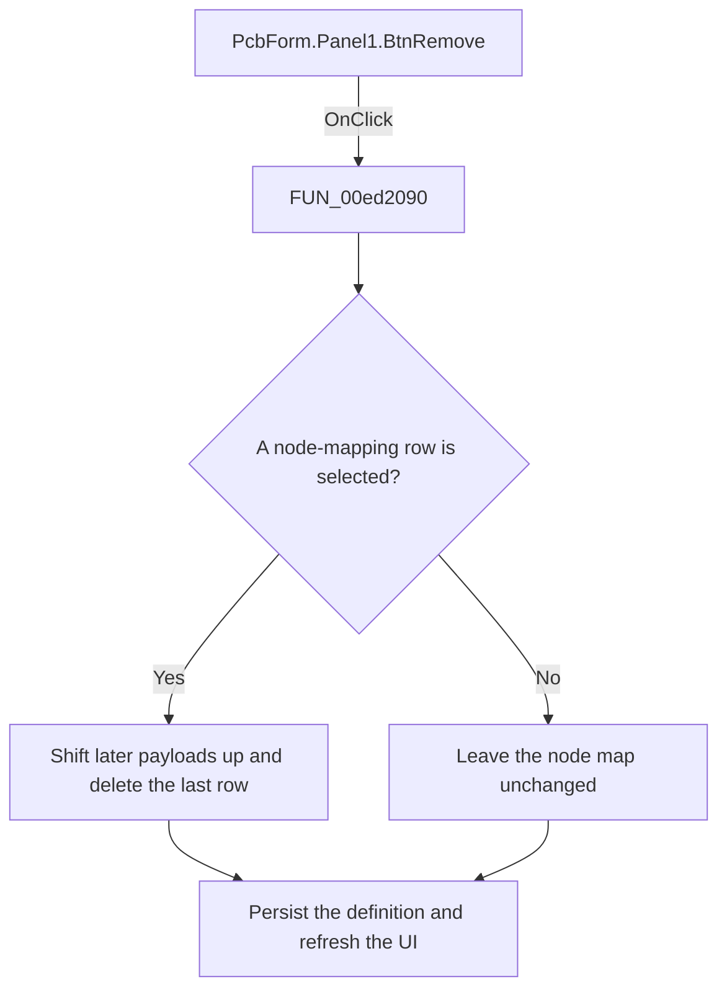

# Delete mapping

> Analysis status: Reviewed: the handler removes the selected node-mapping row and compacts the remaining payloads.

## Control

| Property | Recovered value |
| --- | --- |
| Form | PcbForm |
| Form caption | PCB information for SPICE macro components |
| Component path | PcbForm.Panel1.BtnRemove |
| Control class | TBitBtn |
| Caption | &Delete |
| Hint | Not present |
| Handler name | BtnRemoveClick |
| Handler address | 00ed2090 |
| Graph node | `resource:dfm:PcbForm/PcbForm.Panel1.BtnRemove` |
| Handler node | `function:00ed2090` |
| Graph layer | UI |

## What happens when clicked

1. The handler requires a selected node-map row. It shifts later mapping payloads upward while preserving each destination row's ordinal prefix, then deletes the final duplicate row.
2. It keeps the same selection index when another row occupies it; otherwise, it selects the preceding row. It persists the definition through `FUN_00ed3300` and refreshes controls and the 3D preview.
3. A missing selection is a no-op.

## Click flow

## Handler and call-path evidence

- [`FUN_00ed2090`](../../../DecompiledSources/Tina16/functions/0000000000ED2090__FUN_00ed2090.c) — Remove a PCB node mapping.
- [`FUN_00ed3300`](../../../DecompiledSources/Tina16/functions/0000000000ED3300__FUN_00ed3300.c) — persist the selected PCB definition.
- [`FUN_00ecbca0`](../../../DecompiledSources/Tina16/functions/0000000000ECBCA0__FUN_00ecbca0.c) — refresh PCB form control availability.

## Resource and glyph evidence

- Recovered form resource: [`ui-evidence.json`](../../../DecompiledSources/Tina16/resources/dfm/ui-evidence.json).

## Inputs, outputs, and limits

- Input: an OnClick event from `PcbForm.Panel1.BtnRemove`, plus the current form selections and state described above.
- State change: Removes the selected node-mapping payload, compacts later rows, selects a surviving row, persists the definition, and refreshes the UI.
- Error or no-op behavior: The decision branches above identify the recovered validation, cancel, confirmation, boundary, or no-op path.
- Analysis limit: The row-prefix and payload delimiters have no recovered Delphi names.

