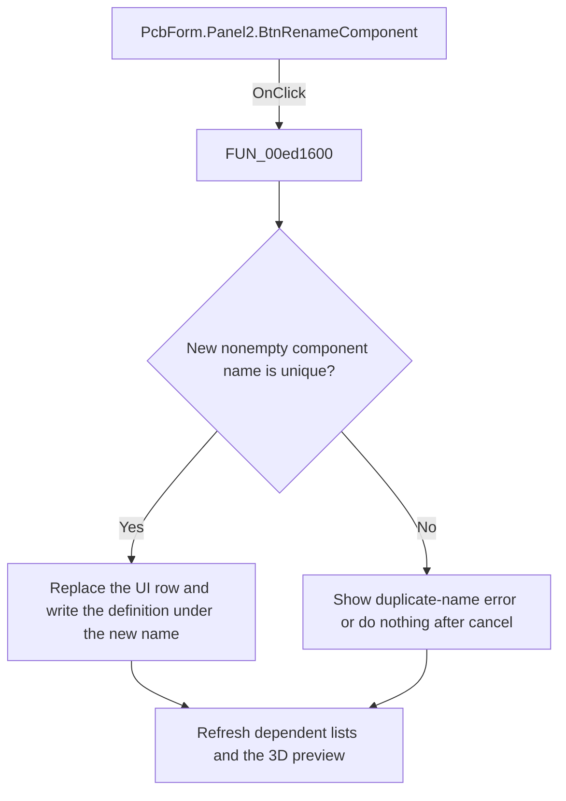

# Rename component

> Analysis status: Reviewed: the handler writes the selected definition under a new unique component name and replaces the visible list row.

## Control

| Property | Recovered value |
| --- | --- |
| Form | PcbForm |
| Form caption | PCB information for SPICE macro components |
| Component path | PcbForm.Panel2.BtnRenameComponent |
| Control class | TBitBtn |
| Caption | Rename |
| Hint | Not present |
| Handler name | BtnRenameComponentClick |
| Handler address | 00ed1600 |
| Graph node | `resource:dfm:PcbForm/PcbForm.Panel2.BtnRenameComponent` |
| Handler node | `function:00ed1600` |
| Graph layer | UI |

## What happens when clicked

1. The handler reads the selected component and asks `FUN_00ebd270` for a replacement name.
2. If the result is nonempty and absent from the backend, it reads the current definition, replaces the selected component-list text, and creates or updates the backend entry under the new name. It then refreshes dependent lists, controls, and the 3D preview.
3. A duplicate name shows localized message 0x846. Canceling the prompt is a no-op. The recovered body has no explicit backend call that deletes the old-name entry, so this article does not claim that the old backend key is removed.

## Click flow

## Handler and call-path evidence

- [`FUN_00ed1600`](../../../DecompiledSources/Tina16/functions/0000000000ED1600__FUN_00ed1600.c) — Rename a PCB component definition.
- [`FUN_00ebd270`](../../../DecompiledSources/Tina16/functions/0000000000EBD270__FUN_00ebd270.c) — prompt and normalize a component name.
- [`FUN_00eccc30`](../../../DecompiledSources/Tina16/functions/0000000000ECCC30__FUN_00eccc30.c) — refresh component-dependent selections.
- [`FUN_00ecbca0`](../../../DecompiledSources/Tina16/functions/0000000000ECBCA0__FUN_00ecbca0.c) — refresh PCB form control availability.

## Resource and glyph evidence

- Recovered form resource: [`ui-evidence.json`](../../../DecompiledSources/Tina16/resources/dfm/ui-evidence.json).

## Inputs, outputs, and limits

- Input: an OnClick event from `PcbForm.Panel2.BtnRenameComponent`, plus the current form selections and state described above.
- State change: Prompts for a unique name, replaces the selected list row, writes the existing definition under the new name, and refreshes dependent PCB data.
- Error or no-op behavior: The decision branches above identify the recovered validation, cancel, confirmation, boundary, or no-op path.
- Analysis limit: No explicit old-name backend deletion is visible; the semantics of the indirect create or update method cannot prove one.

