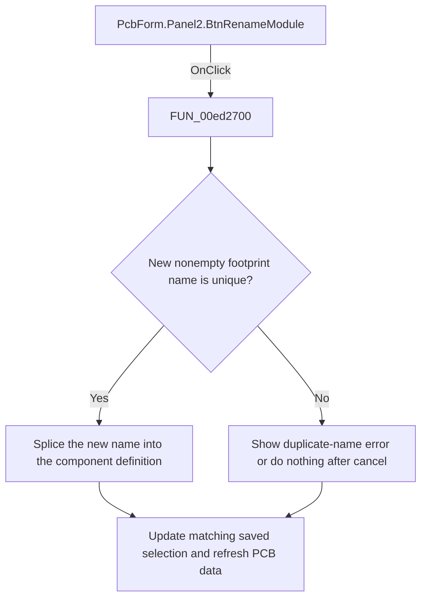

# Rename footprint

> Analysis status: Reviewed: the handler replaces the selected footprint or module name inside the serialized component definition.

## Control

| Property | Recovered value |
| --- | --- |
| Form | PcbForm |
| Form caption | PCB information for SPICE macro components |
| Component path | PcbForm.Panel2.BtnRenameModule |
| Control class | TBitBtn |
| Caption | Rename |
| Hint | Not present |
| Handler name | BtnRenameModuleClick |
| Handler address | 00ed2700 |
| Graph node | `resource:dfm:PcbForm/PcbForm.Panel2.BtnRenameModule` |
| Handler node | `function:00ed2700` |
| Graph layer | UI |

## What happens when clicked

1. The handler reads the selected component, selected footprint, and serialized definition. It isolates the selected module segment and asks `FUN_00ebb850` for a replacement name.
2. If the name is nonempty and absent from the footprint list, it splices the new name into the previous definition position. When the renamed item matches the saved current footprint, it also updates that saved value.
3. It writes the updated component definition and refreshes lists, controls, node mappings, and the 3D preview. A duplicate name shows localized message 0x845. Canceling the prompt is a no-op.

## Click flow

## Handler and call-path evidence

- [`FUN_00ed2700`](../../../DecompiledSources/Tina16/functions/0000000000ED2700__FUN_00ed2700.c) — Rename a PCB footprint definition.
- [`FUN_00ebb850`](../../../DecompiledSources/Tina16/functions/0000000000EBB850__FUN_00ebb850.c) — prompt for a footprint or module name.
- [`FUN_00ecc490`](../../../DecompiledSources/Tina16/functions/0000000000ECC490__FUN_00ecc490.c) — rebuild the selected footprint node map.
- [`FUN_00ed3a60`](../../../DecompiledSources/Tina16/functions/0000000000ED3A60__FUN_00ed3a60.c) — refresh the selected 3D footprint view.

## Resource and glyph evidence

- Recovered form resource: [`ui-evidence.json`](../../../DecompiledSources/Tina16/resources/dfm/ui-evidence.json).

## Inputs, outputs, and limits

- Input: an OnClick event from `PcbForm.Panel2.BtnRenameModule`, plus the current form selections and state described above.
- State change: Prompts for a unique footprint or module name, replaces it in the serialized component definition, updates a matching saved selection, and refreshes the UI.
- Error or no-op behavior: The decision branches above identify the recovered validation, cancel, confirmation, boundary, or no-op path.
- Analysis limit: The source uses case and module terminology for the same user-facing footprint list.

