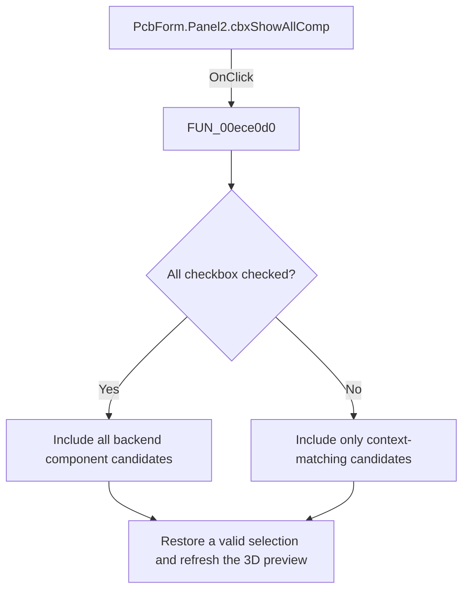

# All components

> Analysis status: Reviewed: the handler rebuilds the component list for either all components or the current context and tries to preserve the current selection.

## Control

| Property | Recovered value |
| --- | --- |
| Form | PcbForm |
| Form caption | PCB information for SPICE macro components |
| Component path | PcbForm.Panel2.cbxShowAllComp |
| Control class | TCheckBox |
| Caption | &All |
| Hint | Not present |
| Handler name | cbxShowAllCompClick |
| Handler address | 00ece0d0 |
| Graph node | `resource:dfm:PcbForm/PcbForm.Panel2.cbxShowAllComp` |
| Handler node | `function:00ece0d0` |
| Graph layer | UI |

## What happens when clicked

1. The handler copies the current component name and calls `FUN_00ecc070` with the checkbox state.
2. `FUN_00ecc070` clears the component, footprint, and node-map lists and resets the preview. It requests candidate components from the backend. When the checkbox is clear, it filters candidates against the current context after removing a numeric suffix; when checked, it includes all candidates.
3. The helper restores the previous component when it remains available. Otherwise, it selects the first available component. The click handler then calls `FUN_00ed3a60` to refresh the 3D preview.

## Click flow

## Handler and call-path evidence

- [`FUN_00ece0d0`](../../../DecompiledSources/Tina16/functions/0000000000ECE0D0__FUN_00ece0d0.c) — Toggle the PCB component-list filter.
- [`FUN_00ecc070`](../../../DecompiledSources/Tina16/functions/0000000000ECC070__FUN_00ecc070.c) — rebuild and filter the PCB component list.
- [`FUN_00ed3a60`](../../../DecompiledSources/Tina16/functions/0000000000ED3A60__FUN_00ed3a60.c) — refresh the selected 3D footprint view.

## Resource and glyph evidence

- Recovered form resource: [`ui-evidence.json`](../../../DecompiledSources/Tina16/resources/dfm/ui-evidence.json).

## Inputs, outputs, and limits

- Input: an OnClick event from `PcbForm.Panel2.cbxShowAllComp`, plus the current form selections and state described above.
- State change: Rebuilds the component list for all or context-matching candidates, preserves the current selection when possible, and refreshes dependent state.
- Error or no-op behavior: The decision branches above identify the recovered validation, cancel, confirmation, boundary, or no-op path.
- Analysis limit: The exact business name of the unchecked context key is not recovered, so the article does not call it a specific package or library filter.

