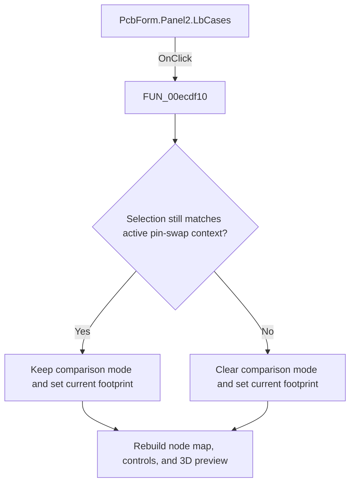

# Footprint list

> Analysis status: Reviewed: the handler makes the clicked footprint current and refreshes its node map, control state, and 3D preview.

## Control

| Property | Recovered value |
| --- | --- |
| Form | PcbForm |
| Form caption | PCB information for SPICE macro components |
| Component path | PcbForm.Panel2.LbCases |
| Control class | TListBox |
| Caption | Not present |
| Hint | Not present |
| Handler name | LbCasesClick |
| Handler address | 00ecdf10 |
| Graph node | `resource:dfm:PcbForm/PcbForm.Panel2.LbCases` |
| Handler node | `function:00ecdf10` |
| Graph layer | UI |

## What happens when clicked

1. When pin-swap comparison mode is active, the handler keeps that mode only if both the selected component and selected footprint still match the stored comparison component and footprint. A changed selection turns the mode off.
2. The handler copies the selected footprint text into the form's current-footprint field.
3. It calls `FUN_00ecc490` to rebuild the footprint node map, `FUN_00ed3a60` to refresh the 3D view, and `FUN_00ecbca0` to refresh enabled controls. The shared label `Footprint list:` confirms the list's UI context; behavior comes from the handler and callees.

## Click flow

## Handler and call-path evidence

- [`FUN_00ecdf10`](../../../DecompiledSources/Tina16/functions/0000000000ECDF10__FUN_00ecdf10.c) — Select a PCB footprint and refresh dependent data.
- [`FUN_00ecc490`](../../../DecompiledSources/Tina16/functions/0000000000ECC490__FUN_00ecc490.c) — rebuild the selected footprint node map.
- [`FUN_00ed3a60`](../../../DecompiledSources/Tina16/functions/0000000000ED3A60__FUN_00ed3a60.c) — refresh the selected 3D footprint view.
- [`FUN_00ecbca0`](../../../DecompiledSources/Tina16/functions/0000000000ECBCA0__FUN_00ecbca0.c) — refresh PCB form control availability.

## Resource and glyph evidence

- Recovered form resource: [`ui-evidence.json`](../../../DecompiledSources/Tina16/resources/dfm/ui-evidence.json).

## Inputs, outputs, and limits

- Input: an OnClick event from `PcbForm.Panel2.LbCases`, plus the current form selections and state described above.
- State change: Updates the current footprint, cancels pin-swap comparison if the selection changes context, and rebuilds node mappings, controls, and the 3D preview.
- Error or no-op behavior: The decision branches above identify the recovered validation, cancel, confirmation, boundary, or no-op path.
- Analysis limit: The list selection getter does not expose a separate no-selection error branch in the recovered handler.

