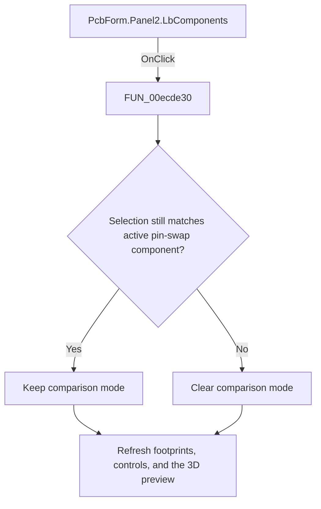

# Component list

> Analysis status: Reviewed: the handler makes the clicked component current and refreshes all component-dependent PCB data.

## Control

| Property | Recovered value |
| --- | --- |
| Form | PcbForm |
| Form caption | PCB information for SPICE macro components |
| Component path | PcbForm.Panel2.LbComponents |
| Control class | TListBox |
| Caption | Not present |
| Hint | Not present |
| Handler name | LbComponentsClick |
| Handler address | 00ecde30 |
| Graph node | `resource:dfm:PcbForm/PcbForm.Panel2.LbComponents` |
| Handler node | `function:00ecde30` |
| Graph layer | UI |

## What happens when clicked

1. When pin-swap comparison mode is active, the handler compares the selected component with the stored comparison component. A different component turns comparison mode off.
2. It calls `FUN_00eccc30` to rebuild component-dependent footprint selections, `FUN_00ed3a60` to refresh the 3D view, and `FUN_00ecbca0` to refresh enabled controls.
3. The shared label `Component list:` confirms the list's UI context. The handler does not show a message when the selection changes.

## Click flow

## Handler and call-path evidence

- [`FUN_00ecde30`](../../../DecompiledSources/Tina16/functions/0000000000ECDE30__FUN_00ecde30.c) — Select a PCB component and refresh dependent data.
- [`FUN_00eccc30`](../../../DecompiledSources/Tina16/functions/0000000000ECCC30__FUN_00eccc30.c) — refresh component-dependent selections.
- [`FUN_00ed3a60`](../../../DecompiledSources/Tina16/functions/0000000000ED3A60__FUN_00ed3a60.c) — refresh the selected 3D footprint view.
- [`FUN_00ecbca0`](../../../DecompiledSources/Tina16/functions/0000000000ECBCA0__FUN_00ecbca0.c) — refresh PCB form control availability.

## Resource and glyph evidence

- Recovered form resource: [`ui-evidence.json`](../../../DecompiledSources/Tina16/resources/dfm/ui-evidence.json).

## Inputs, outputs, and limits

- Input: an OnClick event from `PcbForm.Panel2.LbComponents`, plus the current form selections and state described above.
- State change: Cancels pin-swap comparison when the component context changes, then rebuilds dependent footprint, control, and 3D-preview state.
- Error or no-op behavior: The decision branches above identify the recovered validation, cancel, confirmation, boundary, or no-op path.
- Analysis limit: The selected component is obtained through VCL list accessors; no separate invalid-index error branch is recovered.

