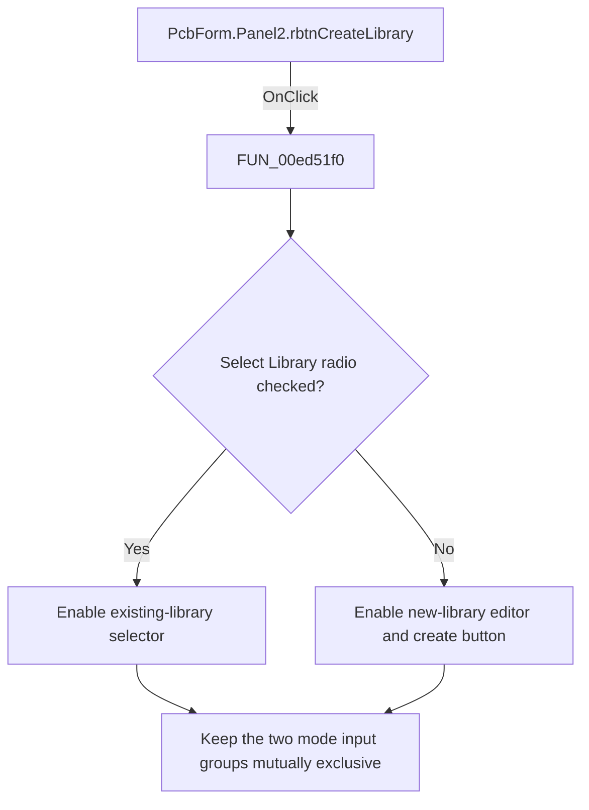

# Create Library

> Analysis status: Reviewed: the handler synchronizes the controls for create-library mode.

## Control

| Property | Recovered value |
| --- | --- |
| Form | PcbForm |
| Form caption | PCB information for SPICE macro components |
| Component path | PcbForm.Panel2.rbtnCreateLibrary |
| Control class | TRadioButton |
| Caption | Create Library |
| Hint | Not present |
| Handler name | rbtnCreateLibraryClick |
| Handler address | 00ed51f0 |
| Graph node | `resource:dfm:PcbForm/PcbForm.Panel2.rbtnCreateLibrary` |
| Handler node | `function:00ed51f0` |
| Graph layer | UI |

## What happens when clicked

1. The recovered field map identifies offset `0x840` as `rbtnSelectLibrary`, `0x850` as `etdNewLibrary`, `0x858` as `cbxSelectLibrary`, and `0x860` as `sbtnCreateLibrary`.
2. This handler reads the opposite Select Library radio state. It enables the existing-library combo when Select mode is active, enables the new-library editor when Select mode is inactive, and makes the create button follow the editor's enabled state.
3. Therefore, after Create Library becomes selected, the existing-library combo is disabled and the new-library editor and create button are enabled. The handler does not create a library itself.

## Click flow

## Handler and call-path evidence

- [`FUN_00ed51f0`](../../../DecompiledSources/Tina16/functions/0000000000ED51F0__FUN_00ed51f0.c) — Synchronize create-library mode controls.
- [`FUN_00ed5150`](../../../DecompiledSources/Tina16/functions/0000000000ED5150__FUN_00ed5150.c) — synchronize controls from the opposite radio state.

## Resource and glyph evidence

- Recovered form resource: [`ui-evidence.json`](../../../DecompiledSources/Tina16/resources/dfm/ui-evidence.json).

## Inputs, outputs, and limits

- Input: an OnClick event from `PcbForm.Panel2.rbtnCreateLibrary`, plus the current form selections and state described above.
- State change: Reads the opposite select-mode radio state, disables the existing-library selector for create mode, and enables the new-library editor and create button.
- Error or no-op behavior: The decision branches above identify the recovered validation, cancel, confirmation, boundary, or no-op path.
- Analysis limit: The field map comes from the recovered DFM component order together with the offsets used by the create and delete handlers.

