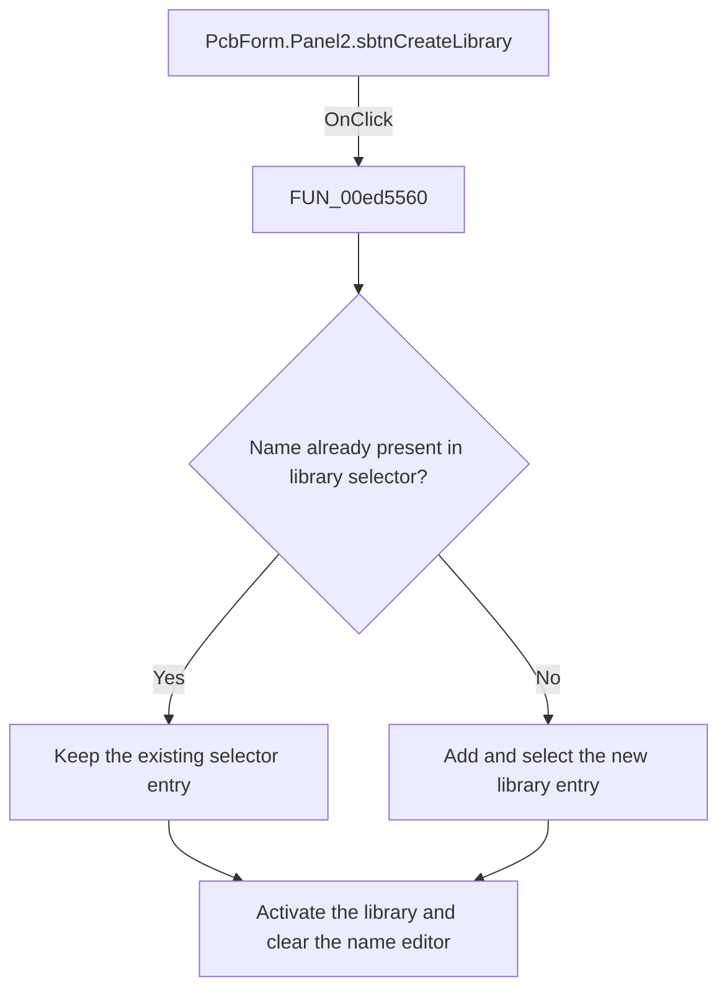

# Create Library button

> Analysis status: Reviewed: the handler creates or selects the library named in the new-library editor, adds it to the selector when needed, and clears the editor.

## Control

| Property | Recovered value |
| --- | --- |
| Form | PcbForm |
| Form caption | PCB information for SPICE macro components |
| Component path | PcbForm.Panel2.sbtnCreateLibrary |
| Control class | TSpeedButton |
| Caption | Not present |
| Hint | Create Library |
| Handler name | sbtnCreateLibraryClick |
| Handler address | 00ed5560 |
| Graph node | `resource:dfm:PcbForm/PcbForm.Panel2.sbtnCreateLibrary` |
| Handler node | `function:00ed5560` |
| Graph layer | UI |

## What happens when clicked

1. The handler reads the text from `etdNewLibrary` and passes it to `FUN_00ecba00`. That helper resolves the named PCB-library object, makes it current, clears pin-swap state, selects the first library item, and rebuilds component and dependent control state.
2. The handler checks whether the same name already exists in `cbxSelectLibrary`. If absent, it adds and selects the name in the combo and updates the combo's associated state.
3. It clears the new-library editor after the operation. The recovered body has no local empty-name or error branch. The extracted glyph depicts a create or add action and is consistent with the hint, but the source establishes the library behavior.

## Click flow

## Handler and call-path evidence

- [`FUN_00ed5560`](../../../DecompiledSources/Tina16/functions/0000000000ED5560__FUN_00ed5560.c) — Create and select a PCB library.
- [`FUN_00ecba00`](../../../DecompiledSources/Tina16/functions/0000000000ECBA00__FUN_00ecba00.c) — activate a named PCB library and rebuild form state.

## Resource and glyph evidence

- Extracted glyph: [`0298_PcbForm_PcbForm_Panel2_sbtnCreateLibrary_Glyph_Data.png`](../../../glyph/0298_PcbForm_PcbForm_Panel2_sbtnCreateLibrary_Glyph_Data.png).
- Recovered form resource: [`ui-evidence.json`](../../../DecompiledSources/Tina16/resources/dfm/ui-evidence.json).

## Inputs, outputs, and limits

- Input: an OnClick event from `PcbForm.Panel2.sbtnCreateLibrary`, plus the current form selections and state described above.
- State change: Activates the library named in the new-library editor, adds it to the selector when absent, and clears the editor.
- Error or no-op behavior: The decision branches above identify the recovered validation, cancel, confirmation, boundary, or no-op path.
- Analysis limit: Error behavior for an empty or invalid name is delegated to the library resolver and is not visible in this handler.

