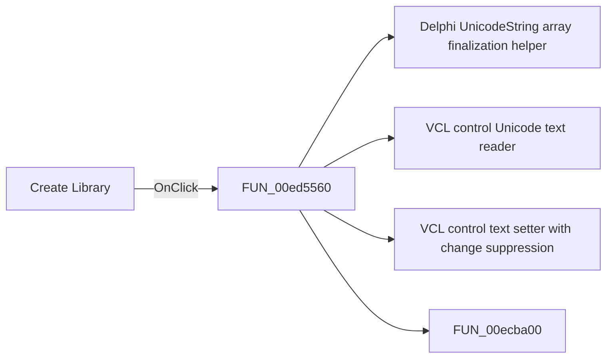

# Create Library

> Analysis status: Pending individual source review.

## Control

| Property | Recovered value |
| --- | --- |
| Form | PcbForm |
| Component path | PcbForm.Panel2.sbtnCreateLibrary |
| Control class | TSpeedButton |
| Caption | Not present in the recovered resource. |
| Hint | Create Library |
| Text | Not present in the recovered resource. |
| Handler name | sbtnCreateLibraryClick |
| Handler address | 00ed5560 |
| Graph node | `resource:dfm:PcbForm/PcbForm.Panel2.sbtnCreateLibrary` |
| Handler node | `function:00ed5560` |
| Graph layer | UI |

## What happens when clicked

Pending individual analysis. An agent must read the recovered handler source and its relevant callees before it replaces this text.

## Click flow

## Handler evidence

- Source: [DecompiledSources/Tina16/functions/0000000000ED5560__FUN_00ed5560.c](../../../DecompiledSources/Tina16/functions/0000000000ED5560__FUN_00ed5560.c)
- Recovered role: Not present in the recovered resource.
- Current graph summary: Handles 1 Delphi UI event: PcbForm.Panel2.sbtnCreateLibrary.OnClick.
- Current graph behavior: Not present in the recovered resource.
- Current graph evidence: Not present in the recovered resource.
- Complexity: complex
- Distinct outgoing calls: 4

## Direct calls

- `function:00414560` — Delphi UnicodeString array finalization helper
- `function:0064dd90` — VCL control Unicode text reader
- `function:0064de00` — VCL control text setter with change suppression
- `function:00ecba00` — FUN_00ecba00

## Resource evidence

- Kind: Not present in the recovered resource.
- Modal result: Not present in the recovered resource.
- Checked state: Not present in the recovered resource.
- List items: Not present in the recovered resource.
- Image reference: Not present in the recovered resource.
- Extracted glyph: [`0298_PcbForm_PcbForm_Panel2_sbtnCreateLibrary_Glyph_Data.png`](../../../glyph/0298_PcbForm_PcbForm_Panel2_sbtnCreateLibrary_Glyph_Data.png)

## Nearby label candidates

Nearby labels are layout candidates only. They are not proof of behavior.

- Rank 1: 3D component view: at distance 102.
- Rank 2: Footprint list: at distance 267.
- Rank 3: Component list: at distance 448.

## Analysis limits

- Do not infer behavior from the control class, caption, hint, glyph, or nearby label alone.
- Do not replace the pending status until the handler source and relevant call path provide enough evidence.
