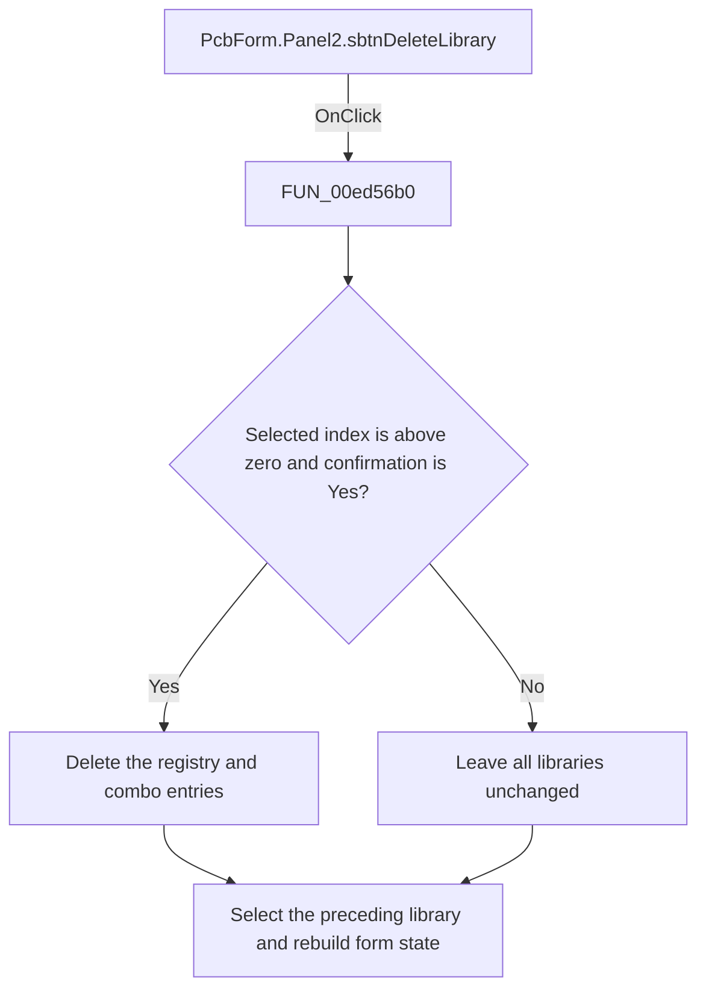

# Delete Library button

> Analysis status: Reviewed: the handler confirms and deletes the selected nonfirst PCB library, then activates the preceding library.

## Control

| Property | Recovered value |
| --- | --- |
| Form | PcbForm |
| Form caption | PCB information for SPICE macro components |
| Component path | PcbForm.Panel2.sbtnDeleteLibrary |
| Control class | TSpeedButton |
| Caption | Not present |
| Hint | Delete Library |
| Handler name | sbtnDeleteLibraryClick |
| Handler address | 00ed56b0 |
| Graph node | `resource:dfm:PcbForm/PcbForm.Panel2.sbtnDeleteLibrary` |
| Handler node | `function:00ed56b0` |
| Graph layer | UI |

## What happens when clicked

1. The handler reads the selected index from `cbxSelectLibrary`. Index zero and negative indexes are protected by an immediate no-op, so the first library cannot be deleted through this button.
2. For a later item, it shows `%s will be deleted. Continue?`. Only dialog result 6 proceeds.
3. `FUN_00eae480` removes and destroys the named library object from the global registry. The handler removes the combo item, selects the preceding row, and passes that library name to `FUN_00ecba00` so the form reloads its component and footprint state.
4. A No response leaves the registry and selector unchanged. The red-X glyph supports delete intent, but the source proves the target and the protected-index rule.

## Click flow

## Handler and call-path evidence

- [`FUN_00ed56b0`](../../../DecompiledSources/Tina16/functions/0000000000ED56B0__FUN_00ed56b0.c) — Delete a selected PCB library.
- [`FUN_00eae480`](../../../DecompiledSources/Tina16/functions/0000000000EAE480__FUN_00eae480.c) — remove one named PCB library object.
- [`FUN_00ecba00`](../../../DecompiledSources/Tina16/functions/0000000000ECBA00__FUN_00ecba00.c) — activate a named PCB library and rebuild form state.

## Resource and glyph evidence

- Extracted glyph: [`0299_PcbForm_PcbForm_Panel2_sbtnDeleteLibrary_Glyph_Data.png`](../../../glyph/0299_PcbForm_PcbForm_Panel2_sbtnDeleteLibrary_Glyph_Data.png).
- Recovered form resource: [`ui-evidence.json`](../../../DecompiledSources/Tina16/resources/dfm/ui-evidence.json).

## Inputs, outputs, and limits

- Input: an OnClick event from `PcbForm.Panel2.sbtnDeleteLibrary`, plus the current form selections and state described above.
- State change: Protects the first library entry, confirms deletion of a later entry, removes it from the registry and combo, and activates the preceding library.
- Error or no-op behavior: The decision branches above identify the recovered validation, cancel, confirmation, boundary, or no-op path.
- Analysis limit: The first entry is protected by index, but its name is not hard-coded in this handler.

