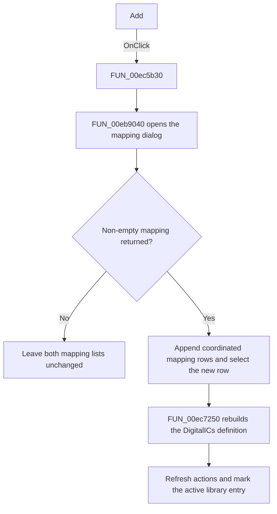

# &Add

> Analysis status: Source, call-path, state, and error evidence reviewed.

## Control

| Property | Recovered value |
| --- | --- |
| Form | PcbForm4 |
| Component path | PcbForm4.Panel1.BtnAdd |
| Control class | TBitBtn |
| Caption | &Add |
| Hint | Not present in the recovered resource. |
| Text | Not present in the recovered resource. |
| Handler name | BtnAddClick |
| Handler address | 00ec5b30 |
| Graph node | `resource:dfm:PcbForm4/PcbForm4.Panel1.BtnAdd` |
| Handler node | `function:00ec5b30` |
| Graph layer | UI |

## What happens when clicked

The click adds one pin-to-node mapping row for the selected component and footprint.

[`FUN_00eb9040`](../../../DecompiledSources/Tina16/functions/0000000000EB9040__FUN_00eb9040.c) opens the recovered mapping-selection dialog with the current mapping source and node list. If the dialog returns a non-empty mapping, the handler appends coordinated display and data rows to the two mapping lists, selects the appended row, and calls [`FUN_00ec7250`](../../../DecompiledSources/Tina16/functions/0000000000EC7250__FUN_00ec7250.c). That helper rebuilds and stores the selected component's `DigitalICs` definition for the selected footprint and the complete mapping list.

The handler then refreshes action availability and marks the active library entry for later persistence by the OK path.

## Click flow

## Handler evidence

- Source: [DecompiledSources/Tina16/functions/0000000000EC5B30__FUN_00ec5b30.c](../../../DecompiledSources/Tina16/functions/0000000000EC5B30__FUN_00ec5b30.c)
- Recovered role: Adds a pin-to-node mapping to the selected PCB footprint.
- Current graph summary: Handles 1 Delphi UI event: PcbForm4.Panel1.BtnAdd.OnClick.
- Current graph behavior: Opens the mapping dialog, appends coordinated rows to the visible and backing mapping lists when a non-empty result returns, selects the new row, rebuilds the component definition, refreshes actions, and marks the active library entry for later persistence.
- Current graph evidence: FUN_00ec5b30 calls FUN_00eb9040 with the current mapping source and node list. Its accepted branch appends to two list objects, calls FUN_00ec7250 with the selected component and footprint, calls FUN_00ec0380, and sets an item-associated state for the current library entry.
- Complexity: complex
- Distinct outgoing calls: 9

## Direct calls

- `function:00414560` — Delphi UnicodeString array finalization helper
- `function:00416cd0` — FUN_00416cd0
- `function:00416e20` — FUN_00416e20
- `function:004170c0` — FUN_004170c0
- `function:0043f750` — FUN_0043f750
- `function:00ea9ca0` — FUN_00ea9ca0
- `function:00eb9040` — FUN_00eb9040
- `function:00ec0380` — FUN_00ec0380
- `function:00ec7250` — FUN_00ec7250

## Resource evidence

- Kind: Not present in the recovered resource.
- Modal result: Not present in the recovered resource.
- Checked state: Not present in the recovered resource.
- List items: Not present in the recovered resource.
- Image reference: Not present in the recovered resource.
- Extracted glyph: None.

## Nearby label candidates

Nearby labels are layout candidates only. They are not proof of behavior.

- Rank 1: Part: at distance 67.
- Rank 2: Swapped nodes at distance 77.
- Rank 3: Node list: at distance 164.

## No-op and error behavior

- Cancel or an empty dialog result leaves both mapping lists and the component definition unchanged.
- The handler has no local exception recovery for list updates or the backend definition write.

## Analysis limits

- The source proves two coordinated mapping lists, but their internal item-string encoding is only partly recovered.
- Nearby labels identify the pin and node area; the dialog and rebuild calls prove the behavior.
