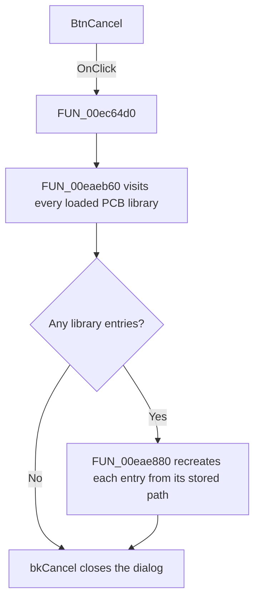

# BtnCancel

> Analysis status: Source, call-path, state, and error evidence reviewed.

## Control

| Property | Recovered value |
| --- | --- |
| Form | PcbForm4 |
| Component path | PcbForm4.BtnCancel |
| Control class | TBitBtn |
| Caption | Not present in the recovered resource. |
| Hint | Not present in the recovered resource. |
| Text | Not present in the recovered resource. |
| Handler name | BtnCancelClick |
| Handler address | 00ec64d0 |
| Graph node | `resource:dfm:PcbForm4/PcbForm4.BtnCancel` |
| Handler node | `function:00ec64d0` |
| Graph layer | UI |

## What happens when clicked

The handler discards the unsaved in-memory PCB library changes before the built-in Cancel action closes the dialog.

It calls [`FUN_00eaeb60`](../../../DecompiledSources/Tina16/functions/0000000000EAEB60__FUN_00eaeb60.c). That function visits every entry in the global PCB library collection. For each entry, [`FUN_00eae880`](../../../DecompiledSources/Tina16/functions/0000000000EAE880__FUN_00eae880.c) retains the stored file path, destroys the current library object, recreates an object from the same path, and replaces the collection entry. This reload boundary removes edits that the form made to the live objects.

The resource kind is `bkCancel`. The recovered handler does not set a modal result itself; the built-in button behavior supplies the Cancel close request after the reload call returns.

## Click flow

## Handler evidence

- Source: [DecompiledSources/Tina16/functions/0000000000EC64D0__FUN_00ec64d0.c](../../../DecompiledSources/Tina16/functions/0000000000EC64D0__FUN_00ec64d0.c)
- Recovered role: Reloads all PCB libraries so Cancel discards in-memory edits.
- Current graph summary: Handles 1 Delphi UI event: PcbForm4.BtnCancel.OnClick.
- Current graph behavior: Calls FUN_00eaeb60. That function recreates every global PCB library object from its stored path before the bkCancel button closes the modal form.
- Current graph evidence: The handler contains one direct call. FUN_00eaeb60 iterates the global library collection, and FUN_00eae880 destroys and replaces each object with one loaded from the same path.
- Complexity: simple
- Distinct outgoing calls: 1

## Direct calls

- `function:00eaeb60` — FUN_00eaeb60

## Resource evidence

- Kind: bkCancel
- Modal result: Not present in the recovered resource.
- Checked state: Not present in the recovered resource.
- List items: Not present in the recovered resource.
- Image reference: Not present in the recovered resource.
- Extracted glyph: None.

## Nearby label candidates

Nearby labels are layout candidates only. They are not proof of behavior.

- No same-parent label candidate is available.

## No-op and error behavior

- An empty library collection makes the reload loop a no-op. The built-in Cancel close still follows.
- The handler has no local error recovery. An exception during object recreation propagates before the normal Cancel close.
- The handler does not save any edited library object.

## Analysis limits

- The recovered code proves a full object reload from stored paths. It does not expose a user-visible rollback progress state.
