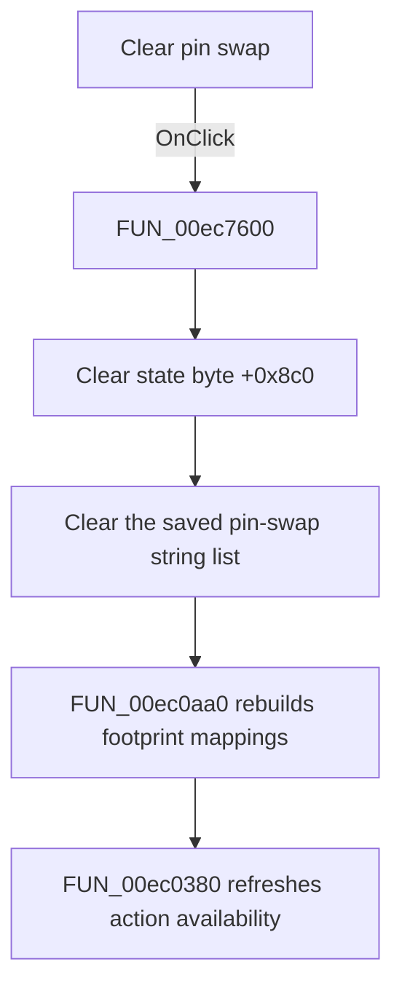

# Clear pin swap

> Analysis status: Source, call-path, state, and error evidence reviewed.

## Control

| Property | Recovered value |
| --- | --- |
| Form | PcbForm4 |
| Component path | PcbForm4.Panel1.BtnClearPinSwap |
| Control class | TBitBtn |
| Caption | Clear pin swap |
| Hint | Not present in the recovered resource. |
| Text | Not present in the recovered resource. |
| Handler name | BtnClearPinSwapClick |
| Handler address | 00ec7600 |
| Graph node | `resource:dfm:PcbForm4/PcbForm4.Panel1.BtnClearPinSwap` |
| Handler node | `function:00ec7600` |
| Graph layer | UI |

## What happens when clicked

The click clears the form's saved pin-swap ordering and rebuilds the current footprint view.

The handler clears the state byte at form offset `+0x8c0`, clears the string-list object at `+0x858`, calls [`FUN_00ec0aa0`](../../../DecompiledSources/Tina16/functions/0000000000EC0AA0__FUN_00ec0aa0.c) to reconstruct the footprint's pin-to-node rows, and calls [`FUN_00ec0380`](../../../DecompiledSources/Tina16/functions/0000000000EC0380__FUN_00ec0380.c) to refresh button availability. The shared rebuild helper uses the cleared list only when the state byte is set, which confirms that these fields hold the pin-swap ordering state.

The resource starts with this button disabled. The action-state helper controls when it becomes available.

## Click flow

## Handler evidence

- Source: [DecompiledSources/Tina16/functions/0000000000EC7600__FUN_00ec7600.c](../../../DecompiledSources/Tina16/functions/0000000000EC7600__FUN_00ec7600.c)
- Recovered role: Clears the saved pin-swap ordering and rebuilds the footprint mapping view.
- Current graph summary: Handles 1 Delphi UI event: PcbForm4.Panel1.BtnClearPinSwap.OnClick.
- Current graph behavior: Clears form state byte +0x8c0 and the string-list object at +0x858, then rebuilds the current footprint mapping rows and refreshes action availability.
- Current graph evidence: FUN_00ec7600 performs both state clears before calling FUN_00ec0aa0 and FUN_00ec0380. FUN_00ec0aa0 consults the same state byte and string list when it applies pin-swap ordering.
- Complexity: moderate
- Distinct outgoing calls: 2

## Direct calls

- `function:00ec0380` — FUN_00ec0380
- `function:00ec0aa0` — FUN_00ec0aa0

## Resource evidence

- Kind: Not present in the recovered resource.
- Modal result: Not present in the recovered resource.
- Checked state: Not present in the recovered resource.
- List items: Not present in the recovered resource.
- Image reference: Not present in the recovered resource.
- Extracted glyph: None.

## Nearby label candidates

Nearby labels are layout candidates only. They are not proof of behavior.

- Rank 1: Invalid node at distance 168.
- Rank 2: Swapped node at distance 189.
- Rank 3:  Valid node at distance 207.

## No-op and error behavior

- Clearing an already empty swap list still performs the mapping and action refresh.
- The handler does not change the selected component or footprint directly.
- The handler has no local exception recovery.

## Analysis limits

- The recovered code proves the ordering-state clear. It does not recover a Delphi field name for offsets `+0x858` and `+0x8c0`.
