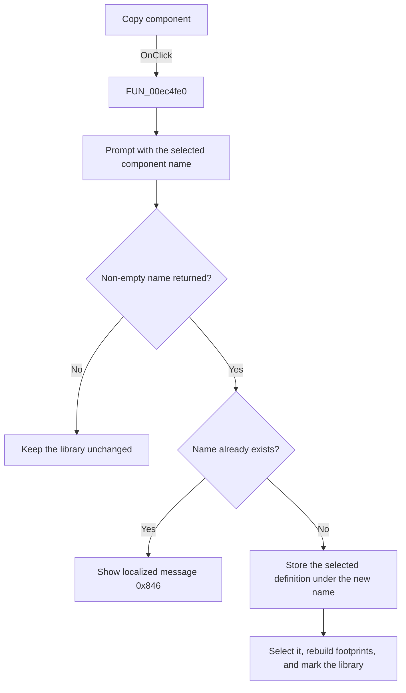

# Copy

> Analysis status: Source, call-path, state, and error evidence reviewed.

## Control

| Property | Recovered value |
| --- | --- |
| Form | PcbForm4 |
| Component path | PcbForm4.Panel2.BtnCloneComponent |
| Control class | TBitBtn |
| Caption | Copy |
| Hint | Not present in the recovered resource. |
| Text | Not present in the recovered resource. |
| Handler name | BtnCloneComponentClick |
| Handler address | 00ec4fe0 |
| Graph node | `resource:dfm:PcbForm4/PcbForm4.Panel2.BtnCloneComponent` |
| Handler node | `function:00ec4fe0` |
| Graph layer | UI |

## What happens when clicked

The click copies the selected component definition under a new component name.

The handler reads the selected Component list value and opens [`FUN_00ebd270`](../../../DecompiledSources/Tina16/functions/0000000000EBD270__FUN_00ebd270.c) with that name as the initial value. If a non-empty name returns, it tests whether the `DigitalICs` backend already contains that name. A duplicate shows localized message `0x846` and stops.

For a unique name, the handler reads the selected component's stored definition, writes the same definition under the new name, adds and selects the normalized new name in the Component list, rebuilds the Footprint list and action state, and marks the active library entry for later persistence.

## Click flow

## Handler evidence

- Source: [DecompiledSources/Tina16/functions/0000000000EC4FE0__FUN_00ec4fe0.c](../../../DecompiledSources/Tina16/functions/0000000000EC4FE0__FUN_00ec4fe0.c)
- Recovered role: Copies the selected PCB component definition under a new unique name.
- Current graph summary: Handles 1 Delphi UI event: PcbForm4.Panel2.BtnCloneComponent.OnClick.
- Current graph behavior: Prompts for a name seeded from the selected component. A duplicate name shows localized message 0x846. A unique name receives the selected component definition, is added and selected in the Component list, and triggers dependent-list and action refreshes.
- Current graph evidence: FUN_00ec4fe0 reads the selected component string, calls FUN_00ebd270, checks backend existence in DigitalICs, reads the old definition, writes it with the returned name, updates the component list, calls FUN_00ec1150 and FUN_00ec0380, and marks the active library entry.
- Complexity: complex
- Distinct outgoing calls: 13

## Direct calls

- `function:00414560` — Delphi UnicodeString array finalization helper
- `function:00414ad0` — Delphi UnicodeString assignment helper
- `function:0043e130` — FUN_0043e130
- `function:0043ea00` — FUN_0043ea00
- `function:00442f70` — FUN_00442f70
- `function:0072d440` — FUN_0072d440
- `function:00b89270` — FUN_00b89270
- `function:00b8e520` — FUN_00b8e520
- `function:00ea9ca0` — FUN_00ea9ca0
- `function:00ea9ef0` — FUN_00ea9ef0
- `function:00ebd270` — FUN_00ebd270
- `function:00ec0380` — FUN_00ec0380
- `function:00ec1150` — FUN_00ec1150

## Resource evidence

- Kind: Not present in the recovered resource.
- Modal result: Not present in the recovered resource.
- Checked state: Not present in the recovered resource.
- List items: Not present in the recovered resource.
- Image reference: Not present in the recovered resource.
- Extracted glyph: None.

## Nearby label candidates

Nearby labels are layout candidates only. They are not proof of behavior.

- Rank 1: Component list: at distance 240.
- Rank 2: Footprint list: at distance 420.

## No-op and error behavior

- Cancel or an empty returned name makes no change.
- A duplicate name shows localized message `0x846` and makes no copy.
- The handler has no local recovery for backend read or write failures.

## Analysis limits

- The localized duplicate message text is not recovered.
- Name normalization occurs in helper calls; the exact normalization rules are not fully recovered.
