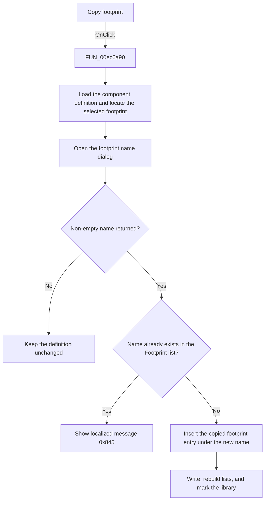

# Copy

> Analysis status: Source, call-path, state, and error evidence reviewed.

## Control

| Property | Recovered value |
| --- | --- |
| Form | PcbForm4 |
| Component path | PcbForm4.Panel2.BtnCloneModule |
| Control class | TBitBtn |
| Caption | Copy |
| Hint | Not present in the recovered resource. |
| Text | Not present in the recovered resource. |
| Handler name | BtnCloneModuleClick |
| Handler address | 00ec6a90 |
| Graph node | `resource:dfm:PcbForm4/PcbForm4.Panel2.BtnCloneModule` |
| Handler node | `function:00ec6a90` |
| Graph layer | UI |

## What happens when clicked

The click copies the selected footprint entry within the selected component.

The handler reads the selected component and Footprint list values, loads the component's `DigitalICs` definition, and locates the selected footprint section. It opens [`FUN_00ebb850`](../../../DecompiledSources/Tina16/functions/0000000000EBB850__FUN_00ebb850.c) with the current footprint value. A duplicate returned name shows localized message `0x845`.

For a unique name, the handler applies the recovered copy transformation at the selected footprint position, writes the updated component definition, rebuilds both lists and action state, and marks the active library entry for later persistence.

## Click flow

## Handler evidence

- Source: [DecompiledSources/Tina16/functions/0000000000EC6A90__FUN_00ec6a90.c](../../../DecompiledSources/Tina16/functions/0000000000EC6A90__FUN_00ec6a90.c)
- Recovered role: Copies the selected footprint entry under a new unique name.
- Current graph summary: Handles 1 Delphi UI event: PcbForm4.Panel2.BtnCloneModule.OnClick.
- Current graph behavior: Loads the selected component definition, locates the selected footprint, prompts for a new name, rejects a duplicate with message 0x845, applies the recovered copy transformation, writes the definition, refreshes lists and actions, and marks the active library entry.
- Current graph evidence: FUN_00ec6a90 reads both selected list values, loads the DigitalICs definition, derives the selected footprint position, calls FUN_00ebb850, checks the returned name in the Footprint list, modifies the definition at the saved position, writes it, and runs the shared refresh paths.
- Complexity: complex
- Distinct outgoing calls: 16

## Direct calls

- `function:00414560` — Delphi UnicodeString array finalization helper
- `function:00414ad0` — Delphi UnicodeString assignment helper
- `function:00416ba0` — FUN_00416ba0
- `function:00416ea0` — FUN_00416ea0
- `function:004170c0` — FUN_004170c0
- `function:0043e130` — FUN_0043e130
- `function:0043ea00` — FUN_0043ea00
- `function:00442f70` — FUN_00442f70
- `function:0072d440` — FUN_0072d440
- `function:00b89270` — FUN_00b89270
- `function:00b8e520` — FUN_00b8e520
- `function:00ea9ca0` — FUN_00ea9ca0
- `function:00ea9ef0` — FUN_00ea9ef0
- `function:00ebb850` — FUN_00ebb850
- `function:00ec0380` — FUN_00ec0380
- `function:00ec1150` — FUN_00ec1150

## Resource evidence

- Kind: Not present in the recovered resource.
- Modal result: Not present in the recovered resource.
- Checked state: Not present in the recovered resource.
- List items: Not present in the recovered resource.
- Image reference: Not present in the recovered resource.
- Extracted glyph: None.

## Nearby label candidates

Nearby labels are layout candidates only. They are not proof of behavior.

- Rank 1: Footprint list: at distance 244.
- Rank 2: Component list: at distance 414.

## No-op and error behavior

- Cancel or an empty returned name leaves the component definition unchanged.
- A duplicate footprint name shows localized message `0x845` and makes no copy.
- The handler has no local backend error recovery.

## Analysis limits

- The recovered string helpers prove a copy transformation at the selected footprint position, but the full footprint-section grammar is not named.
- The localized duplicate message text is not recovered.
