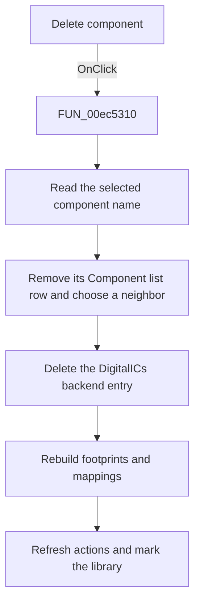

# Delete

> Analysis status: Source, call-path, state, and error evidence reviewed.

## Control

| Property | Recovered value |
| --- | --- |
| Form | PcbForm4 |
| Component path | PcbForm4.Panel2.BtnDeleteComponent |
| Control class | TBitBtn |
| Caption | Delete |
| Hint | Not present in the recovered resource. |
| Text | Not present in the recovered resource. |
| Handler name | BtnDeleteComponentClick |
| Handler address | 00ec5310 |
| Graph node | `resource:dfm:PcbForm4/PcbForm4.Panel2.BtnDeleteComponent` |
| Handler node | `function:00ec5310` |
| Graph layer | UI |

## What happens when clicked

The click deletes the selected component from the current PCB library.

The handler reads the selected Component list value, removes that list row, and selects the row that now occupies the same index or the preceding final row. It then calls the current library backend's `DigitalICs` deletion method with the selected component key, calls [`FUN_00ec1150`](../../../DecompiledSources/Tina16/functions/0000000000EC1150__FUN_00ec1150.c) to rebuild the Footprint and mapping lists, refreshes action availability, and marks the active library entry for later persistence.

## Click flow

## Handler evidence

- Source: [DecompiledSources/Tina16/functions/0000000000EC5310__FUN_00ec5310.c](../../../DecompiledSources/Tina16/functions/0000000000EC5310__FUN_00ec5310.c)
- Recovered role: Deletes the selected component from the current PCB library.
- Current graph summary: Handles 1 Delphi UI event: PcbForm4.Panel2.BtnDeleteComponent.OnClick.
- Current graph behavior: Removes the selected component row, selects a remaining neighbor, deletes the corresponding DigitalICs backend entry, rebuilds dependent footprint and mapping lists, refreshes action availability, and marks the active library entry.
- Current graph evidence: FUN_00ec5310 reads the selected component string and index, deletes that list item, adjusts ItemIndex, invokes the backend method at vtable offset 0xc0 with DigitalICs and the component key, calls FUN_00ec1150 and FUN_00ec0380, and sets item-associated state on the current library entry.
- Complexity: complex
- Distinct outgoing calls: 6

## Direct calls

- `function:00414480` — Delphi UnicodeString clear and finalization helper
- `function:00414560` — Delphi UnicodeString array finalization helper
- `function:0043e130` — FUN_0043e130
- `function:00ea9ca0` — FUN_00ea9ca0
- `function:00ec0380` — FUN_00ec0380
- `function:00ec1150` — FUN_00ec1150

## Resource evidence

- Kind: Not present in the recovered resource.
- Modal result: Not present in the recovered resource.
- Checked state: Not present in the recovered resource.
- List items: Not present in the recovered resource.
- Image reference: Not present in the recovered resource.
- Extracted glyph: None.

## Nearby label candidates

Nearby labels are layout candidates only. They are not proof of behavior.

- Rank 1: Component list: at distance 295.
- Rank 2: Footprint list: at distance 317.

## No-op and error behavior

- The handler has no confirmation dialog.
- Normal UI state disables this action when the Component list is empty. The recovered handler itself does not add a separate invalid-selection guard.
- The handler has no local backend error recovery.

## Analysis limits

- The backend deletion method is recovered only through its call shape and coordinated UI removal.
