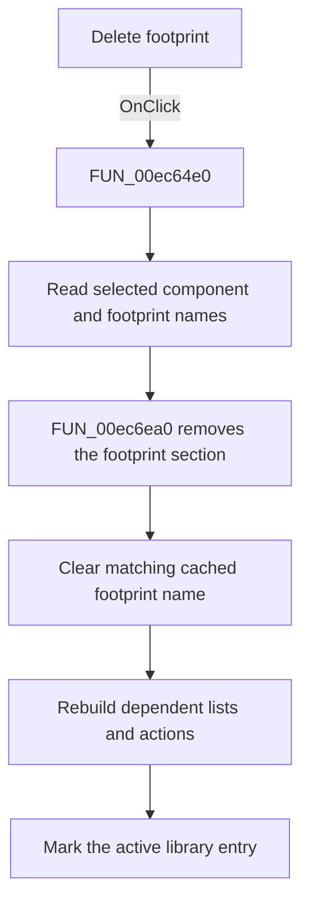

# Delete

> Analysis status: Source, call-path, state, and error evidence reviewed.

## Control

| Property | Recovered value |
| --- | --- |
| Form | PcbForm4 |
| Component path | PcbForm4.Panel2.BtnDeleteModule |
| Control class | TBitBtn |
| Caption | Delete |
| Hint | Not present in the recovered resource. |
| Text | Not present in the recovered resource. |
| Handler name | BtnDeleteModuleClick |
| Handler address | 00ec64e0 |
| Graph node | `resource:dfm:PcbForm4/PcbForm4.Panel2.BtnDeleteModule` |
| Handler node | `function:00ec64e0` |
| Graph layer | UI |

## What happens when clicked

The click deletes the selected footprint from the selected component definition.

The handler reads the selected Component list and Footprint list values and calls [`FUN_00ec6ea0`](../../../DecompiledSources/Tina16/functions/0000000000EC6EA0__FUN_00ec6ea0.c) with its removal flag set. That helper loads the component's `DigitalICs` definition, removes the selected footprint section, clears the cached current footprint when it matches the deleted name, and writes the modified definition.

The handler then rebuilds the Footprint and mapping lists, refreshes action availability, and marks the active library entry for later persistence.

## Click flow

## Handler evidence

- Source: [DecompiledSources/Tina16/functions/0000000000EC64E0__FUN_00ec64e0.c](../../../DecompiledSources/Tina16/functions/0000000000EC64E0__FUN_00ec64e0.c)
- Recovered role: Deletes the selected footprint from the selected component definition.
- Current graph summary: Handles 1 Delphi UI event: PcbForm4.Panel2.BtnDeleteModule.OnClick.
- Current graph behavior: Passes the selected component and footprint to FUN_00ec6ea0 with removal enabled. The helper removes the footprint section and clears a matching cached selection. The handler then rebuilds lists and actions and marks the active library entry.
- Current graph evidence: FUN_00ec64e0 reads both selected list values, calls FUN_00ec6ea0 with final argument 1, then calls FUN_00ec1150 and FUN_00ec0380 and sets item-associated state. FUN_00ec6ea0 rewrites the DigitalICs definition and conditionally clears the cached footprint.
- Complexity: complex
- Distinct outgoing calls: 5

## Direct calls

- `function:00414560` — Delphi UnicodeString array finalization helper
- `function:00ea9ca0` — FUN_00ea9ca0
- `function:00ec0380` — FUN_00ec0380
- `function:00ec1150` — FUN_00ec1150
- `function:00ec6ea0` — FUN_00ec6ea0

## Resource evidence

- Kind: Not present in the recovered resource.
- Modal result: Not present in the recovered resource.
- Checked state: Not present in the recovered resource.
- List items: Not present in the recovered resource.
- Image reference: Not present in the recovered resource.
- Extracted glyph: None.

## Nearby label candidates

Nearby labels are layout candidates only. They are not proof of behavior.

- Rank 1: Footprint list: at distance 291.
- Rank 2: Component list: at distance 471.

## No-op and error behavior

- Normal UI state disables this action when the Footprint list is empty. The recovered handler does not add a separate invalid-selection guard.
- The handler has no confirmation dialog or local backend error recovery.

## Analysis limits

- The footprint-section delimiters are visible only as recovered string constants; their semantic names are unknown.
