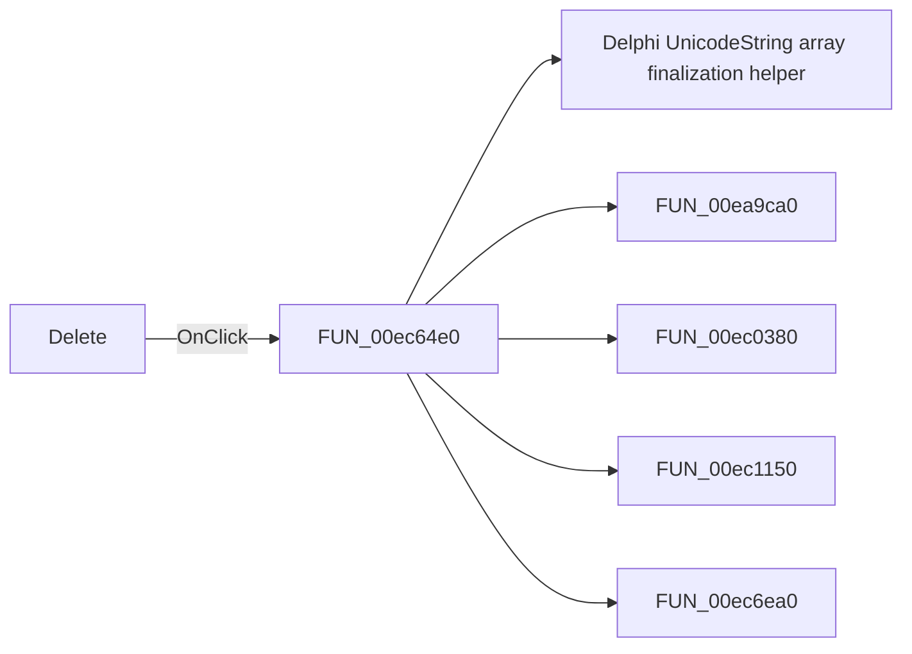

# Delete

> Analysis status: Pending individual source review.

## Control

| Property | Recovered value |
| --- | --- |
| Form | PcbForm4 |
| Component path | PcbForm4.Panel2.BtnDeleteModule |
| Control class | TBitBtn |
| Caption | Delete |
| Hint | Not present in the recovered resource. |
| Text | Not present in the recovered resource. |
| Handler name | BtnDeleteModuleClick |
| Handler address | 00ec64e0 |
| Graph node | `resource:dfm:PcbForm4/PcbForm4.Panel2.BtnDeleteModule` |
| Handler node | `function:00ec64e0` |
| Graph layer | UI |

## What happens when clicked

Pending individual analysis. An agent must read the recovered handler source and its relevant callees before it replaces this text.

## Click flow

## Handler evidence

- Source: [DecompiledSources/Tina16/functions/0000000000EC64E0__FUN_00ec64e0.c](../../../DecompiledSources/Tina16/functions/0000000000EC64E0__FUN_00ec64e0.c)
- Recovered role: Not present in the recovered resource.
- Current graph summary: Handles 1 Delphi UI event: PcbForm4.Panel2.BtnDeleteModule.OnClick.
- Current graph behavior: Not present in the recovered resource.
- Current graph evidence: Not present in the recovered resource.
- Complexity: complex
- Distinct outgoing calls: 5

## Direct calls

- `function:00414560` — Delphi UnicodeString array finalization helper
- `function:00ea9ca0` — FUN_00ea9ca0
- `function:00ec0380` — FUN_00ec0380
- `function:00ec1150` — FUN_00ec1150
- `function:00ec6ea0` — FUN_00ec6ea0

## Resource evidence

- Kind: Not present in the recovered resource.
- Modal result: Not present in the recovered resource.
- Checked state: Not present in the recovered resource.
- List items: Not present in the recovered resource.
- Image reference: Not present in the recovered resource.
- Extracted glyph: None.

## Nearby label candidates

Nearby labels are layout candidates only. They are not proof of behavior.

- Rank 1: Footprint list: at distance 291.
- Rank 2: Component list: at distance 471.

## Analysis limits

- Do not infer behavior from the control class, caption, hint, glyph, or nearby label alone.
- Do not replace the pending status until the handler source and relevant call path provide enough evidence.
