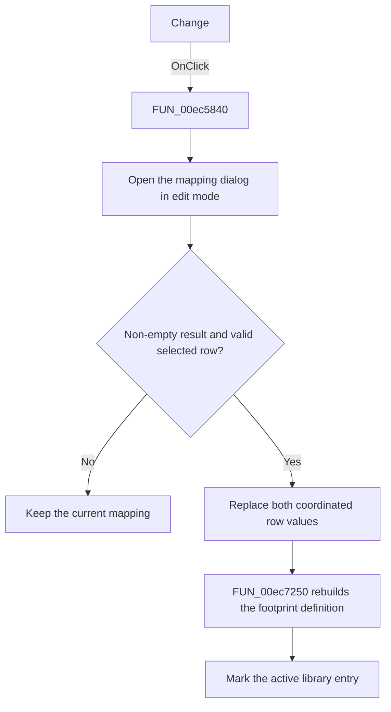

# &Change

> Analysis status: Source, call-path, state, and error evidence reviewed.

## Control

| Property | Recovered value |
| --- | --- |
| Form | PcbForm4 |
| Component path | PcbForm4.Panel1.BtnEdit |
| Control class | TBitBtn |
| Caption | &Change |
| Hint | Not present in the recovered resource. |
| Text | Not present in the recovered resource. |
| Handler name | BtnEditClick |
| Handler address | 00ec5840 |
| Graph node | `resource:dfm:PcbForm4/PcbForm4.Panel1.BtnEdit` |
| Handler node | `function:00ec5840` |
| Graph layer | UI |

## What happens when clicked

The click changes the selected pin-to-node mapping.

The handler reads the selected mapping index and opens [`FUN_00eb9040`](../../../DecompiledSources/Tina16/functions/0000000000EB9040__FUN_00eb9040.c) in edit mode with the current mapping source and the existing list. It proceeds only when the dialog returns a non-empty mapping and the selected index is valid. The accepted branch replaces the corresponding entries in both coordinated mapping lists, calls [`FUN_00ec7250`](../../../DecompiledSources/Tina16/functions/0000000000EC7250__FUN_00ec7250.c) to rebuild the selected footprint definition, and marks the active library entry for later persistence.

The handler does not insert or remove a row; it preserves the selected row position.

## Click flow

## Handler evidence

- Source: [DecompiledSources/Tina16/functions/0000000000EC5840__FUN_00ec5840.c](../../../DecompiledSources/Tina16/functions/0000000000EC5840__FUN_00ec5840.c)
- Recovered role: Edits the selected pin-to-node mapping.
- Current graph summary: Handles 1 Delphi UI event: PcbForm4.Panel1.BtnEdit.OnClick.
- Current graph behavior: Opens the mapping dialog in edit mode. When it returns a non-empty value and a row is selected, the handler replaces the same row in both mapping lists, rebuilds the selected footprint definition, and marks the active library entry.
- Current graph evidence: FUN_00ec5840 reads the selected index, calls FUN_00eb9040 with edit flag 0, checks both the returned string and index, updates the two list objects at that index, calls FUN_00ec7250, and sets item-associated state on the current library entry.
- Complexity: complex
- Distinct outgoing calls: 7

## Direct calls

- `function:00414560` — Delphi UnicodeString array finalization helper
- `function:00416ba0` — FUN_00416ba0
- `function:00416e20` — FUN_00416e20
- `function:004170c0` — FUN_004170c0
- `function:00ea9ca0` — FUN_00ea9ca0
- `function:00eb9040` — FUN_00eb9040
- `function:00ec7250` — FUN_00ec7250

## Resource evidence

- Kind: Not present in the recovered resource.
- Modal result: Not present in the recovered resource.
- Checked state: Not present in the recovered resource.
- List items: Not present in the recovered resource.
- Image reference: Not present in the recovered resource.
- Extracted glyph: None.

## Nearby label candidates

Nearby labels are layout candidates only. They are not proof of behavior.

- Rank 1: Part: at distance 129.
- Rank 2: Swapped nodes at distance 139.
- Rank 3:  Valid node at distance 154.

## No-op and error behavior

- No selected row, Cancel, or an empty dialog result leaves the mapping unchanged.
- The handler has no local exception recovery for list replacement or backend write failures.

## Analysis limits

- The mapping dialog's item-string grammar is only partly recovered.
- The nearby labels are consistent with pin and node data, but the source calls establish the edit operation.
