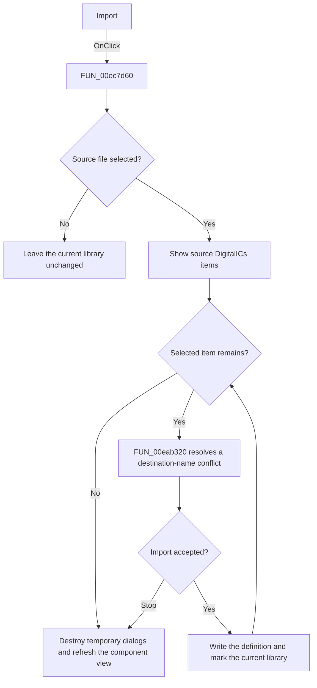

# Import

> Analysis status: Source, call-path, state, and error evidence reviewed.

## Control

| Property | Recovered value |
| --- | --- |
| Form | PcbForm4 |
| Component path | PcbForm4.Panel2.BtnImportComponent |
| Control class | TBitBtn |
| Caption | Import |
| Hint | Not present in the recovered resource. |
| Text | Not present in the recovered resource. |
| Handler name | BtnImportComponentClick |
| Handler address | 00ec7d60 |
| Graph node | `resource:dfm:PcbForm4/PcbForm4.Panel2.BtnImportComponent` |
| Handler node | `function:00ec7d60` |
| Graph layer | UI |

## What happens when clicked

The click imports selected `DigitalICs` component definitions from another library file into the current library.

The handler configures and opens the recovered file dialog. Cancel makes no change. After a file is selected, it opens the source library and an import-selection dialog populated with that file's `DigitalICs` items. For each selected item, it reads the source definition and calls [`FUN_00eab320`](../../../DecompiledSources/Tina16/functions/0000000000EAB320__FUN_00eab320.c) to resolve a destination-name conflict. That helper generates a numbered alternative and asks the user when the requested key already exists.

An accepted item is written to the current library and marks its library entry for later persistence. A response value of `2` stops the remaining import loop. The handler destroys both temporary objects and calls [`FUN_00ec24d0`](../../../DecompiledSources/Tina16/functions/0000000000EC24D0__FUN_00ec24d0.c) to rebuild the filtered component view.

## Click flow

## Handler evidence

- Source: [DecompiledSources/Tina16/functions/0000000000EC7D60__FUN_00ec7d60.c](../../../DecompiledSources/Tina16/functions/0000000000EC7D60__FUN_00ec7d60.c)
- Recovered role: Imports selected DigitalICs component definitions from another library.
- Current graph summary: Handles 1 Delphi UI event: PcbForm4.Panel2.BtnImportComponent.OnClick.
- Current graph behavior: Opens a library file and an item-selection dialog, reads each selected DigitalICs definition, resolves destination-name conflicts, writes accepted items to the current library, marks the library entry, destroys temporary objects, and refreshes the component view.
- Current graph evidence: FUN_00ec7d60 executes the file dialog, creates source-library and selection-dialog objects, enumerates selected rows with FUN_0068bca0, reads source definitions, calls FUN_00eab320, writes accepted definitions, stops on response 2, destroys both objects, and calls FUN_00ec24d0.
- Complexity: complex
- Distinct outgoing calls: 15

## Direct calls

- `function:00410f20` — Nil-safe Delphi object destruction helper
- `function:00414480` — Delphi UnicodeString clear and finalization helper
- `function:00414560` — Delphi UnicodeString array finalization helper
- `function:00416ad0` — FUN_00416ad0
- `function:00416ba0` — FUN_00416ba0
- `function:00441920` — FUN_00441920
- `function:005dc9d0` — FUN_005dc9d0
- `function:0064dd90` — VCL control Unicode text reader
- `function:0064de00` — VCL control text setter with change suppression
- `function:0068bca0` — FUN_0068bca0
- `function:00724270` — FUN_00724270
- `function:00724420` — FUN_00724420
- `function:007fc180` — FUN_007fc180
- `function:00eab320` — FUN_00eab320
- `function:00ec24d0` — Handles 1 Delphi UI event: PcbForm4.Panel2.cbxShowAllComp.OnClick.

## Resource evidence

- Kind: Not present in the recovered resource.
- Modal result: Not present in the recovered resource.
- Checked state: Not present in the recovered resource.
- List items: Not present in the recovered resource.
- Image reference: Not present in the recovered resource.
- Extracted glyph: None.

## Nearby label candidates

Nearby labels are layout candidates only. They are not proof of behavior.

- Rank 1: Component list: at distance 263.
- Rank 2: Footprint list: at distance 443.

## No-op and error behavior

- Cancel in the file dialog makes no change.
- Closing the item-selection dialog without OK imports no items.
- A destination conflict can produce a numbered alternative name and a prompt. Response `2` stops the remaining items.
- The handler has no local file-read or backend-write recovery.

## Analysis limits

- The imported file extension and dialog filter are built from global strings that are not named in the handler.
- The localized conflict prompt text is not recovered.
