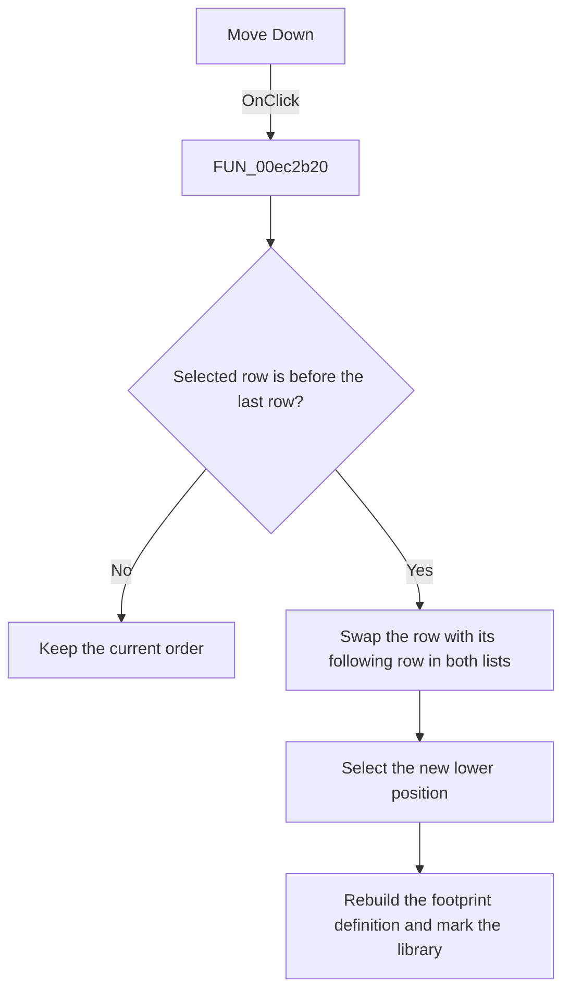

# Move D&own

> Analysis status: Source, call-path, state, and error evidence reviewed.

## Control

| Property | Recovered value |
| --- | --- |
| Form | PcbForm4 |
| Component path | PcbForm4.Panel1.BtnMoveDown |
| Control class | TBitBtn |
| Caption | Move D&own |
| Hint | Not present in the recovered resource. |
| Text | Not present in the recovered resource. |
| Handler name | BtnMoveDownClick |
| Handler address | 00ec2b20 |
| Graph node | `resource:dfm:PcbForm4/PcbForm4.Panel1.BtnMoveDown` |
| Handler node | `function:00ec2b20` |
| Graph layer | UI |

## What happens when clicked

The click moves the selected pin-to-node mapping down by one row.

The handler compares the selected index with the last row index. When a following row exists, it swaps the selected and following entries in both coordinated mapping lists, increments the selection, calls [`FUN_00ec7250`](../../../DecompiledSources/Tina16/functions/0000000000EC7250__FUN_00ec7250.c) to rebuild the footprint definition in the new order, and marks the active library entry for later persistence.

## Click flow

## Handler evidence

- Source: [DecompiledSources/Tina16/functions/0000000000EC2B20__FUN_00ec2b20.c](../../../DecompiledSources/Tina16/functions/0000000000EC2B20__FUN_00ec2b20.c)
- Recovered role: Moves the selected pin-to-node mapping down by one position.
- Current graph summary: Handles 1 Delphi UI event: PcbForm4.Panel1.BtnMoveDown.OnClick.
- Current graph behavior: When the selected row is not last, swaps it with the following row in both coordinated mapping lists, advances the selection, rebuilds the selected footprint definition, refreshes mapping state, and marks the active library entry.
- Current graph evidence: FUN_00ec2b20 checks ItemIndex against the list count, performs paired string swaps at index and index + 1, sets ItemIndex to the incremented value, calls FUN_00ec7250, and sets item-associated state on the current library entry.
- Complexity: complex
- Distinct outgoing calls: 7

## Direct calls

- `function:00414560` — Delphi UnicodeString array finalization helper
- `function:00416ad0` — FUN_00416ad0
- `function:00416dc0` — FUN_00416dc0
- `function:00416e20` — FUN_00416e20
- `function:004170c0` — FUN_004170c0
- `function:00ea9ca0` — FUN_00ea9ca0
- `function:00ec7250` — FUN_00ec7250

## Resource evidence

- Kind: Not present in the recovered resource.
- Modal result: Not present in the recovered resource.
- Checked state: Not present in the recovered resource.
- List items: Not present in the recovered resource.
- Image reference: Not present in the recovered resource.
- Extracted glyph: None.

## Nearby label candidates

Nearby labels are layout candidates only. They are not proof of behavior.

- Rank 1:  Valid node at distance 92.
- Rank 2: Swapped node at distance 110.
- Rank 3: Invalid node at distance 131.

## No-op and error behavior

- No selection or selection of the last row causes no list, definition, or selection change.
- The handler has no local exception recovery.

## Analysis limits

- The source proves coordinated reordering in two lists. Their internal item-string encoding is only partly recovered.
