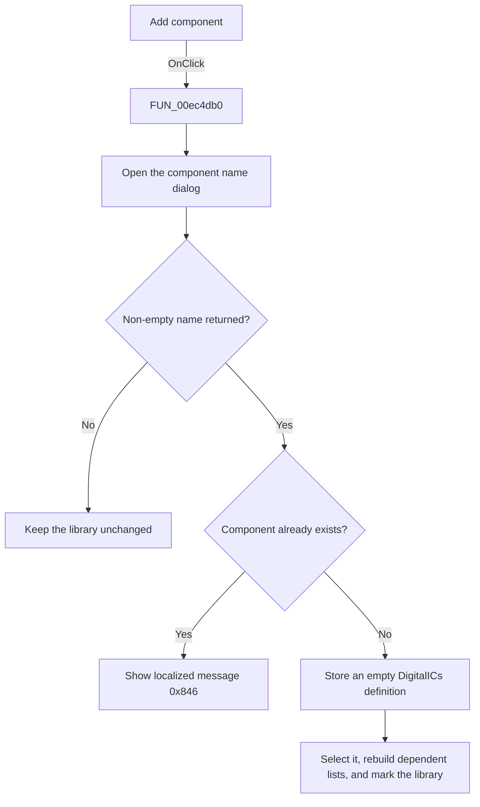

# Add

> Analysis status: Source, call-path, state, and error evidence reviewed.

## Control

| Property | Recovered value |
| --- | --- |
| Form | PcbForm4 |
| Component path | PcbForm4.Panel2.BtnNewComponent |
| Control class | TBitBtn |
| Caption | Add |
| Hint | Not present in the recovered resource. |
| Text | Not present in the recovered resource. |
| Handler name | BtnNewComponentClick |
| Handler address | 00ec4db0 |
| Graph node | `resource:dfm:PcbForm4/PcbForm4.Panel2.BtnNewComponent` |
| Handler node | `function:00ec4db0` |
| Graph layer | UI |

## What happens when clicked

The click creates an empty `DigitalICs` component entry.

[`FUN_00ebd270`](../../../DecompiledSources/Tina16/functions/0000000000EBD270__FUN_00ebd270.c) opens the recovered name-entry dialog. If it returns a non-empty name, the handler checks the current library backend for that component key. A duplicate shows localized message `0x846` and stops.

For a unique name, the handler adds and selects the normalized name in the Component list, stores an empty definition under that key, clears the cached footprint selection, rebuilds the Footprint and mapping lists, refreshes action availability, and marks the active library entry for later persistence.

## Click flow

## Handler evidence

- Source: [DecompiledSources/Tina16/functions/0000000000EC4DB0__FUN_00ec4db0.c](../../../DecompiledSources/Tina16/functions/0000000000EC4DB0__FUN_00ec4db0.c)
- Recovered role: Creates an empty PCB component entry with a unique name.
- Current graph summary: Handles 1 Delphi UI event: PcbForm4.Panel2.BtnNewComponent.OnClick.
- Current graph behavior: Prompts for a component name, rejects a duplicate with localized message 0x846, stores an empty DigitalICs definition under a unique name, selects it, clears the cached footprint, rebuilds dependent lists and actions, and marks the active library entry.
- Current graph evidence: FUN_00ec4db0 calls FUN_00ebd270, checks backend existence, adds and selects the normalized returned name, invokes the DigitalICs write method with a zero definition, clears field +0x860, calls FUN_00ec1150 and FUN_00ec0380, and marks the current library entry.
- Complexity: complex
- Distinct outgoing calls: 12

## Direct calls

- `function:00414480` — Delphi UnicodeString clear and finalization helper
- `function:00414560` — Delphi UnicodeString array finalization helper
- `function:00414ad0` — Delphi UnicodeString assignment helper
- `function:0043e130` — FUN_0043e130
- `function:00442f70` — FUN_00442f70
- `function:0072d440` — FUN_0072d440
- `function:00b89270` — FUN_00b89270
- `function:00b8e520` — FUN_00b8e520
- `function:00ea9ef0` — FUN_00ea9ef0
- `function:00ebd270` — FUN_00ebd270
- `function:00ec0380` — FUN_00ec0380
- `function:00ec1150` — FUN_00ec1150

## Resource evidence

- Kind: Not present in the recovered resource.
- Modal result: Not present in the recovered resource.
- Checked state: Not present in the recovered resource.
- List items: Not present in the recovered resource.
- Image reference: Not present in the recovered resource.
- Extracted glyph: None.

## Nearby label candidates

Nearby labels are layout candidates only. They are not proof of behavior.

- Rank 1: Component list: at distance 217.
- Rank 2: Footprint list: at distance 397.

## No-op and error behavior

- Cancel or an empty returned name makes no change.
- A duplicate name shows localized message `0x846` and does not overwrite the existing component.
- The handler has no local backend error recovery.

## Analysis limits

- The localized duplicate message text and full name-normalization rules are not recovered.
