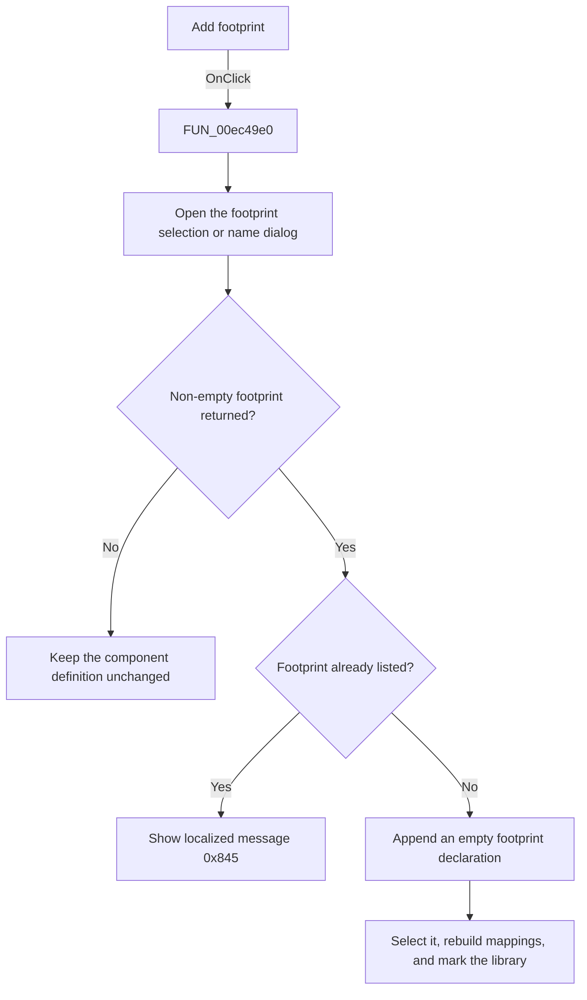

# Add

> Analysis status: Source, call-path, state, and error evidence reviewed.

## Control

| Property | Recovered value |
| --- | --- |
| Form | PcbForm4 |
| Component path | PcbForm4.Panel2.BtnNewModule |
| Control class | TBitBtn |
| Caption | Add |
| Hint | Not present in the recovered resource. |
| Text | Not present in the recovered resource. |
| Handler name | BtnNewModuleClick |
| Handler address | 00ec49e0 |
| Graph node | `resource:dfm:PcbForm4/PcbForm4.Panel2.BtnNewModule` |
| Handler node | `function:00ec49e0` |
| Graph layer | UI |

## What happens when clicked

The click adds a new empty footprint entry to the selected component.

[`FUN_00ebb850`](../../../DecompiledSources/Tina16/functions/0000000000EBB850__FUN_00ebb850.c) opens the recovered footprint-selection or name dialog with no initial footprint. If it returns a non-empty value, the handler tests the Footprint list for a duplicate. A duplicate shows localized message `0x845`.

For a unique footprint, the handler adds and selects its normalized name, initializes the cached footprint when none exists, loads the selected component's `DigitalICs` definition, appends the recovered empty-footprint declaration, writes the updated definition, rebuilds the footprint mapping view and action state, and marks the active library entry.

## Click flow

## Handler evidence

- Source: [DecompiledSources/Tina16/functions/0000000000EC49E0__FUN_00ec49e0.c](../../../DecompiledSources/Tina16/functions/0000000000EC49E0__FUN_00ec49e0.c)
- Recovered role: Adds a new empty footprint entry to the selected component.
- Current graph summary: Handles 1 Delphi UI event: PcbForm4.Panel2.BtnNewModule.OnClick.
- Current graph behavior: Opens the footprint dialog, rejects a duplicate with localized message 0x845, adds and selects a unique footprint name, appends an empty footprint declaration to the component definition, writes it, refreshes mapping and action state, and marks the active library entry.
- Current graph evidence: FUN_00ec49e0 calls FUN_00ebb850 with no initial value, checks the Footprint list, adds and selects the returned name, appends a recovered declaration ending in empty parentheses and a semicolon to the DigitalICs definition, writes it, and runs the shared refresh paths.
- Complexity: complex
- Distinct outgoing calls: 14

## Direct calls

- `function:00414560` — Delphi UnicodeString array finalization helper
- `function:00414ad0` — Delphi UnicodeString assignment helper
- `function:00416cd0` — FUN_00416cd0
- `function:0043e130` — FUN_0043e130
- `function:0043ea00` — FUN_0043ea00
- `function:00442f70` — FUN_00442f70
- `function:0072d440` — FUN_0072d440
- `function:00b89270` — FUN_00b89270
- `function:00b8e520` — FUN_00b8e520
- `function:00ea9ca0` — FUN_00ea9ca0
- `function:00ea9ef0` — FUN_00ea9ef0
- `function:00ebb850` — FUN_00ebb850
- `function:00ec0380` — FUN_00ec0380
- `function:00ec0aa0` — FUN_00ec0aa0

## Resource evidence

- Kind: Not present in the recovered resource.
- Modal result: Not present in the recovered resource.
- Checked state: Not present in the recovered resource.
- List items: Not present in the recovered resource.
- Image reference: Not present in the recovered resource.
- Extracted glyph: None.

## Nearby label candidates

Nearby labels are layout candidates only. They are not proof of behavior.

- Rank 1: Footprint list: at distance 221.
- Rank 2: Component list: at distance 391.

## No-op and error behavior

- Cancel or an empty returned value leaves the definition unchanged.
- A duplicate footprint shows localized message `0x845` and is not added.
- The handler has no local backend error recovery.

## Analysis limits

- The footprint dialog supports several sources and modes. This handler passes the form's recovered mode field, whose Delphi name is unknown.
- The localized duplicate message text is not recovered.
