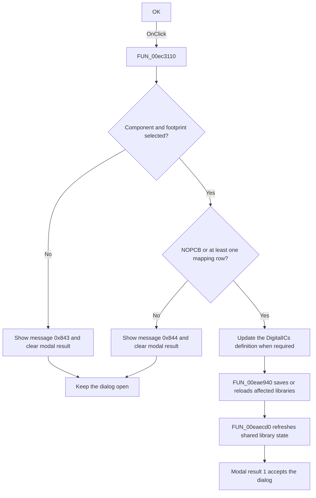

# OK

> Analysis status: Source, call-path, state, and error evidence reviewed.

## Control

| Property | Recovered value |
| --- | --- |
| Form | PcbForm4 |
| Component path | PcbForm4.BtnOK |
| Control class | TBitBtn |
| Caption | OK |
| Hint | Not present in the recovered resource. |
| Text | Not present in the recovered resource. |
| Handler name | BtnOKClick |
| Handler address | 00ec3110 |
| Graph node | `resource:dfm:PcbForm4/PcbForm4.BtnOK` |
| Handler node | `function:00ec3110` |
| Graph layer | UI |

## What happens when clicked

The handler validates the current component and footprint selection, writes the edited `DigitalICs` definition when required, persists the affected PCB libraries, and refreshes the shared library state. The resource supplies modal result `1`, so a successful return accepts the dialog.

It first requires a selected item in both the Component list and Footprint list. If either selection is absent, it clears the form modal result and shows localized message `0x843`. For a footprint other than `NOPCB`, it also requires at least one pin-to-node mapping row. A missing mapping clears the modal result and shows localized message `0x844`.

On the accepted path, the handler compares the generated component definition with the stored `DigitalICs` definition and calls [`FUN_00eaec40`](../../../DecompiledSources/Tina16/functions/0000000000EAEC40__FUN_00eaec40.c) when an update is required. [`FUN_00eae940`](../../../DecompiledSources/Tina16/functions/0000000000EAE940__FUN_00eae940.c) then processes the library entries. It asks for confirmation before it modifies the standard `TINA` library; a declined confirmation reloads that entry instead. Finally, [`FUN_00eaecd0`](../../../DecompiledSources/Tina16/functions/0000000000EAECD0__FUN_00eaecd0.c) invokes the global library refresh.

The green-check glyph supports the accept meaning. The source, selection checks, writes, save path, and modal-result resets establish the implementation.

## Click flow

## Handler evidence

- Source: [DecompiledSources/Tina16/functions/0000000000EC3110__FUN_00ec3110.c](../../../DecompiledSources/Tina16/functions/0000000000EC3110__FUN_00ec3110.c)
- Recovered role: Validates and persists the edited PCB component and footprint library state.
- Current graph summary: Handles 1 Delphi UI event: PcbForm4.BtnOK.OnClick.
- Current graph behavior: Requires selected component and footprint rows and, except for NOPCB, at least one mapping row. Validation failures clear the modal result and show localized messages. The accepted path updates the DigitalICs definition when required, processes library persistence, refreshes shared state, and then permits modal result 1.
- Current graph evidence: The handler reads both list selections, compares the selected footprint with NOPCB, checks the mapping-row count, writes through FUN_00eaec40, processes libraries through FUN_00eae940, and calls FUN_00eaecd0. The DFM supplies modal result 1 and the inspected glyph shows green check marks.
- Complexity: complex
- Distinct outgoing calls: 13

## Direct calls

- `function:00414480` — Delphi UnicodeString clear and finalization helper
- `function:00414560` — Delphi UnicodeString array finalization helper
- `function:00416ba0` — FUN_00416ba0
- `function:00416db0` — FUN_00416db0
- `function:0043e130` — FUN_0043e130
- `function:0072d440` — FUN_0072d440
- `function:00b89270` — FUN_00b89270
- `function:00b8e520` — FUN_00b8e520
- `function:00ea99b0` — FUN_00ea99b0
- `function:00ea9ca0` — FUN_00ea9ca0
- `function:00eae940` — FUN_00eae940
- `function:00eaec40` — FUN_00eaec40
- `function:00eaecd0` — FUN_00eaecd0

## Resource evidence

- Kind: Not present in the recovered resource.
- Modal result: 1
- Checked state: Not present in the recovered resource.
- List items: Not present in the recovered resource.
- Image reference: Not present in the recovered resource.
- Extracted glyph: [`0301_PcbForm4_PcbForm4_BtnOK_Glyph_Data.png`](../../../glyph/0301_PcbForm4_PcbForm4_BtnOK_Glyph_Data.png)

## Nearby label candidates

Nearby labels are layout candidates only. They are not proof of behavior.

- No same-parent label candidate is available.

## No-op and error behavior

- Missing component or footprint selection: show localized message `0x843`, clear the modal result, and keep the form open.
- Non-`NOPCB` footprint without mapping rows: show localized message `0x844`, clear the modal result, and keep the form open.
- Standard `TINA` library modification declined: reload that library entry instead of saving it.
- The handler has no local exception recovery for backend reads, writes, or saves.

## Analysis limits

- The localized message text is not present in the recovered handler; only message identifiers and branch conditions are proven.
- The code conditionally writes the component definition. The exact backend storage format remains behind recovered virtual methods.
