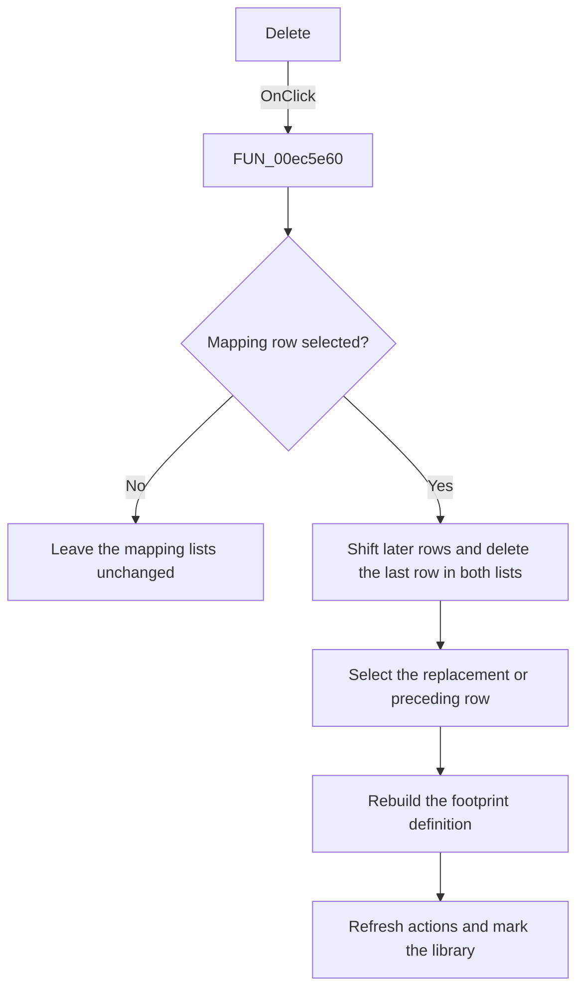

# &Delete

> Analysis status: Source, call-path, state, and error evidence reviewed.

## Control

| Property | Recovered value |
| --- | --- |
| Form | PcbForm4 |
| Component path | PcbForm4.Panel1.BtnRemove |
| Control class | TBitBtn |
| Caption | &Delete |
| Hint | Not present in the recovered resource. |
| Text | Not present in the recovered resource. |
| Handler name | BtnRemoveClick |
| Handler address | 00ec5e60 |
| Graph node | `resource:dfm:PcbForm4/PcbForm4.Panel1.BtnRemove` |
| Handler node | `function:00ec5e60` |
| Graph layer | UI |

## What happens when clicked

The click removes the selected pin-to-node mapping.

When a row is selected, the handler shifts all later entries up and deletes the last entry in both coordinated mapping lists. It then selects the row that replaced the deleted row, or the preceding row when the deleted row was last. [`FUN_00ec7250`](../../../DecompiledSources/Tina16/functions/0000000000EC7250__FUN_00ec7250.c) rebuilds the selected footprint definition, [`FUN_00ec0380`](../../../DecompiledSources/Tina16/functions/0000000000EC0380__FUN_00ec0380.c) refreshes action availability, and the handler marks the active library entry for later persistence.

## Click flow

## Handler evidence

- Source: [DecompiledSources/Tina16/functions/0000000000EC5E60__FUN_00ec5e60.c](../../../DecompiledSources/Tina16/functions/0000000000EC5E60__FUN_00ec5e60.c)
- Recovered role: Removes the selected pin-to-node mapping.
- Current graph summary: Handles 1 Delphi UI event: PcbForm4.Panel1.BtnRemove.OnClick.
- Current graph behavior: Deletes the selected mapping from both coordinated lists by shifting later rows, chooses a valid remaining selection, rebuilds the footprint definition, refreshes action availability, and marks the active library entry.
- Current graph evidence: FUN_00ec5e60 checks for ItemIndex >= 0, performs the same shift and delete operations on both list objects, adjusts ItemIndex, calls FUN_00ec7250 and FUN_00ec0380, and sets item-associated state on the current library entry.
- Complexity: complex
- Distinct outgoing calls: 8

## Direct calls

- `function:00414560` — Delphi UnicodeString array finalization helper
- `function:00416ad0` — FUN_00416ad0
- `function:00416dc0` — FUN_00416dc0
- `function:00416e20` — FUN_00416e20
- `function:004170c0` — FUN_004170c0
- `function:00ea9ca0` — FUN_00ea9ca0
- `function:00ec0380` — FUN_00ec0380
- `function:00ec7250` — FUN_00ec7250

## Resource evidence

- Kind: Not present in the recovered resource.
- Modal result: Not present in the recovered resource.
- Checked state: Not present in the recovered resource.
- List items: Not present in the recovered resource.
- Image reference: Not present in the recovered resource.
- Extracted glyph: None.

## Nearby label candidates

Nearby labels are layout candidates only. They are not proof of behavior.

- Rank 1: Part: at distance 98.
- Rank 2: Swapped nodes at distance 108.
- Rank 3:  Valid node at distance 185.

## No-op and error behavior

- No selected row causes no mutation.
- Removing the final row leaves no selected mapping and disables actions through the shared refresh helper.
- The handler has no confirmation dialog or local exception recovery.

## Analysis limits

- The source proves removal from two coordinated lists. Their internal item-string encoding is only partly recovered.
