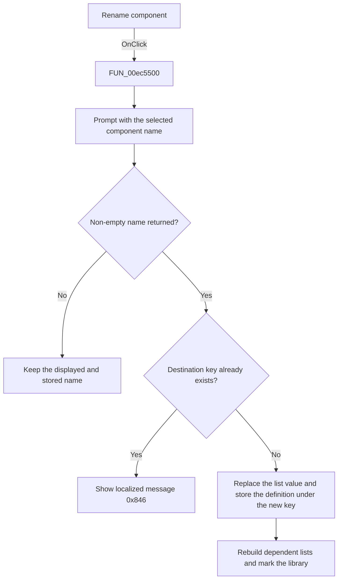

# Rename

> Analysis status: Source, call-path, state, and error evidence reviewed.

## Control

| Property | Recovered value |
| --- | --- |
| Form | PcbForm4 |
| Component path | PcbForm4.Panel2.BtnRenameComponent |
| Control class | TBitBtn |
| Caption | Rename |
| Hint | Not present in the recovered resource. |
| Text | Not present in the recovered resource. |
| Handler name | BtnRenameComponentClick |
| Handler address | 00ec5500 |
| Graph node | `resource:dfm:PcbForm4/PcbForm4.Panel2.BtnRenameComponent` |
| Handler node | `function:00ec5500` |
| Graph layer | UI |

## What happens when clicked

The click stores the selected component definition under a new unique name and replaces the displayed Component list value.

The handler reads the selected component and opens [`FUN_00ebd270`](../../../DecompiledSources/Tina16/functions/0000000000EBD270__FUN_00ebd270.c) with that name as the initial value. Cancel or an empty result makes no change. If the backend already contains the returned key, it shows localized message `0x846`.

For a unique name, the handler reads the selected component's definition, replaces the current Component list row with the normalized new name, writes the definition under the new key, rebuilds the Footprint and mapping lists, refreshes action availability, and marks the active library entry.

## Click flow

## Handler evidence

- Source: [DecompiledSources/Tina16/functions/0000000000EC5500__FUN_00ec5500.c](../../../DecompiledSources/Tina16/functions/0000000000EC5500__FUN_00ec5500.c)
- Recovered role: Stores the selected component definition under a new unique name.
- Current graph summary: Handles 1 Delphi UI event: PcbForm4.Panel2.BtnRenameComponent.OnClick.
- Current graph behavior: Prompts with the selected component name, rejects a duplicate destination with message 0x846, replaces the selected Component list value, stores the current definition under the returned key, refreshes dependent lists and actions, and marks the library entry.
- Current graph evidence: FUN_00ec5500 reads the selected component, calls FUN_00ebd270, checks backend existence, reads the old definition, replaces the list row, writes the definition using the new key, calls FUN_00ec1150 and FUN_00ec0380, and marks the active library entry.
- Complexity: complex
- Distinct outgoing calls: 13

## Direct calls

- `function:00414560` — Delphi UnicodeString array finalization helper
- `function:00414ad0` — Delphi UnicodeString assignment helper
- `function:0043e130` — FUN_0043e130
- `function:0043ea00` — FUN_0043ea00
- `function:00442f70` — FUN_00442f70
- `function:0072d440` — FUN_0072d440
- `function:00b89270` — FUN_00b89270
- `function:00b8e520` — FUN_00b8e520
- `function:00ea9ca0` — FUN_00ea9ca0
- `function:00ea9ef0` — FUN_00ea9ef0
- `function:00ebd270` — FUN_00ebd270
- `function:00ec0380` — FUN_00ec0380
- `function:00ec1150` — FUN_00ec1150

## Resource evidence

- Kind: Not present in the recovered resource.
- Modal result: Not present in the recovered resource.
- Checked state: Not present in the recovered resource.
- List items: Not present in the recovered resource.
- Image reference: Not present in the recovered resource.
- Extracted glyph: None.

## Nearby label candidates

Nearby labels are layout candidates only. They are not proof of behavior.

- Rank 1: Component list: at distance 318.
- Rank 2: Footprint list: at distance 340.

## No-op and error behavior

- Cancel or an empty name leaves the component unchanged.
- A duplicate destination shows localized message `0x846` and makes no visible rename.
- The handler has no local backend error recovery.

## Analysis limits

- The recovered handler does not show a separate backend deletion call for the old key. The backend write or later persistence can implement the final rename semantics, but that boundary is not recovered.
- The localized duplicate message text is not recovered.
