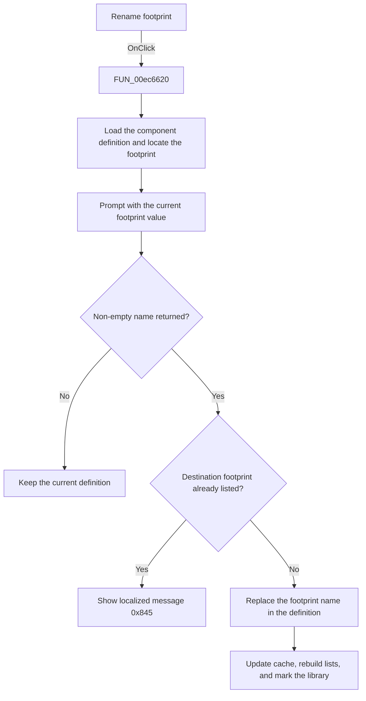

# Rename

> Analysis status: Source, call-path, state, and error evidence reviewed.

## Control

| Property | Recovered value |
| --- | --- |
| Form | PcbForm4 |
| Component path | PcbForm4.Panel2.BtnRenameModule |
| Control class | TBitBtn |
| Caption | Rename |
| Hint | Not present in the recovered resource. |
| Text | Not present in the recovered resource. |
| Handler name | BtnRenameModuleClick |
| Handler address | 00ec6620 |
| Graph node | `resource:dfm:PcbForm4/PcbForm4.Panel2.BtnRenameModule` |
| Handler node | `function:00ec6620` |
| Graph layer | UI |

## What happens when clicked

The click changes the selected footprint name inside the selected component definition.

The handler reads the selected component and footprint values, loads the `DigitalICs` definition, and locates the selected footprint section. It opens [`FUN_00ebb850`](../../../DecompiledSources/Tina16/functions/0000000000EBB850__FUN_00ebb850.c) with the current footprint. Cancel or an empty result makes no change. A duplicate returned name shows localized message `0x845`.

For a unique name, the handler replaces the footprint name at the saved definition position, updates the cached footprint when it matched the old name, writes the modified definition, rebuilds the dependent lists, refreshes actions, and marks the active library entry.

## Click flow

## Handler evidence

- Source: [DecompiledSources/Tina16/functions/0000000000EC6620__FUN_00ec6620.c](../../../DecompiledSources/Tina16/functions/0000000000EC6620__FUN_00ec6620.c)
- Recovered role: Renames the selected footprint inside the component definition.
- Current graph summary: Handles 1 Delphi UI event: PcbForm4.Panel2.BtnRenameModule.OnClick.
- Current graph behavior: Loads and locates the selected footprint, prompts with its current value, rejects a duplicate with message 0x845, replaces the footprint name at the saved definition position, updates a matching cached selection, writes the definition, refreshes lists and actions, and marks the library entry.
- Current graph evidence: FUN_00ec6620 reads both selected list values, loads the DigitalICs definition, locates the footprint substring, calls FUN_00ebb850, checks the returned name in the Footprint list, transforms the definition at the saved position, conditionally updates field +0x860, writes the definition, and runs shared refresh paths.
- Complexity: complex
- Distinct outgoing calls: 18

## Direct calls

- `function:00414560` — Delphi UnicodeString array finalization helper
- `function:00414ad0` — Delphi UnicodeString assignment helper
- `function:00416ba0` — FUN_00416ba0
- `function:00416db0` — FUN_00416db0
- `function:00416e20` — FUN_00416e20
- `function:00416ea0` — FUN_00416ea0
- `function:004170c0` — FUN_004170c0
- `function:0043e130` — FUN_0043e130
- `function:0043ea00` — FUN_0043ea00
- `function:00442f70` — FUN_00442f70
- `function:0072d440` — FUN_0072d440
- `function:00b89270` — FUN_00b89270
- `function:00b8e520` — FUN_00b8e520
- `function:00ea9ca0` — FUN_00ea9ca0
- `function:00ea9ef0` — FUN_00ea9ef0
- `function:00ebb850` — FUN_00ebb850
- `function:00ec0380` — FUN_00ec0380
- `function:00ec1150` — FUN_00ec1150

## Resource evidence

- Kind: Not present in the recovered resource.
- Modal result: Not present in the recovered resource.
- Checked state: Not present in the recovered resource.
- List items: Not present in the recovered resource.
- Image reference: Not present in the recovered resource.
- Extracted glyph: None.

## Nearby label candidates

Nearby labels are layout candidates only. They are not proof of behavior.

- Rank 1: Footprint list: at distance 314.
- Rank 2: Component list: at distance 494.

## No-op and error behavior

- Cancel or an empty returned name leaves the definition unchanged.
- A duplicate footprint name shows localized message `0x845` and is not applied.
- The handler has no local backend error recovery.

## Analysis limits

- The recovered footprint-section grammar is not named.
- The localized duplicate message text is not recovered.
